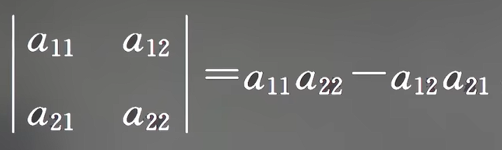
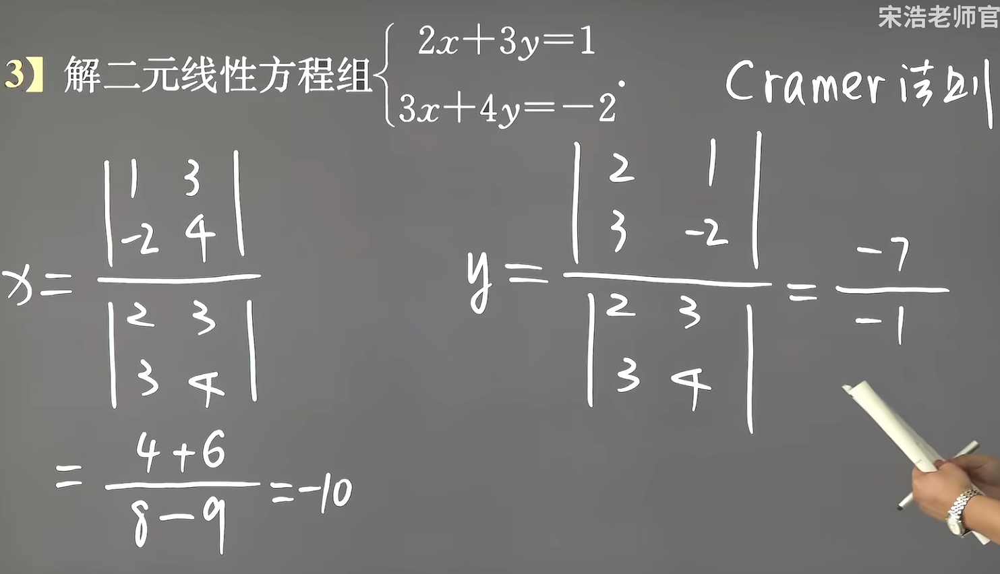
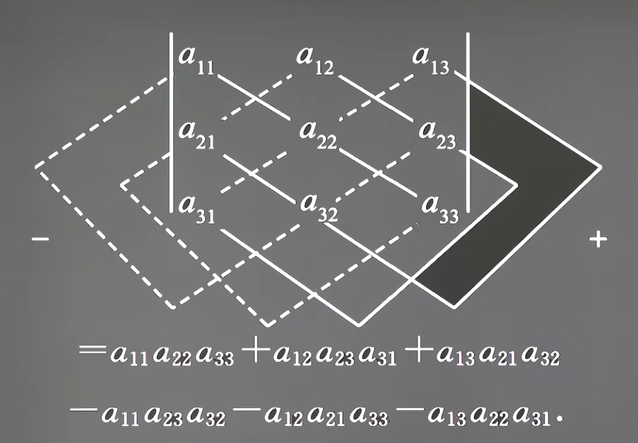
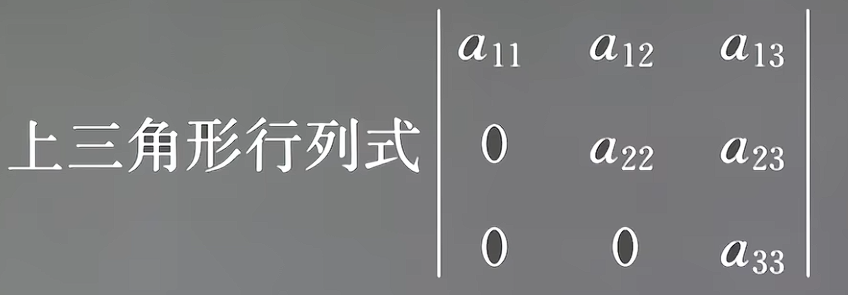
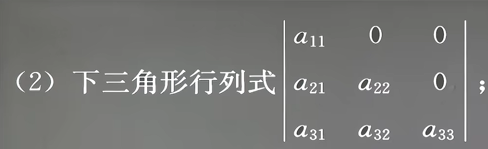
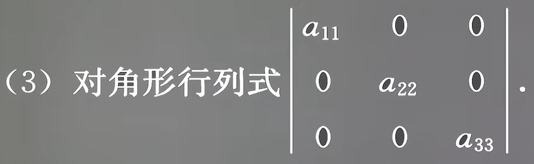

### 1.1二三阶行列式

#### 1. 二阶行列式
+ 计算方法：

+ a~ij~是第i行的第j列
+ 行列式是一种运算符号

#### 2. 克莱姆法则
+ 

#### 3. 三阶行列式
+ 有6项，3项正3项负
+ 项数规律(对角线法则)

+ 若三阶行列式有2-3个0,直接展开不算大问题

#### 4. 特殊0项的三阶行列式
1. 上三角形行列式

2. 下三角形行列式

3. 对角线行列式

+ **结果都为主对角线的积**

