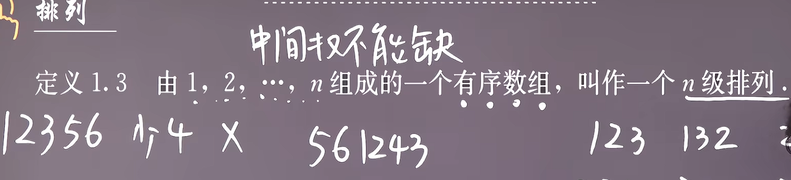
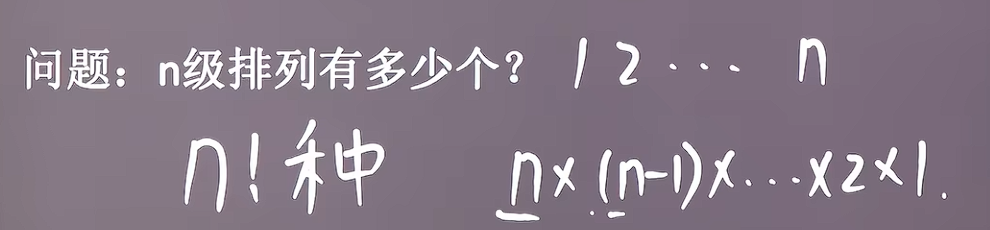
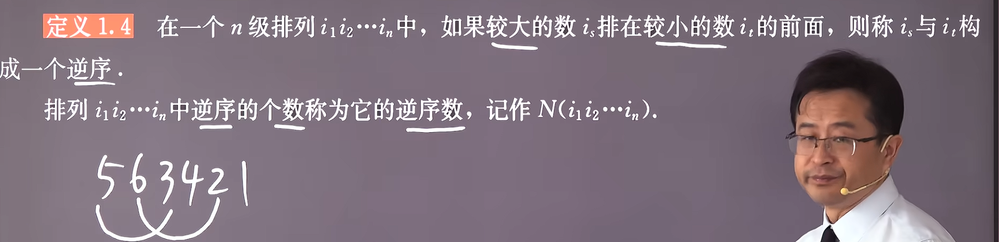
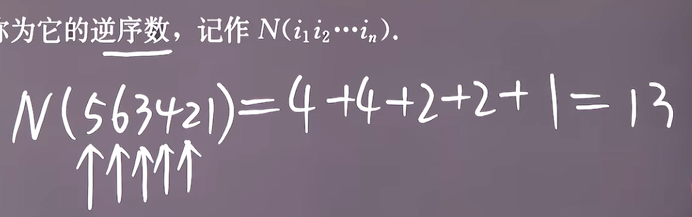
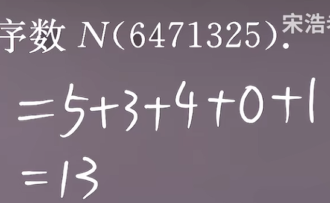
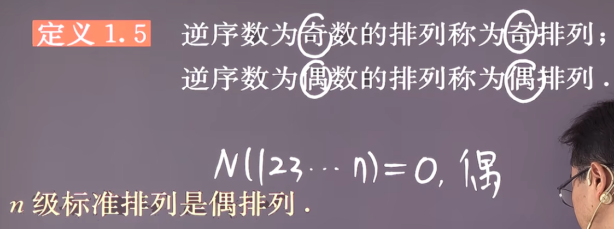
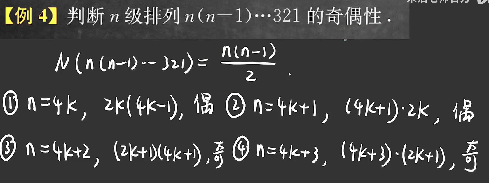
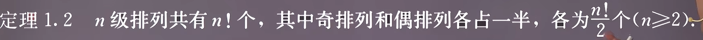
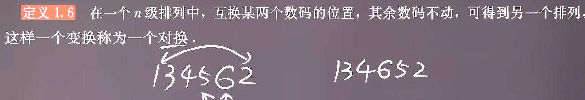
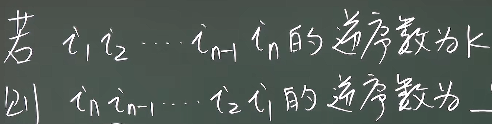

### 排列与逆序

#### 1. 排列
+ 定义：中间项不能缺少

+ n级排列有n!种类型

+ 标准排列/自然排列

#### 2. 逆序
+ 定义

+ 逆序数的计算

+ 特殊的逆序数

#### 3. 奇偶排列
+ 定义

+ 特殊的奇偶排列

**自然排列的逆序数有4种情况！！！**
+ 奇偶排列的数量

#### 4. 对换
+ 定义

+ 对换定理

+ 注意：**逆序数的变化量不确定，只有奇偶性确定**

#### 4. 排列翻转
+ 引例：

+ 突破点：
由于原排列中任意两个元素，在整体翻转后其逆序关系也发生对调，所以，任意两个元素之间只在一种排列情况中成逆序（另一种翻转的则相反），两个排列的逆序数的总和应该恰好是独立的元素的对数，即**两个排列的逆序数的和为**C~n~^2^,则已知一个排列的逆序数为k,另一个排列的逆序数则为C~n~^2^-k