### 1.3 n阶行列式

#### 1. 简记
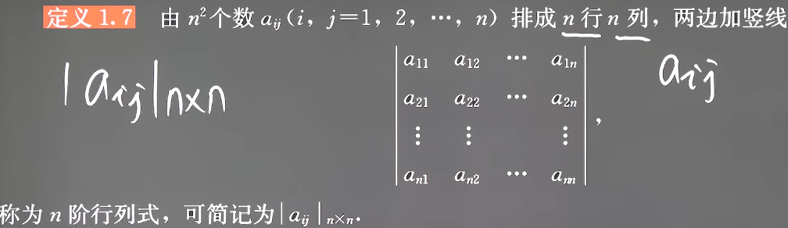
由于行列式实际上是线性方程组的代数特征，因此n阶行列式一定是n*n的方形

#### 2. 三阶行列式展开式的本质
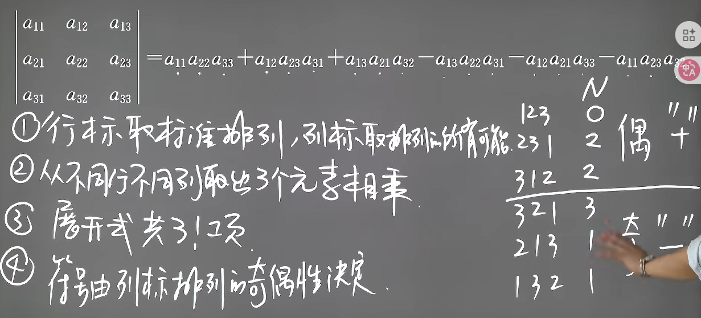
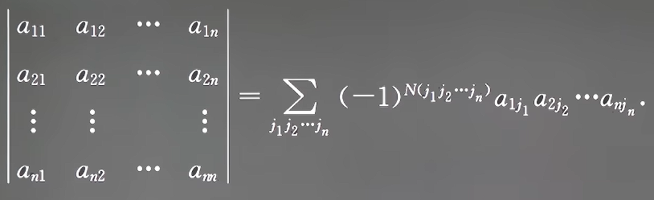

#### 3. n阶行列式展开公式--**定义式**
由于行列式展开的发展本质上是
1. 每一项都是不同行不同列(独占一个十字)的乘积(所以一共只有n!项，每项为n个数)
2. 符号实际上是行列坐标逆序数的和的奇偶性
即：
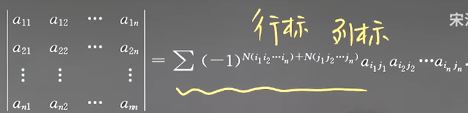

**例如这种题目：**
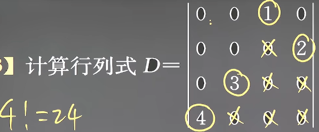
只有一种取法不为0（这种只关注非0项的思维是定义式的主要考察方法）
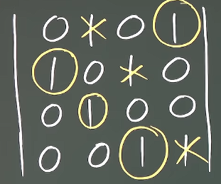
只有一种取法不为0，并且不一定要按顺序取其实
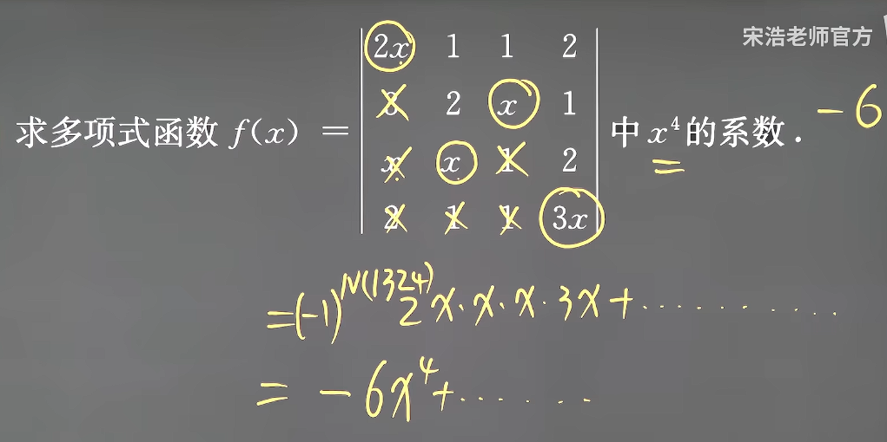
x^4^的取法只有1种（这种只关注特殊项的思维是定义式的主要考察方法）
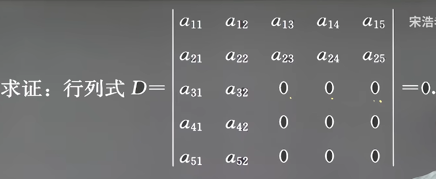
每项必须有n个独占一个十字的数，按行顺序取本质上就是每行取一个然后对应列就划掉，那么最保守的取法在第5行时只有0那一列可以取，因此每项至少有一个0（这种关注每项必须包含元素的思维是定义式的主要考察方法）
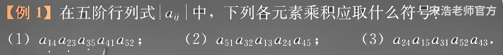
就是求行列坐标逆序数的和的奇偶性

又由于乘法具有交换律,因此我们认为由第一行开始选,每一行独占一列(本质相同),然后行按顺序排列(逆序数为0)那么结果不变但是规则变成
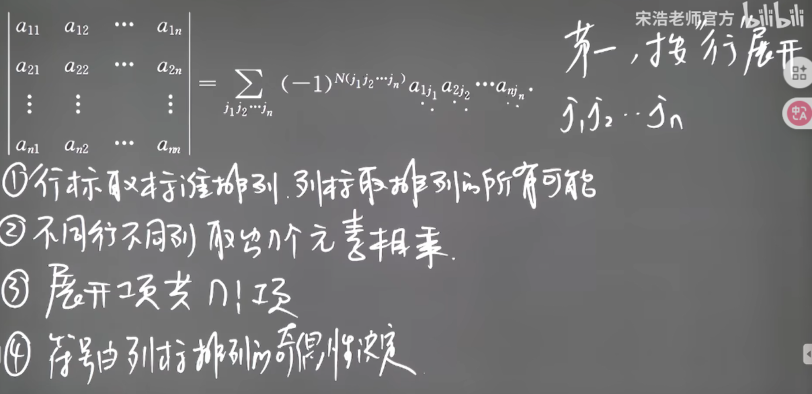

**但是这定义式展开方法太复杂了**

#### 4. 特殊行列式
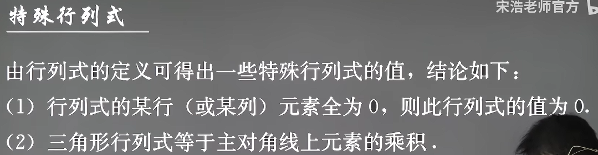

#### 5. 三角形行列式
1. 主对角线型
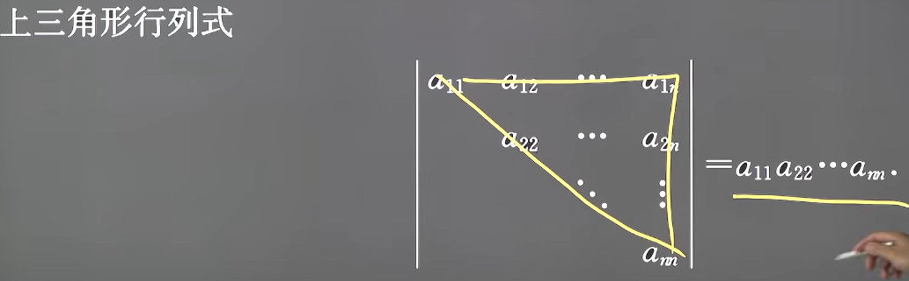
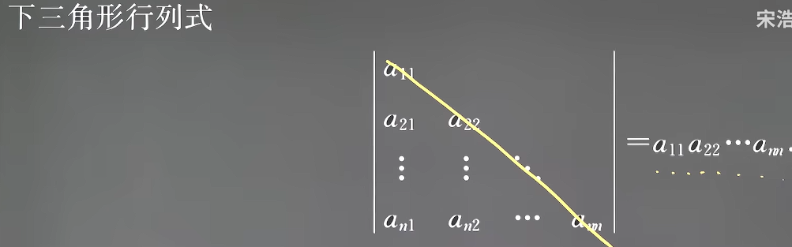
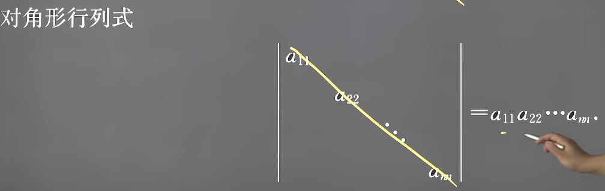

2. 副对角线型
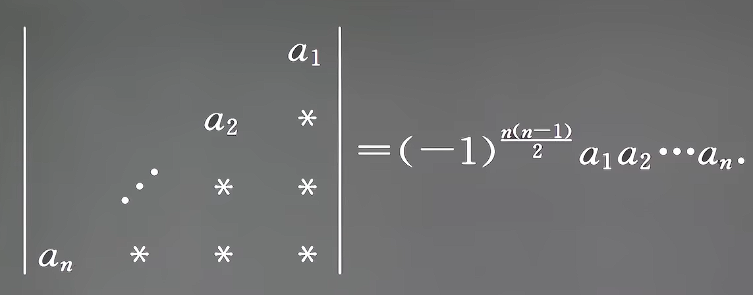
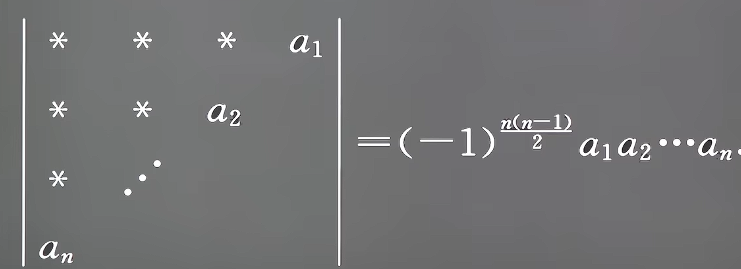
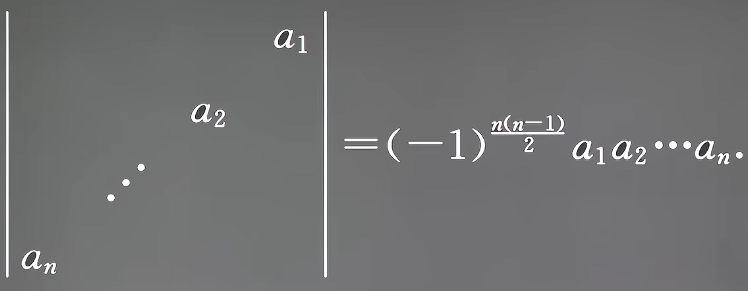

3. 记忆
其实就是利用**定义式**可以知道非零项只有沿着对角线哪一项，而主对角线的逆序数必为0，负对角线则有4种情况，在上一节特殊排列逆序数有记录n(n-1)/2

#### 6. 转置
定义
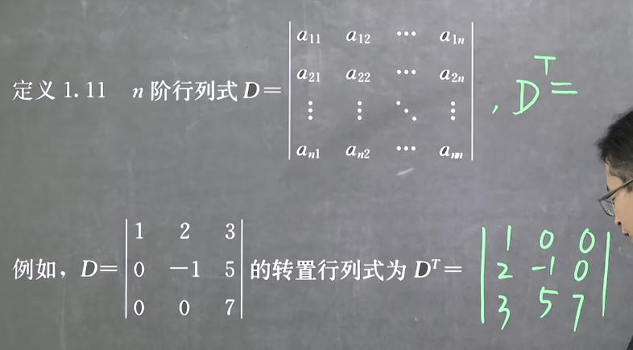
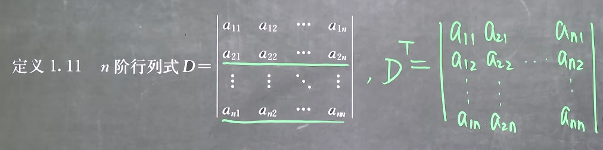
且可以发现转置的转置和原式相等

#### 7. 行列式的性质
+ 性质一
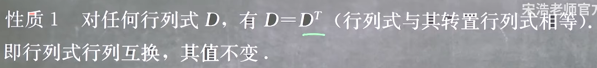
这意味着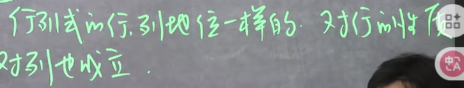
记忆：**转置可任意**
+ 性质二
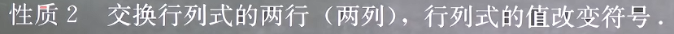
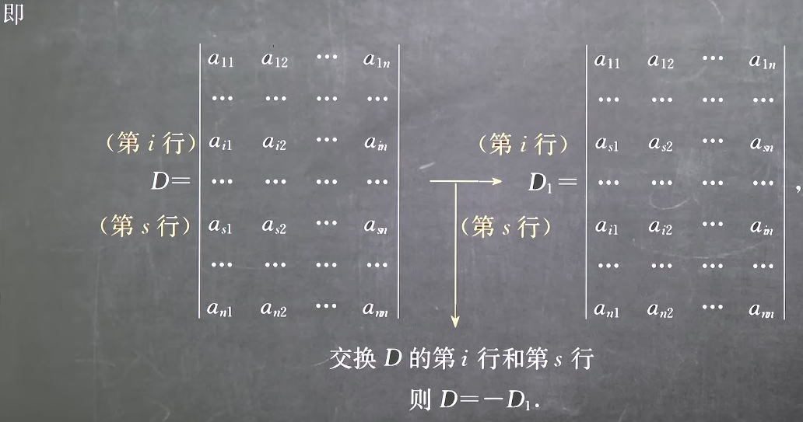
记忆：**交换要变号**
+ 性质三
有性质二可以推得
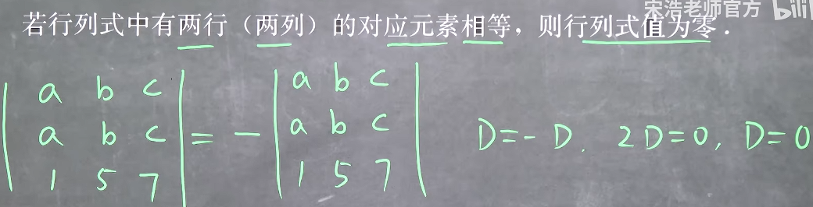
这本质上是这个行列式的共轭方程组线性相关导致无解
记忆：**两行相等值为0**
+ 性质四
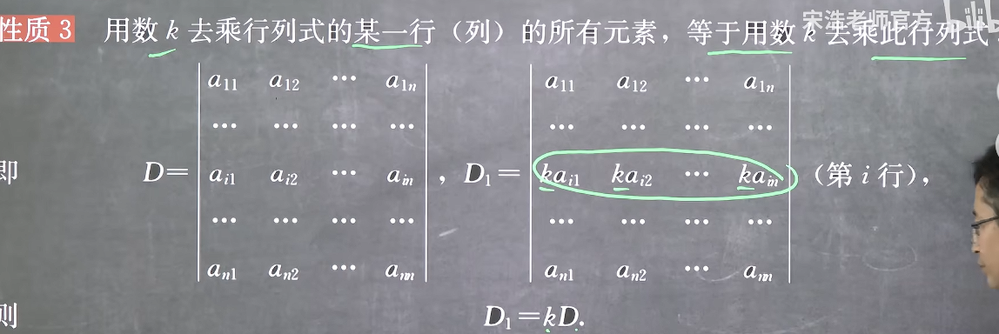
注意每次提出只对一行或一列生效，例如n行都有k为公因式提出实际为k^n^
记忆：**公因可提出，系数可乘入，每行性质独立**
+ 性质五
由性质三和性质四可知
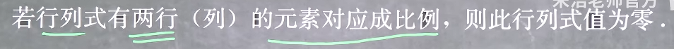
这本质上是这个行列式的共轭方程组线性相关导致无解
记忆：**行成比例值为0**
+ 性质六
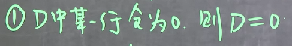
这本质上是这个行列式的共轭方程组缺少方程而导致无解
+ 性质七
可以发现性质三、性质五、性质六都可以归结为：
**若某个行列式的共轭方程组无解，那么这个行列式值为0**
因此可以发现其逆定理不成立，这是由于共轭方程组无解情况也包含这三个性质之外的情况
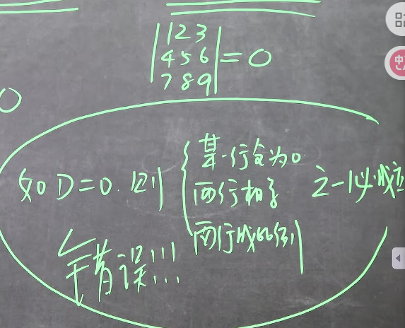
+ 性质八
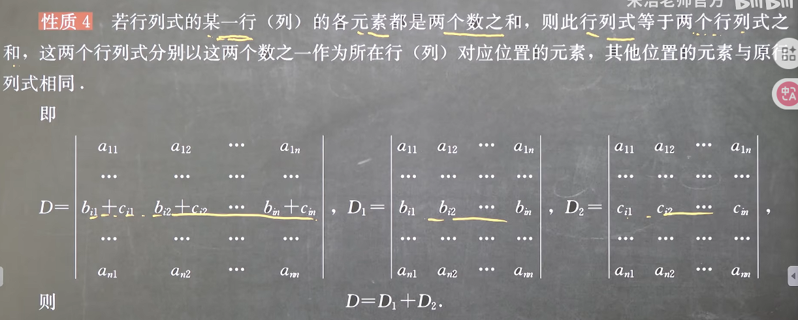
注意其余的行是保持不变，因此和性质四同理，**每行性质独立**，即若有多个需要分开的行，实际上分开的子行列式有2^n^个
记忆：**和可按行分开，仅有一行不同的行列式可按此行求和，每行性质独立**
+ 性质九
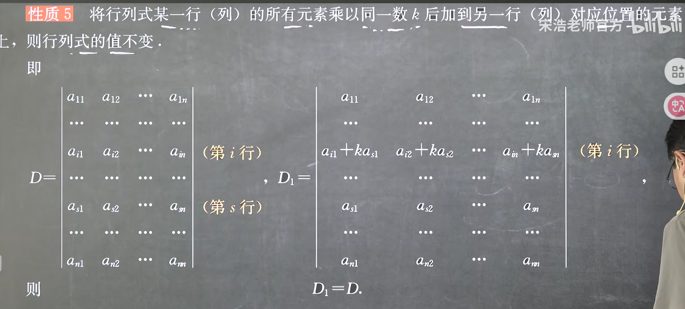
我们对于每一个行列式C都能进行如下变换C = C + 0，而0可以利用性质七换为我们需要的式子，若此式子符合性质八的逆定理，那么就有性质九，我们可以构造一个某两行成比例(k)倍的，然后将其加回原式
**这个性质在行列式形式构造中有大用处**

#### 8. 反对称行列式
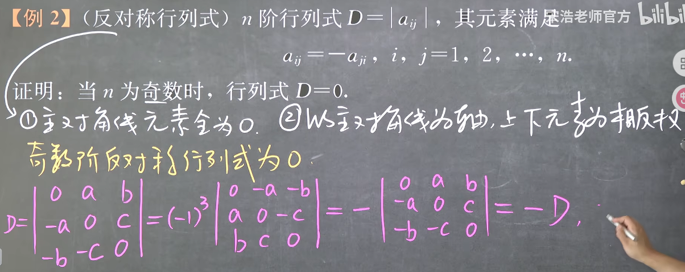

#### 9. 利用性质七解方程
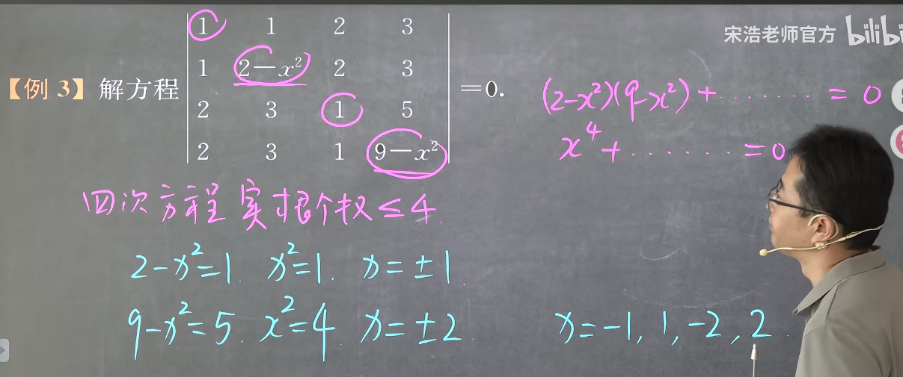

#### 10. 例题
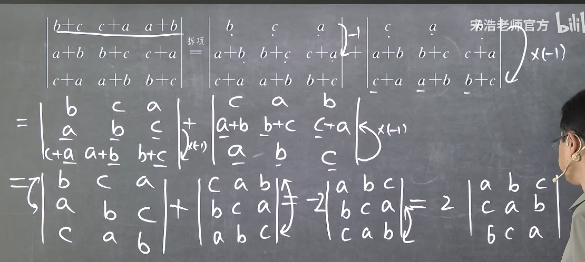
