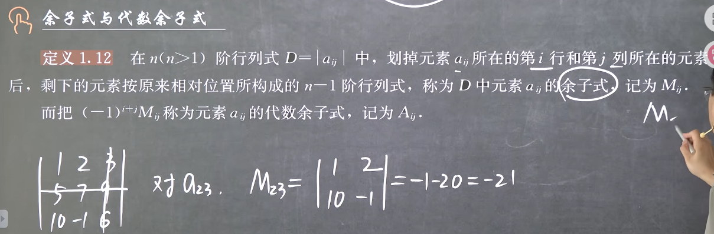
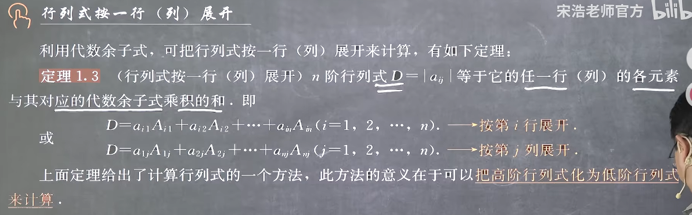
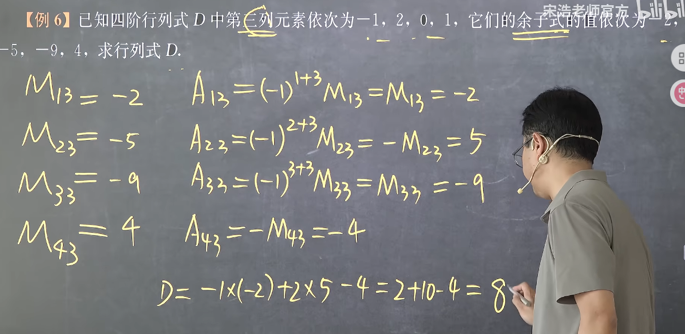
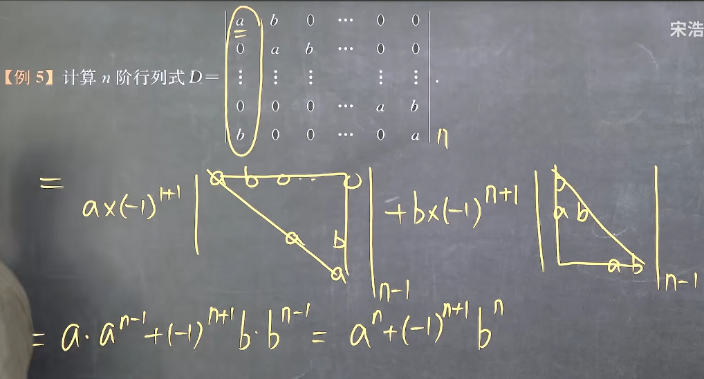
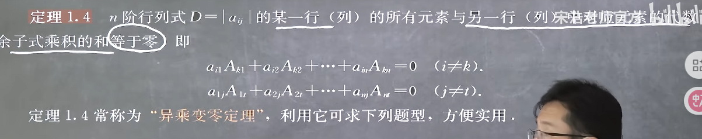
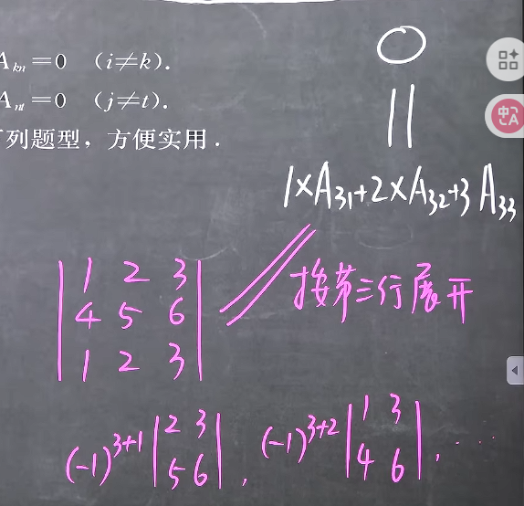
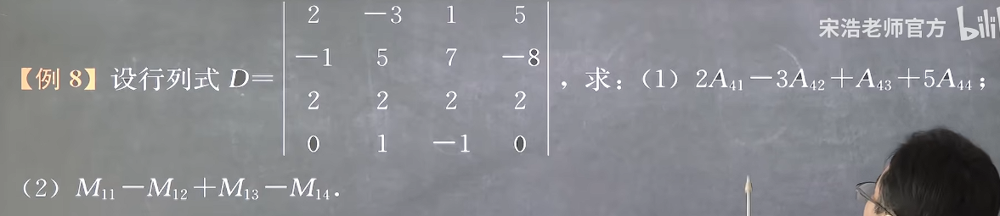
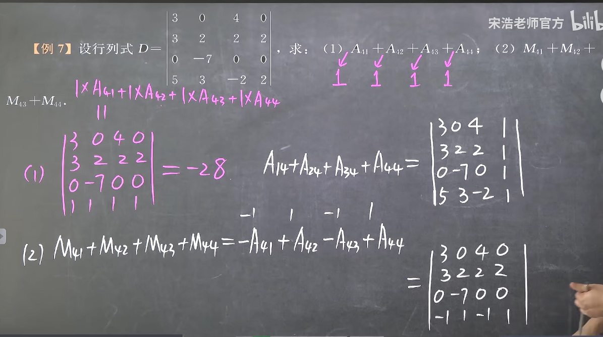

### 行列式按一行(列)展开

#### 1. 余子式与代数余子式

注意:
**1. 余子式是关于某个元素而言的**
**2. 注意代数余子式和余子式的区别**

#### 2. 行列式按一行(列)展开

这是由行列式展开的定义式得的，由于n阶行列式展开时每项都是不同行不同列(独占一个十字)元素的所有组合,因此在取定某一个元素的时候,去除所在行列后的取法可以发现是也是余下元素的所有组合情况,因此可以看作是递归算法,则n阶行列式可以看作在取定某一行(列)的所有情况后,递归为n-1阶的解法

注意:
**1. 展开的时候要注意是代数余子式**
**2. 利用上一节的行列式的性质先在一行凑出尽可能多的0**
**3. 注意展开后每项是是代数余子式与对应元素的乘积,对应元素不要丢了**

**总之记住展开项有3部分:代数、元素、余子式**

#### 3. 递进的行列式，使用展开化为上下三角行列式

#### 4. 行列式按一行(列)展开性质
**根本原理：由于代数余子式本身只和对应元素的位置有关，而与元素本身无关，元素本身只决定展开式中代数余子式所乘系数是什么**

**1. 异乘变零定理**

**注意这里是代数余子式**
其原理是，由于代数余子式本身只和对应元素的位置有关，而与元素本身无关，元素本身只决定展开式中代数余子式所乘系数是什么，因此若代数余子式与其他行的元素作乘累加，那么此运算的结果等价于某个构造行列式满足这两行相等的行列式的结果

简单地说就是"异乘"的过程必然可以由一个两行相等的行列式描述因此结果必然为0
例如：

两个结构都为0

**2. 余子式/代数余子式以任意系数的和**
由异乘变零定理的启发，若要求余子式/代数余子式以任意系数的和，我们只要构造对应的系数的行列式即可

任意发现异乘变零定理就是此定理的特例，当构造的系数恰好已经是某行的系数的时候就得0了

注意：
**1. 我们构造行列式是由于此行列式的结果恰好为所求，与原行列式结果无关**
**2. 在求余子式任意系数的和的时候要注意把相关代数考虑进去，最稳妥的做法是将余子式任意系数的和先转化为代数余子式任意系数的和再进行构造**

例如
