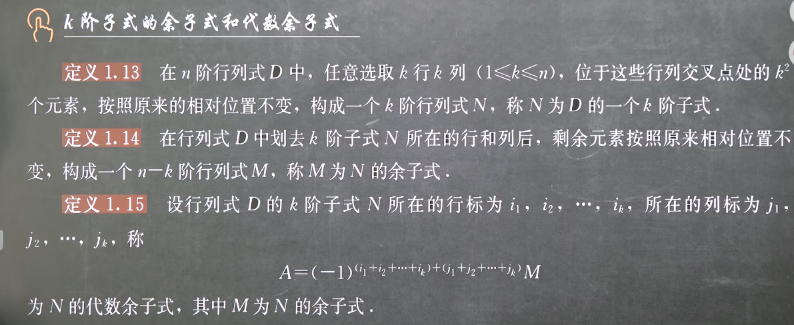
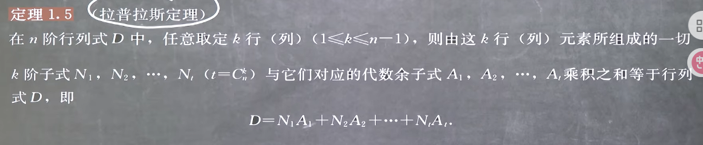
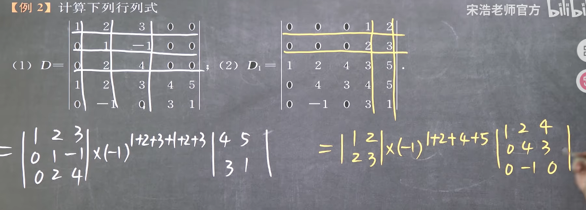
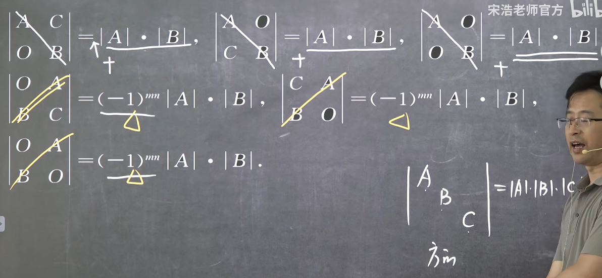

### 行列式按多行(列)展开

#### k阶子式的余子式和代数余子式

#### 拉普拉斯定理

可见上一节的按一行/列展开是拉普拉斯定理的特例，这其实也是行列式取不同行不同列的乘累加的本质

例题

可见：
**1. 有0的块的时候用**
**2. 取了k行就要取k列，因为要构成的是k阶子式**

#### 拉普拉斯定理的推论

需要注意的是，由于结果是展开为两个行列式，而行列式必须是方的，因此A与B必须是方的，即O与C的转置的矩阵规格必须一致