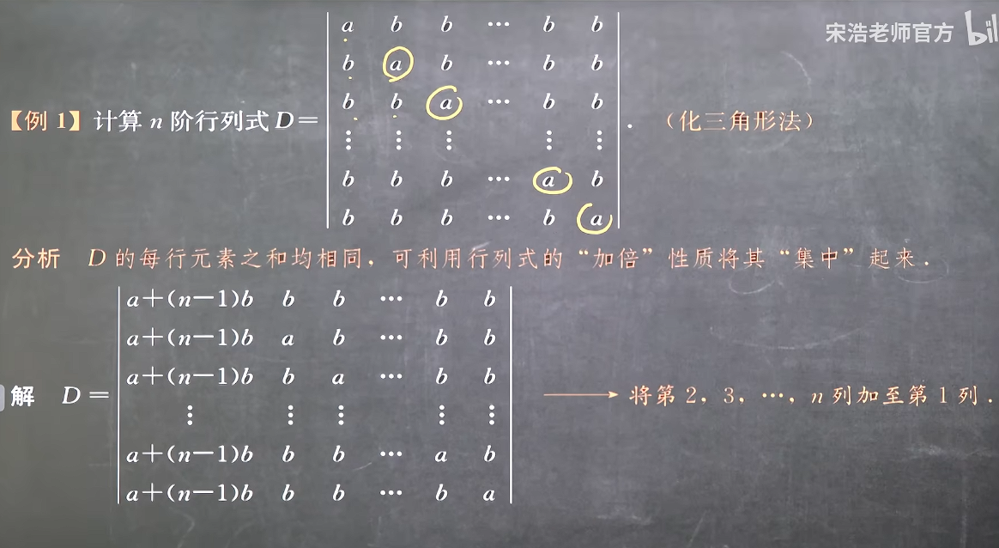
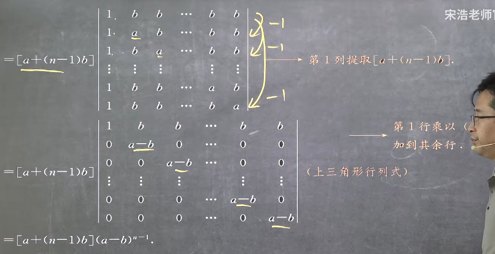
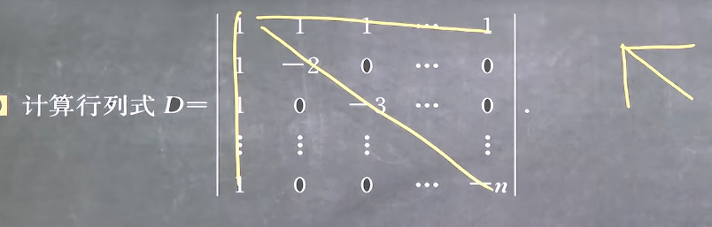
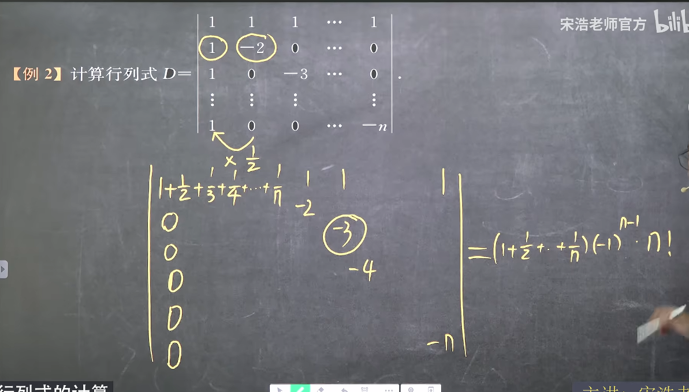
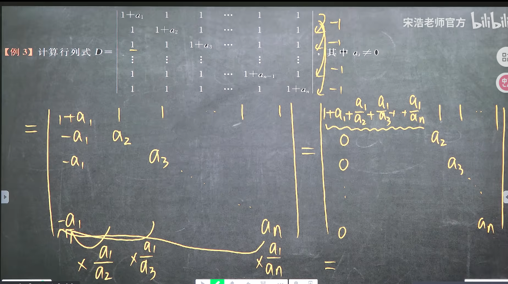
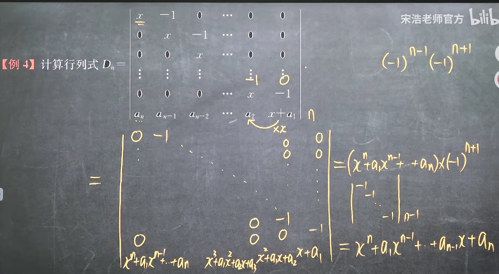
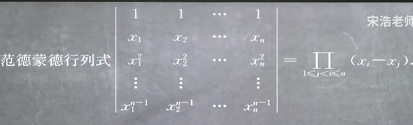
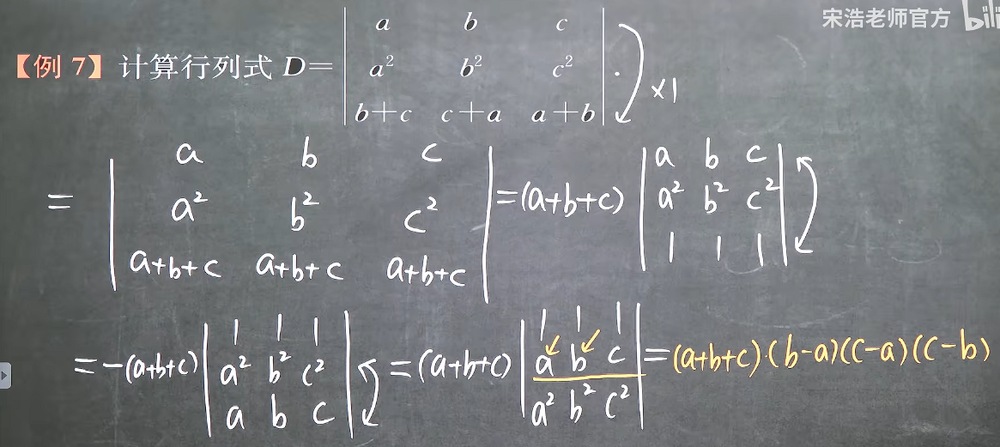
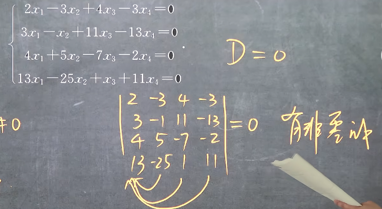

### 1.7 行列式的计算

#### 1. 直接利用定义式展开计算

#### 2. 利用上三角行列式计算
配合行列式的性质

#### 3. 利用按行按列展开定理计算行列式
配合行列式的性质

#### 4. 行列定和行列式

其特征其实是行(列)的和是相等的

#### 5. 爪型行列式

其特征是可以依次用每一列去将第一列消为0，从而构造出上三角行列式

形如下图中只有主对角线不同的行列式也可以转化为爪型行列式

#### 6. 流水线行列式

#### 7. 范德蒙德行列式

即所有右减左的所有可能的差的连乘
可以用由右至左依次抵住一次项行进行列写

注意：
**一定要注意范德蒙德行列式的形式必须是由0次方开始而不是1次方，而且中间必须连续，不能中断**
**有的行列式可以通过变换得到范德蒙德行列式**
**按照列写的可以用转置**

例题

这里在换行公式

#### 8. 拉普拉斯定理
使用拉普拉斯定理或者其推论

#### 9. 利用行列式的性质直接判断为0
例如
行列和为定值则可以构造出相同的行列或者纯0
