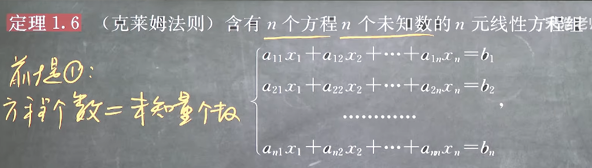
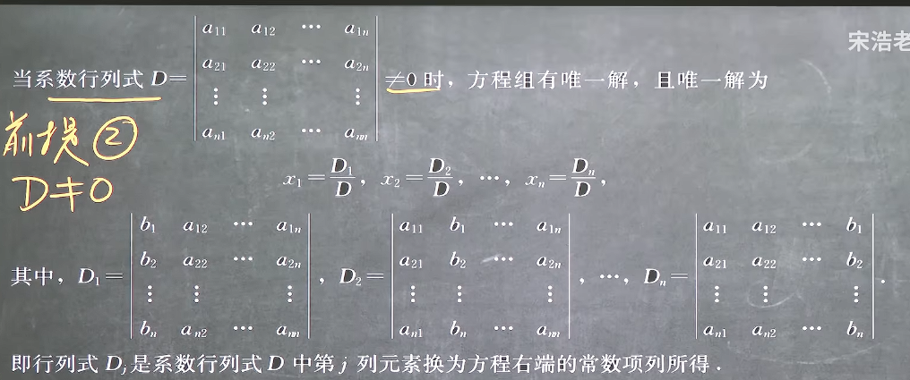
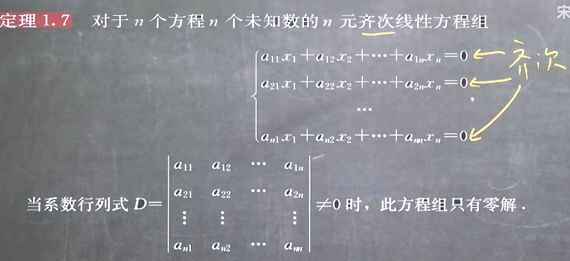
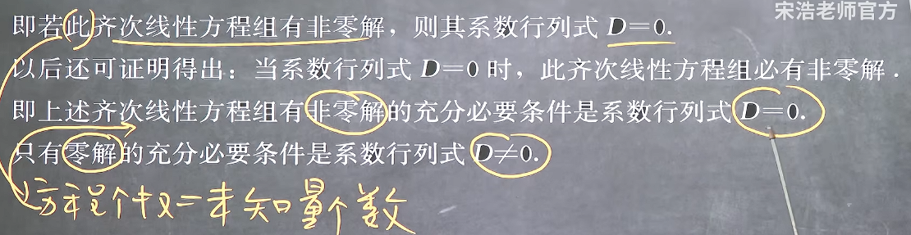

### 1.8 克莱姆法则

#### 克莱姆法则

**注意当D不为0时是指有唯一解**
**但是要注意当系数行列式为0时，不一定无解，下面就有例子**

**注意！！！克莱姆法则解决的是线性方程组，非线性的不可以使用克莱姆法则**

#### 齐次线性方程组

这是由于直接使用克莱姆法则的时候可以发现每个解都有一列全为0

**但是我们可以知道若D=0，那么0/0为不定项，不一定无解，实际上有以下结论**

可以记为
**齐次线性方程组，非零零，零非零**