### 初等矩阵

#### 1. 初等矩阵定义
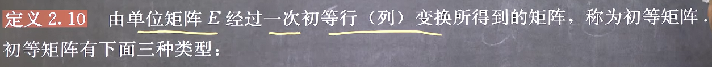
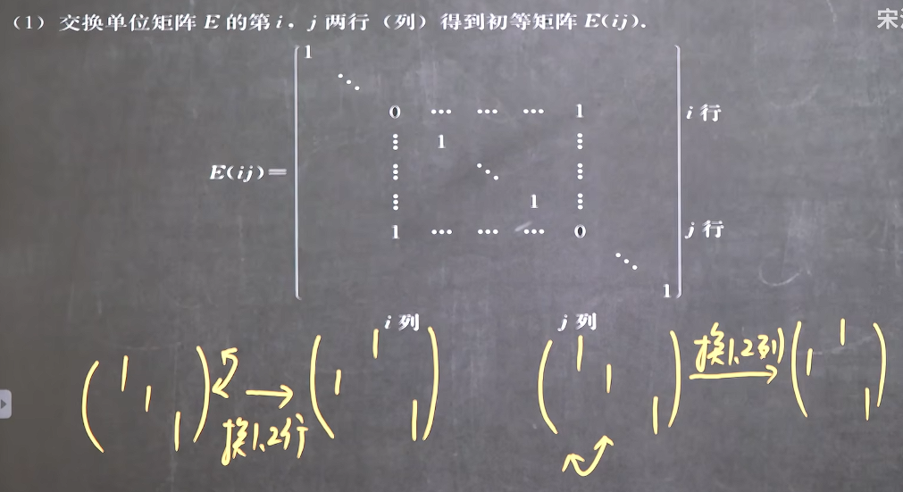
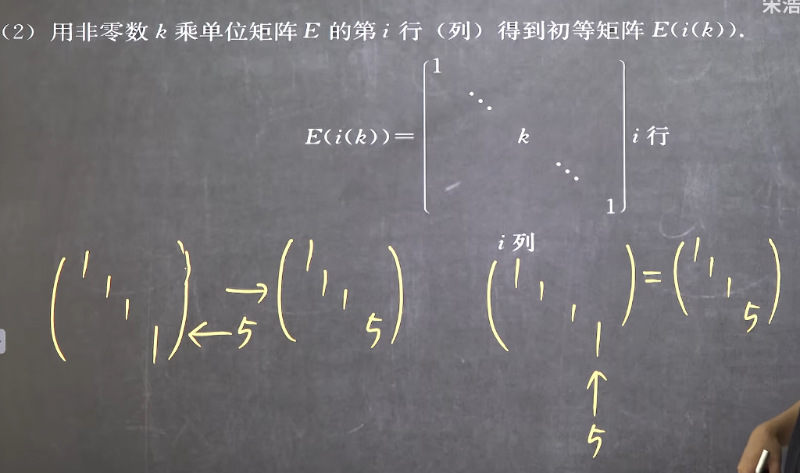
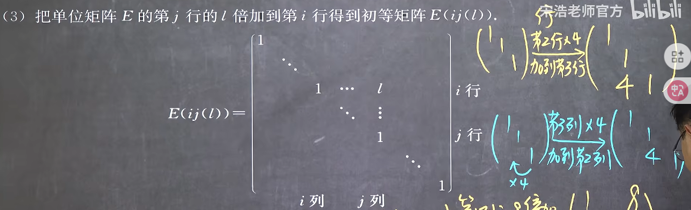

#### 2. 初等矩阵的性质
1. **初等矩阵的行列式都不为0**
这说明，初等矩阵均可逆

2. **初等矩阵的转置矩阵是同种类型的初等矩阵**
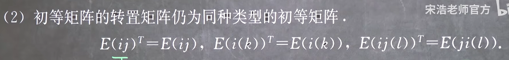

3. **初等矩阵的逆矩阵是同种类型的初等矩阵**
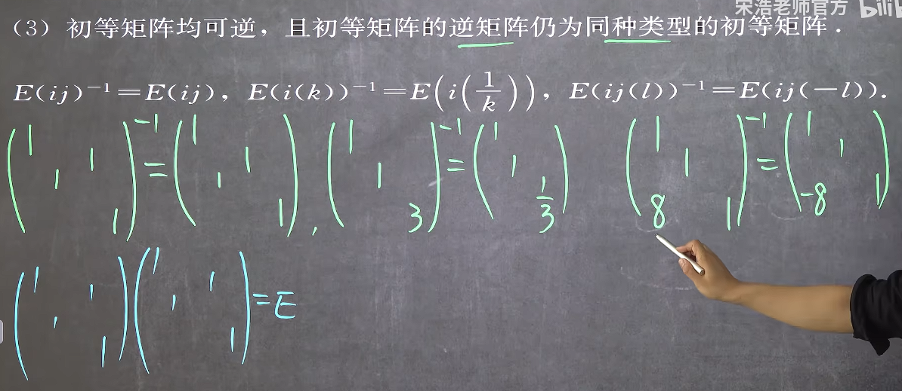

#### 3. 初等矩阵和初等变换的关系
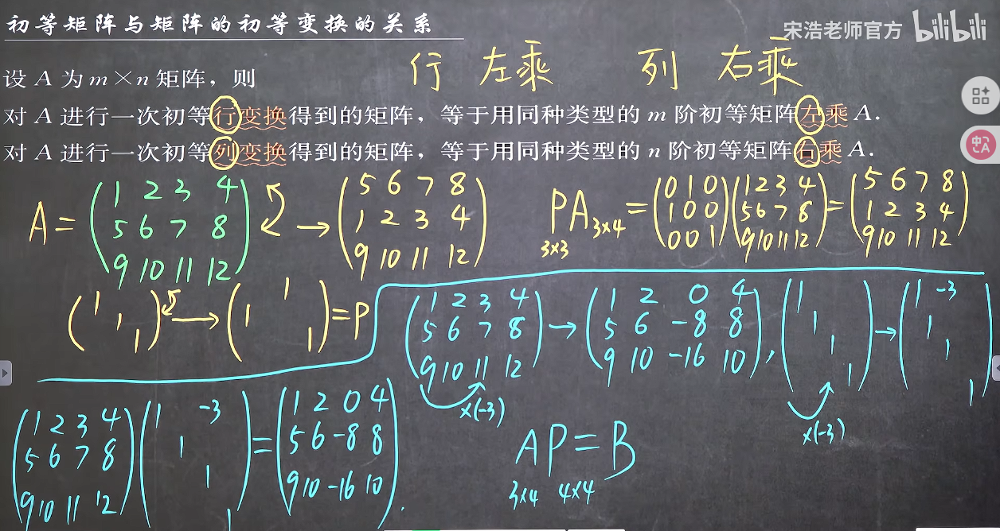

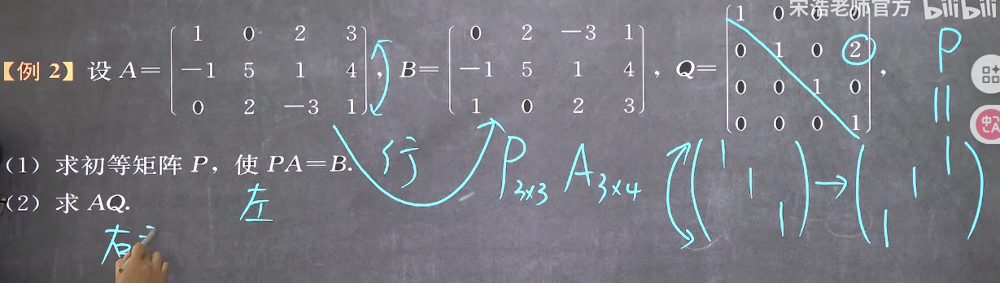
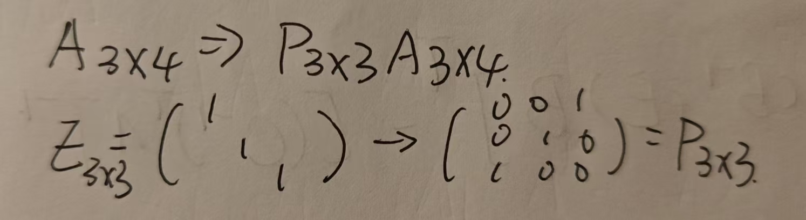
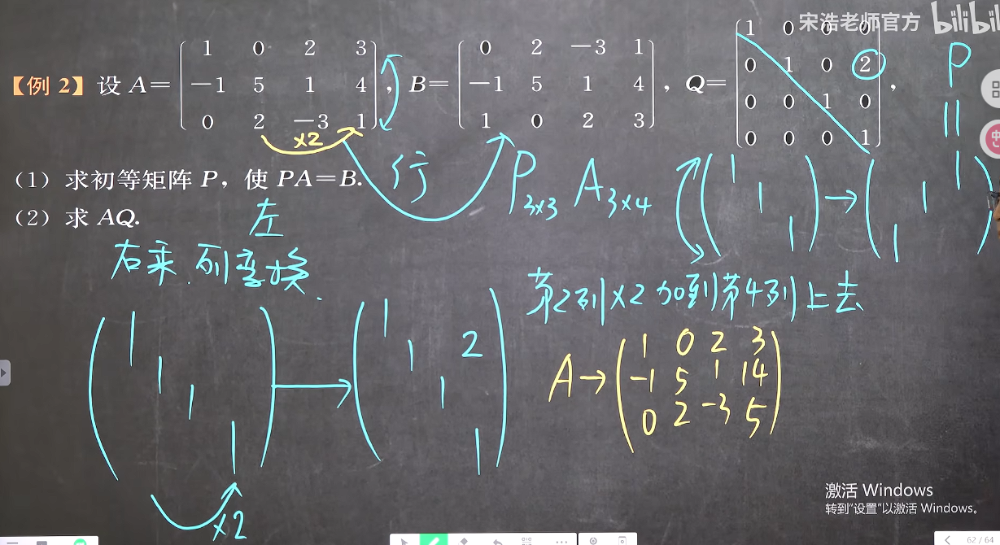

**在同时进行多次行变换或者列变换时，初等矩阵乘在同一边，可以通过结合律进行合并，但是为了准确起见，建议还是用初等矩阵推**
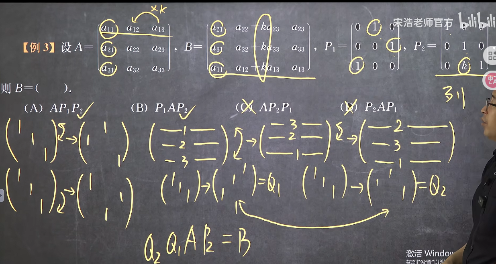