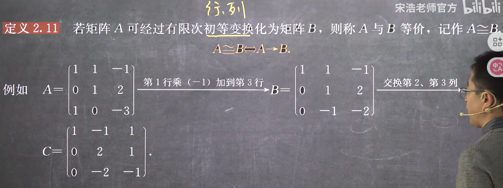
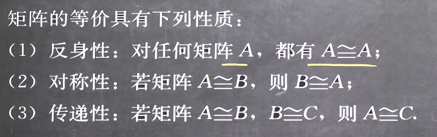
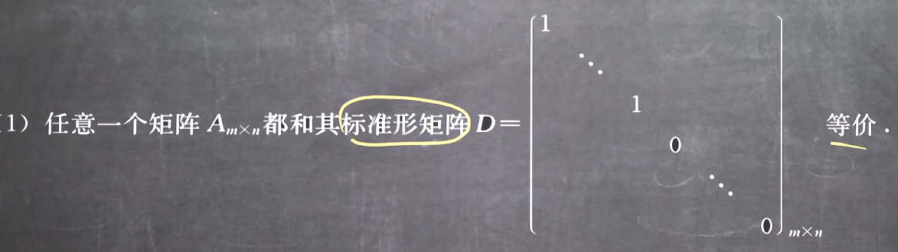
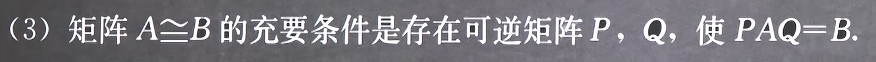
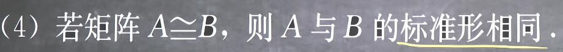
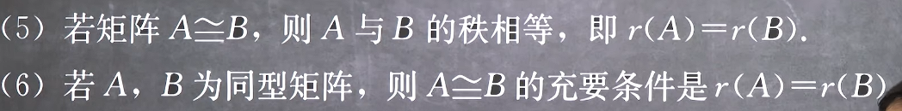
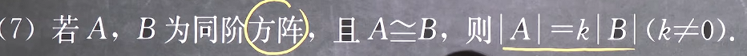
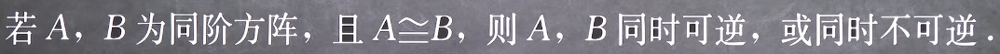
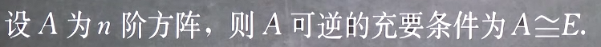

### 矩阵的等价

#### 1. 矩阵等价的定义

+ 显然等价的两个矩阵是同型矩阵
+ 注意矩阵等价不是矩阵相等

#### 2. 矩阵等价的性质

#### 3. 矩阵等价的推论
1. 和标准型矩阵的关系

因为任何矩阵都可以通过初等变换化成标准型，因为初等变换就是一个不断提出系数的过程，如果矩阵矩阵可逆，那么其行列式必然可以分解为k|E|=k的形式，否则为一个一般标准型

2. 和初等矩阵的关系

因为初等矩阵左右乘和初等变化是等价的

3. 和可逆阵乘法的关系

因为一系列初等矩阵可以通过结合律合并，又初等矩阵一定是可逆的，因此这个合并矩阵也一定是可逆的

4. 两个等价矩阵的标准型

通过等价的传递性和标准型的唯一性可得，其实就是秩相同

5. 与秩的关系

这也意味着，矩阵同型和秩相等就是绝对相关的

6. 与行列式的关系

这是由于初等变换在行列式的观点来看，只会影响外面的系数，即最后结果的倍数

7. 与可逆性的关系

因为其秩相等，则必然同时满秩或同时降秩

8. 与单位矩阵的关系

由推论1 可得任意一个矩阵和其标准型是等价的，又由推论7 可得二者的可逆性是相互传递的，所以如果原矩阵可逆，那么其标准型也可逆，那么其标准型一定是方阵且主对角线都为1，即单位矩阵E，或者说可逆一定满秩，而对应矩阵是满秩的同型矩阵，因此一定等价，等价意味着可以由初等变换得到，其实就是矩阵和其标准型的关系和秩相等的关系

9. 与初等矩阵的乘积的关系
由8得，若原矩阵可逆（满秩），那么其一定可以通过初等变换得到单位矩阵（和单位矩阵等价），那么其一定可以通过一个单位矩阵的初等逆变换得到原矩阵，由于和单位矩阵的积等价于原式，所以如果原矩阵可逆，那么其一定可以表示为一系列初等矩阵的乘积