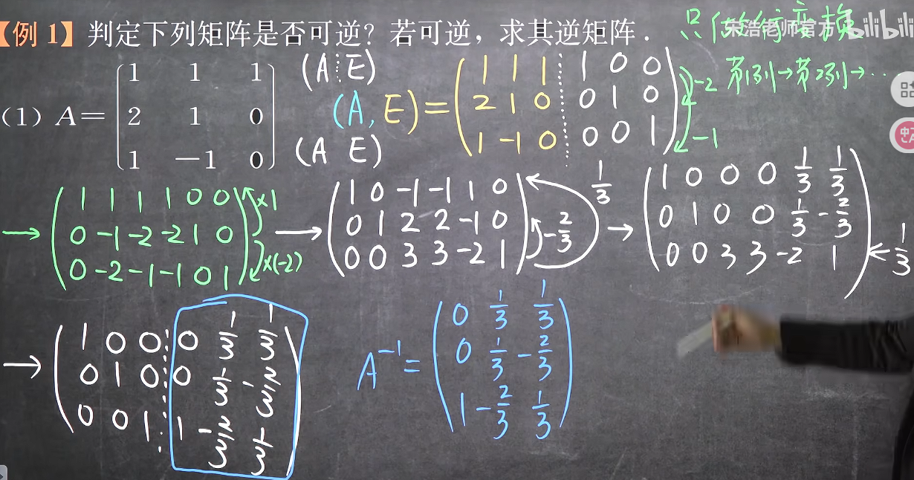
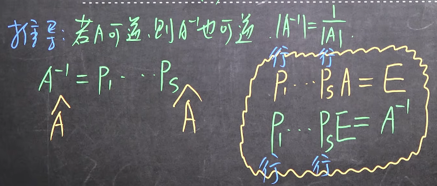
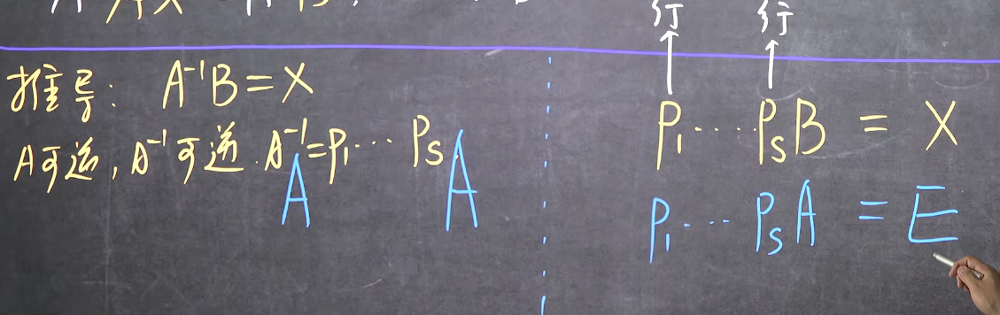
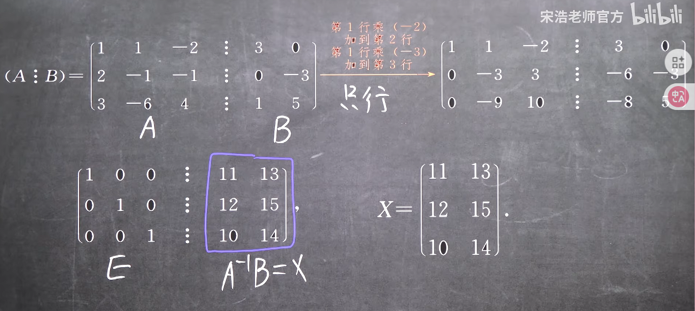
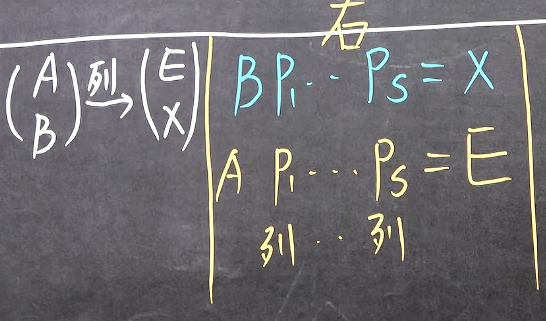

### 初等行变换法求逆矩阵

#### 1. 初等行变换法求逆矩阵求解方法

1. **补充和行数相等的单位矩阵**
2. **只作初等行变换！！！**
3. **当原矩阵变成单位矩阵的时候，补充矩阵就是其原矩阵的逆矩阵**

若无法化为单位矩阵，那么就说明其不可逆（发现行列式为0）

***
进行行变换的时候遵循以下原则
1. **一列一列构成单位矩阵**
2. **每一列构成后，对应行就不能被再使用，因为其对应行不是0！！！即上面的行只能被变换，不能再主动参与运算了**

推导==

#### 2. 初等行变换法求A^-1^B

推导==

但是这个方法只能对AX=B的情况适用，因此具有很大局限性，因为如果是XA=B时，就变成求解BA^-1^了，那么就变成了右乘，就是**初等列变换**了，而不是初等行变换，求解方法变成了：
