### 分块矩阵

#### 1. 定义
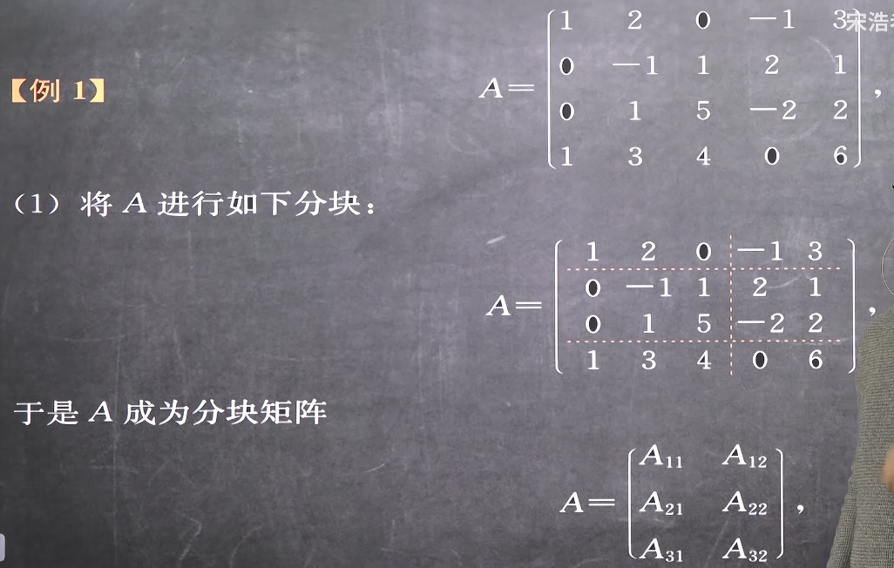
如果分块出来刚刚好是零矩阵就用O命名，刚好是单位矩阵就用E命名
注意：要从头直直切到尾，不能中间停下，也不能中间拐弯

#### 2. 行向量组和列向量组
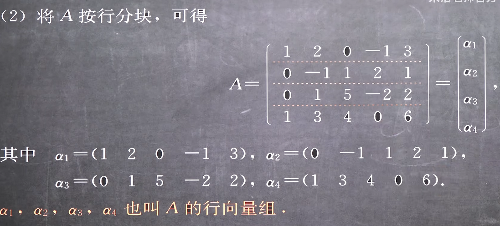
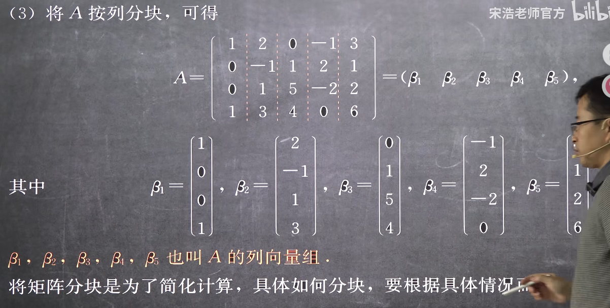

显然行向量组是列向量，列向量组是行向量

#### 3. 特殊的分块矩阵
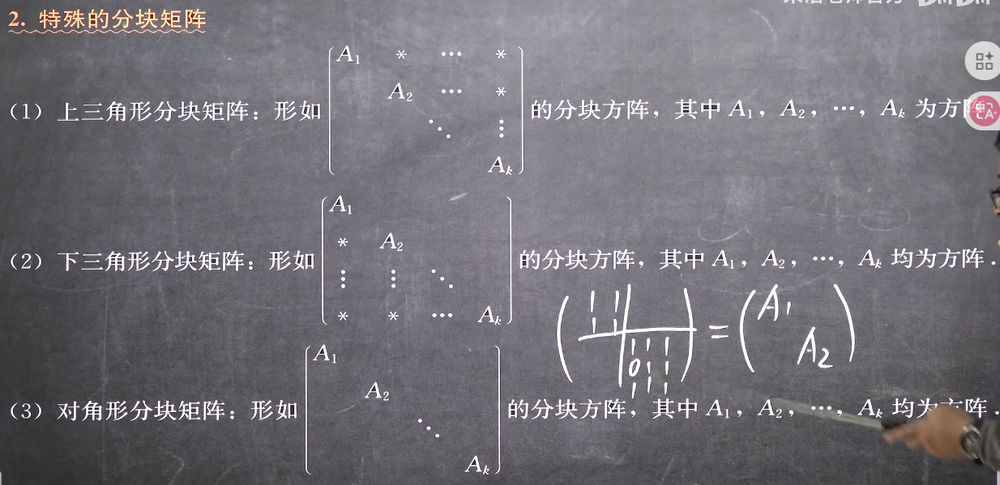
对角形矩阵其实是同时是上三角和下三角的矩阵

#### 4. 分块矩阵做加减法于数乘
> 减法和数乘其实都是加法的一种

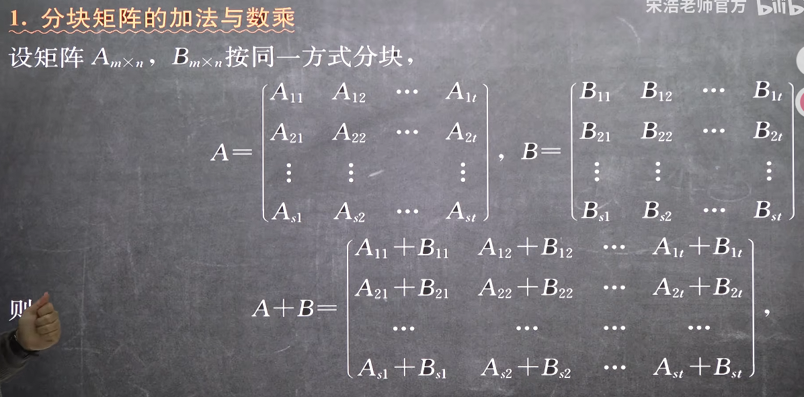

**注意只有用同一分块方法的矩阵才能进行加法运算**

#### 5. 分块矩阵做乘法
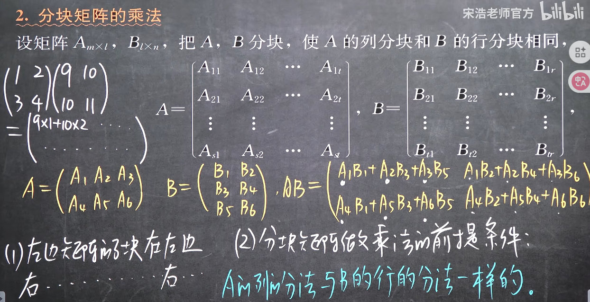
**注意一下子块的左右乘和原式的左右乘都一致,且每一个子块的乘法都要有意义即可**
至于什么叫列分法和行分法一致,就是左矩阵的竖线转置后和B矩阵的横线一致
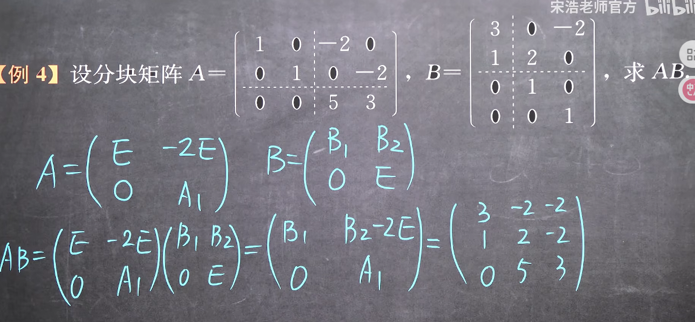
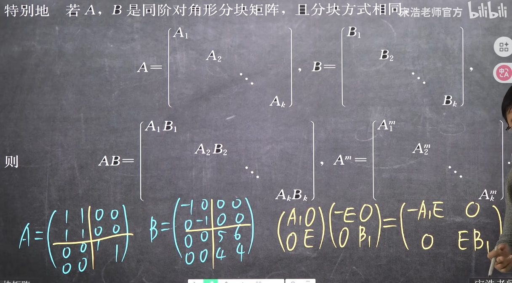

#### 5. 分块矩阵的转置
两步
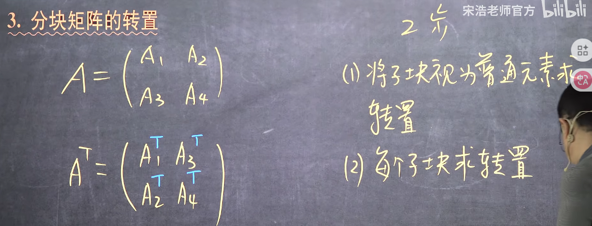

#### 6. 分块矩阵的逆矩阵
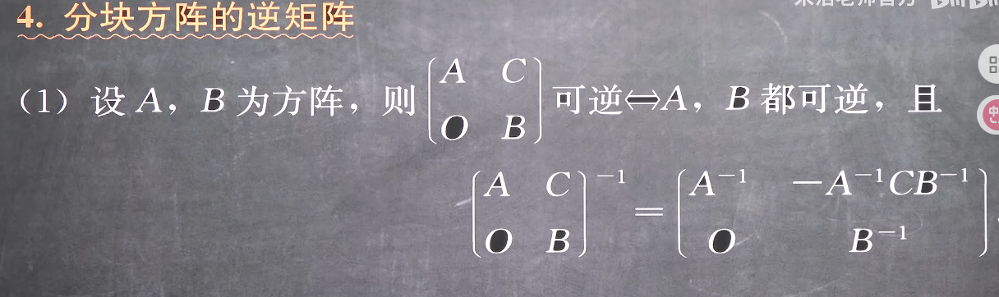
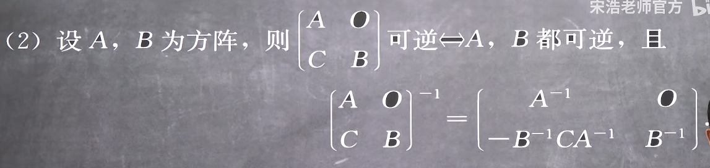
上面这两个太麻烦,几乎不用
***
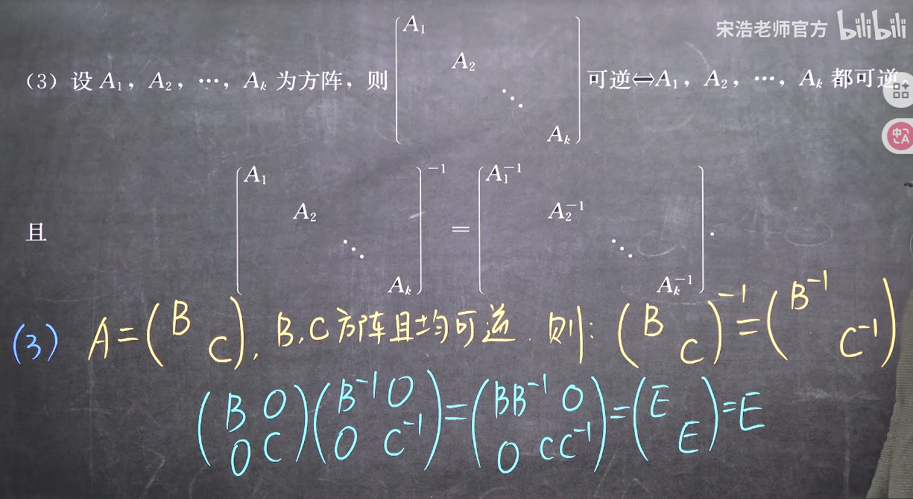
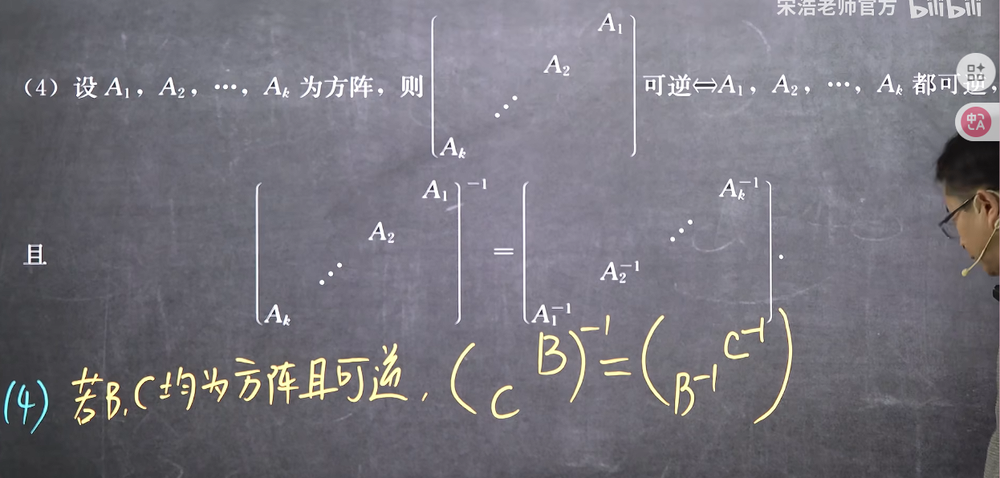
副对角线的注意要颠倒

不过注意这里分块矩阵都需要是方阵且可逆

例如
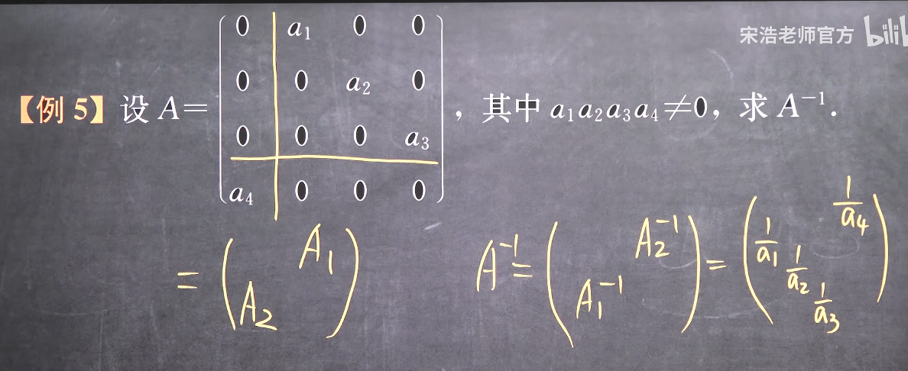

#### 7. 分块矩阵的行列式
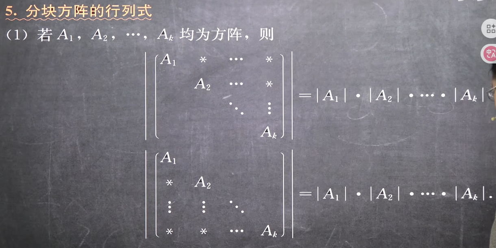
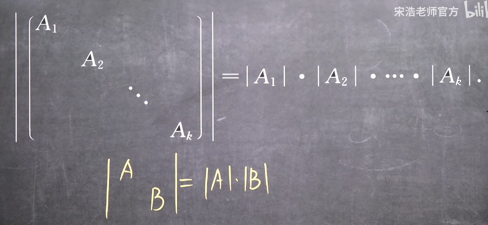
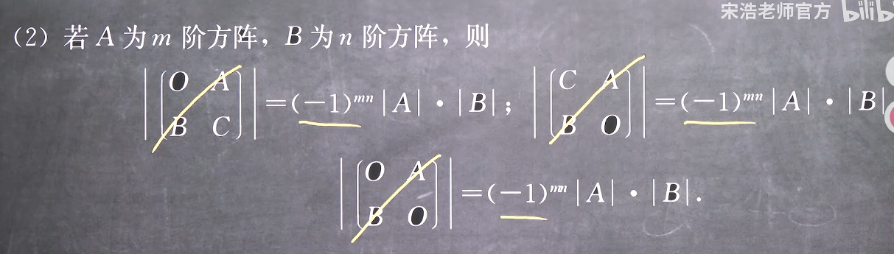
其实就是拉普拉斯变换

