### 矩阵的秩

#### 1. 矩阵的子式
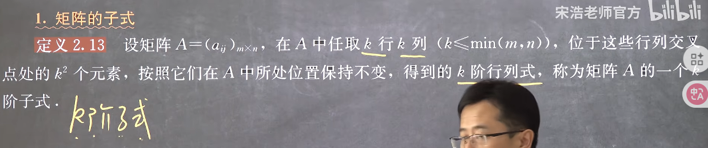

#### 2. 矩阵的秩
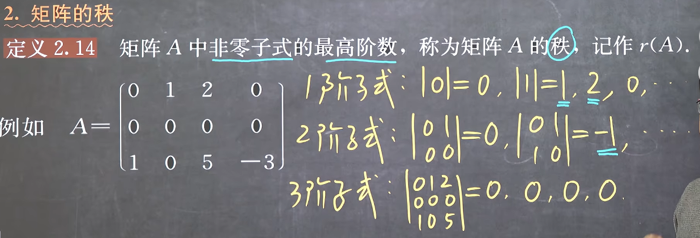
注意：
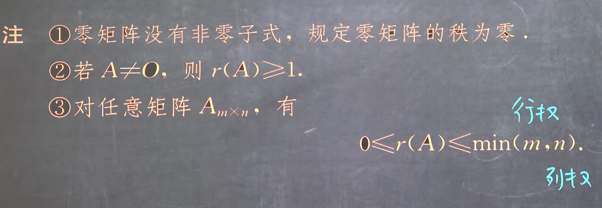

#### 3. 满秩矩阵和降秩矩阵
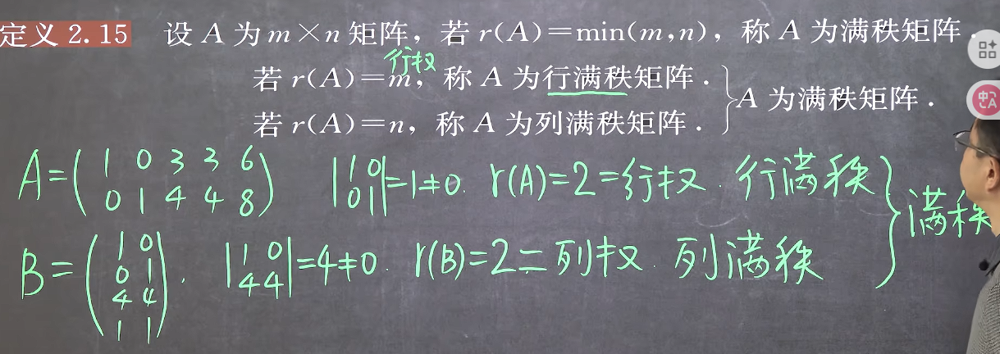
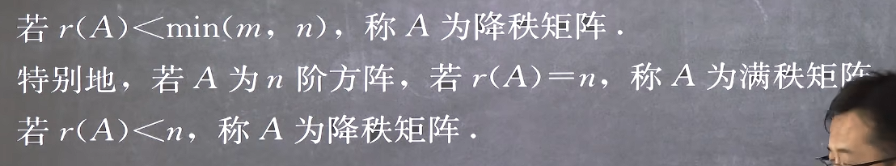

若为方阵则还有以下特征
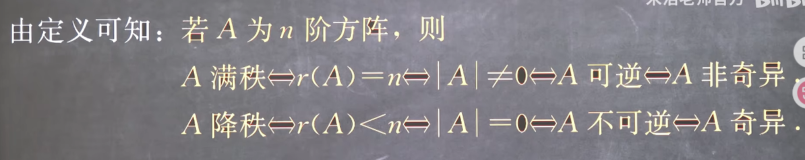
并且这里是充要条件，也就是说如果仅仅是判断满秩还是降秩，**而不关心秩的具体大小时，只需判断是否可逆即可**

#### 4. 矩阵秩的性质
1. 性质1:矩阵子式0的个数
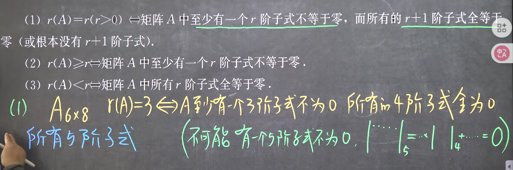
(2)和(3)其实就是具体秩为什么不确定的情况,是(1)的上位概念

2. 性质2:矩阵运算变换后的秩

**这里直接联想为对其标准型的同一变换是否会改变秩的大小即可**
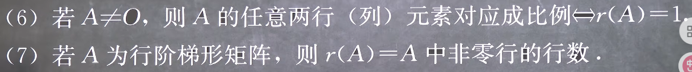
(6)由于任意的两行(列)都是成比例的,那么无论你以什么方式和多少阶的子式,只要不是1阶,就必然有行列式为,因此在A≠O的时候(一阶子式总能找到一个非零值)必然有r(A)=1

(7)是由于只要再多取1行就爆了,因此秩必然就是行数,不用管列数,因为阶梯型矩阵每步阶梯只能下降1个元素,已经是算好的了

3. 性质3:矩阵初等变换后的秩
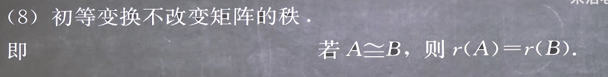
这也是为什么可以用其标准型或者阶梯型判断

但是显然，两个八竿子打不着的矩阵也可以等秩，因此反之不成立，需要补充条件，若矩阵是同型的，则有充要条件
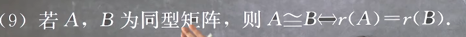

4. 性质4:标准型矩阵的秩
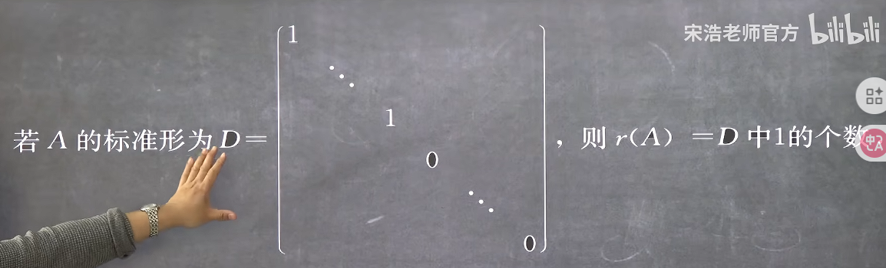

5. 加减法的秩
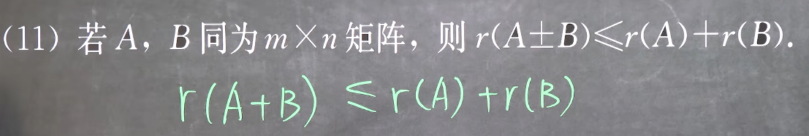
这里直接记忆，类似于向量的绝对值

6. 乘法的秩
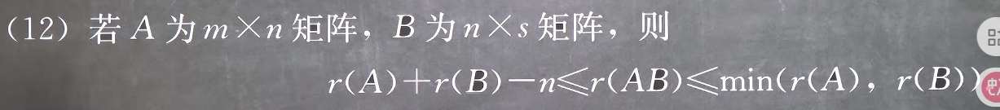
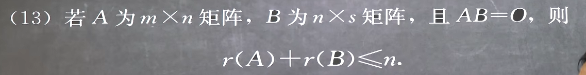
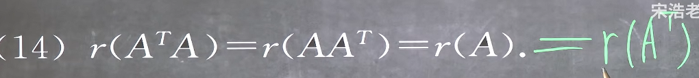
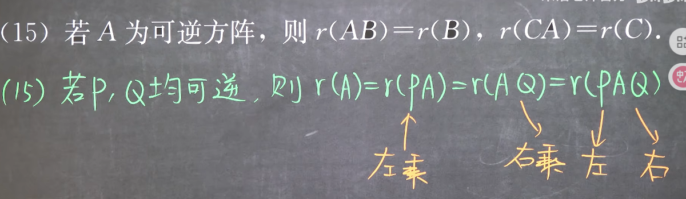

7. 伴随矩阵的秩

#### 5. 例题
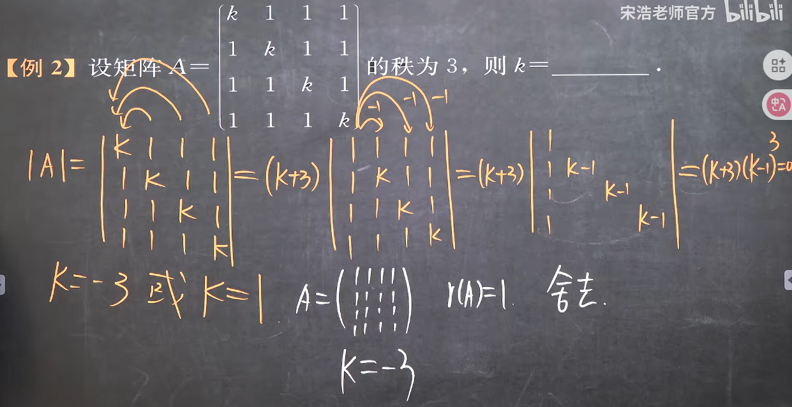
**这里要检验解情况是否秩为3是因为秩为3可以推出4阶子式为0，但是4阶子式为0及其推论只能说明秩<=3**

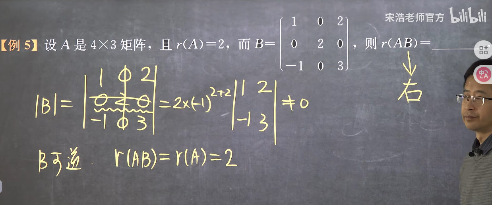
可以用可逆性判断，也可以用不等式

#### 6. 矩阵的秩的求法
1. **定义法**
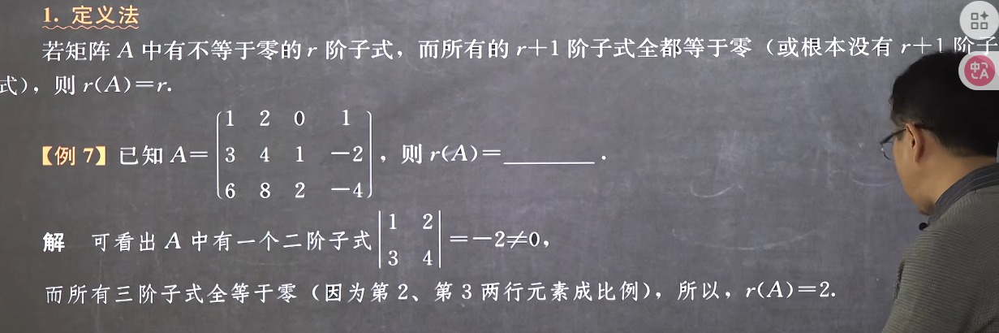

2. **初等变换法**

3. **行列式法（判断满秩法）**
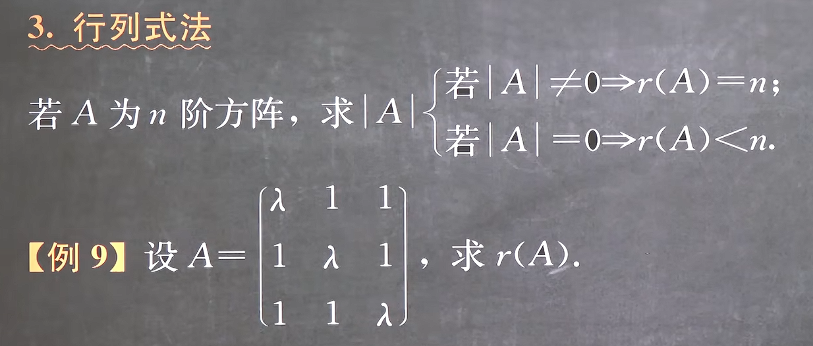
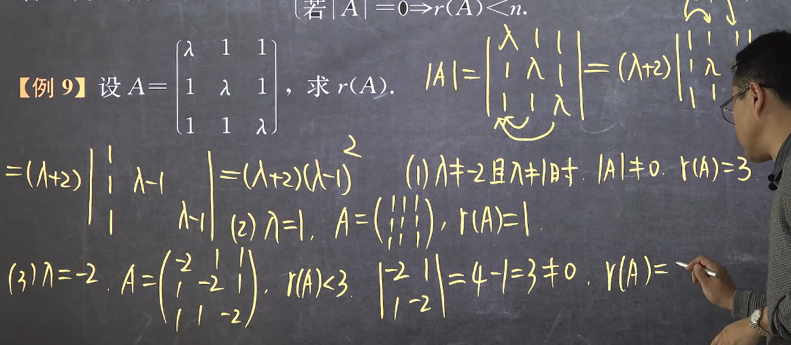
这种方法适用于要分类讨论且行列式结果是一个多因式的情况，因为这可以将任意的情况缩小为只对因式的零点的情况进行判断