### 矩阵

#### 1. 矩阵的概念
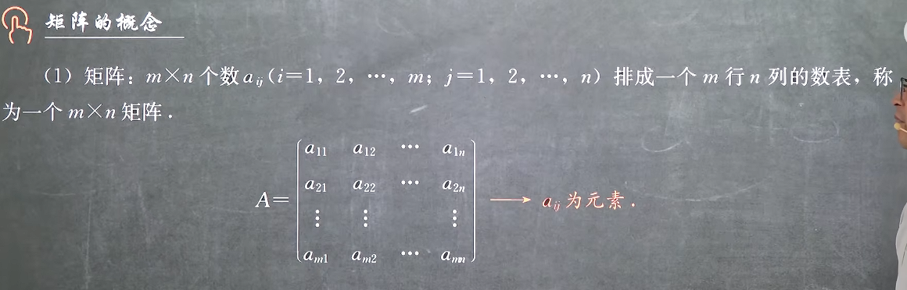
可见矩阵只是一个数表，其不是一种运算，类似于数列或者向量，其为一个有序整体，不是一个值，和方程组无关

#### 2. 行列式和矩阵的对比
||行列式|矩阵|
|:--|:--|:--|
|本质|数|数表|
|形状|一定是方的|不一定是方的|
|符号|\|*\|、D|(\*)或者[\*]、ABC|

#### 3. 同型矩阵
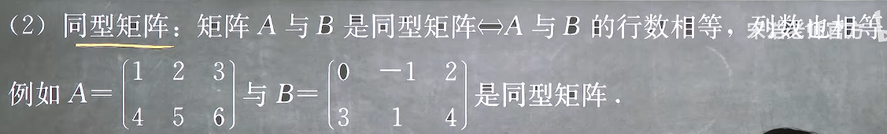

#### 4. 矩阵相等
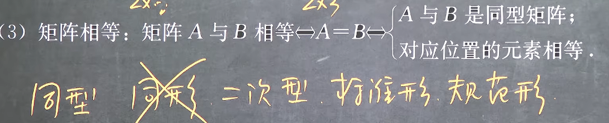

#### 5. 几类特殊的矩阵

1. **方矩**
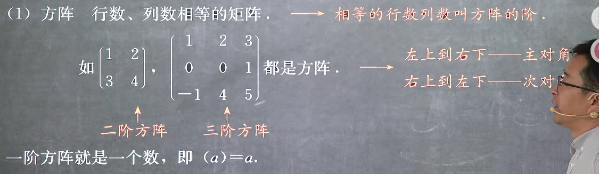

2. **列向量与行向量**
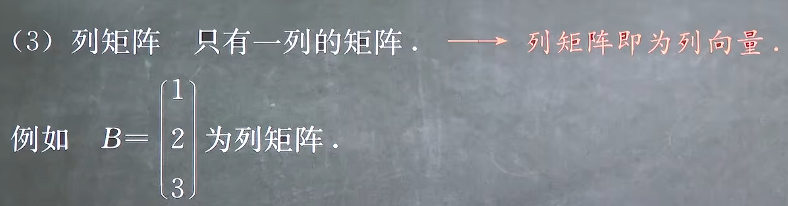
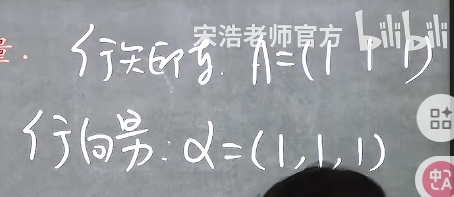
硬要说区别就是行向量加逗号，行矩阵不加
显然方阵的转置和自身相等，反之也成立

3. **零矩阵**
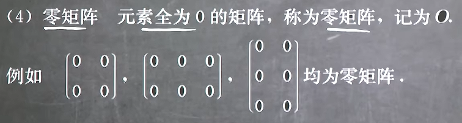
注意矩阵不是一个值，它本身不包含运算，任意两个零矩阵就不一定相等，矩阵相等是一个非常严格的定义，其必须满足序列，和形状上的相等

4. **负矩阵**
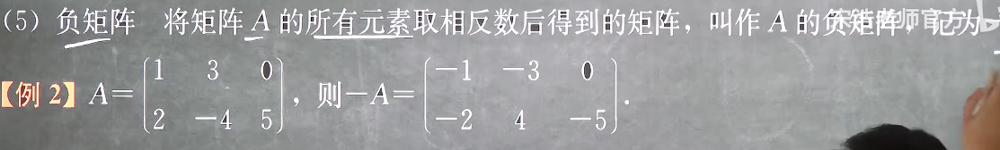

5. **三角形矩阵**
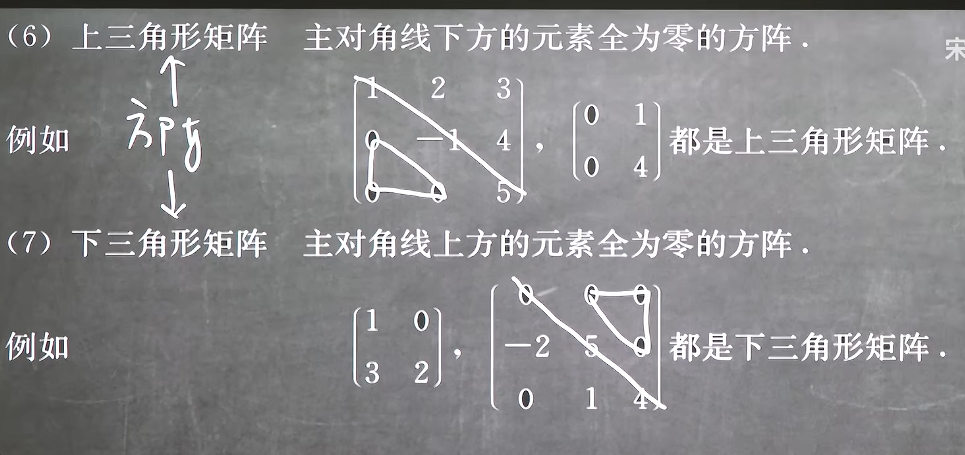
**显然！三角形矩阵必然是方阵**

6. **对角型矩阵**
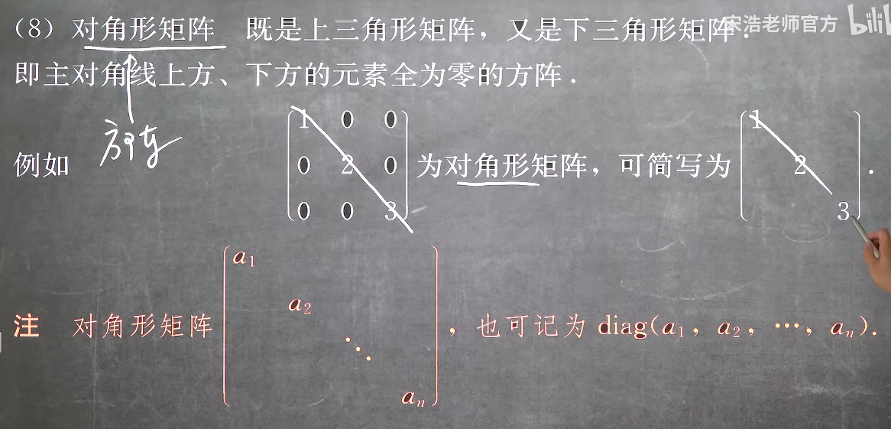
**显然！对角形矩阵必然是方阵**

7. **数量矩阵**
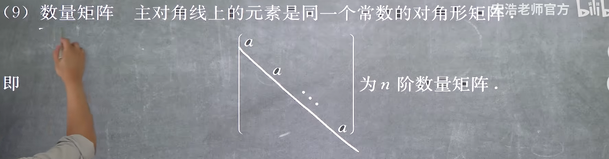
**显然！数量矩阵必然是方阵**
**显然！数量矩阵必然是对角型阵**

8. **单位矩阵**
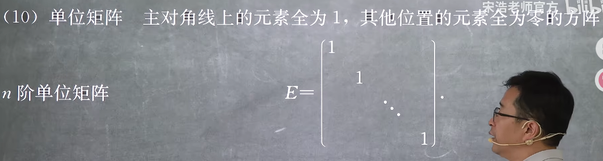
**显然！单位矩阵必然是方阵**
**显然！单位矩阵必然是对角型阵**
**显然！单位矩阵必然是数量矩阵**