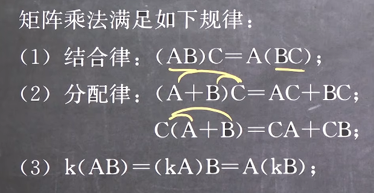
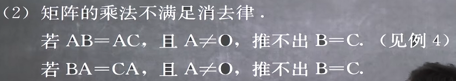
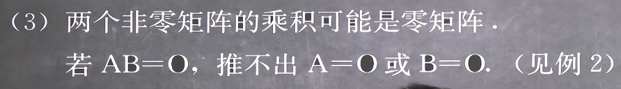
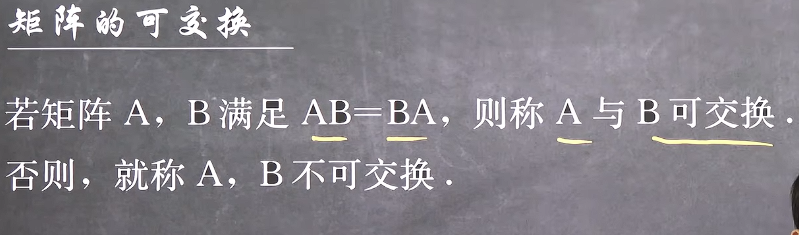
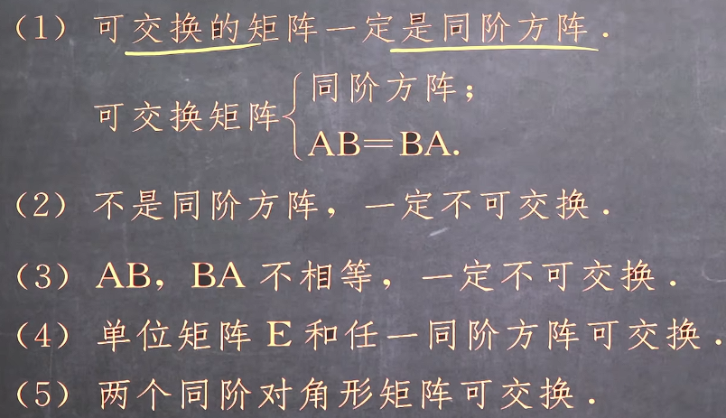

### 矩阵的乘法

#### 1. 定义
可以理解为
+ **左矩阵的第i行向量**与**右矩阵的每一列向量**进行点乘得到**第i行向量**
==或者==
+ **左矩阵的每一行向量**与**右矩阵的第j列向量**进行点乘得到**第j列向量**

可见：如果两个矩阵可以相乘，那么有
1. 左矩阵的行向量和右边矩阵的列向量的维度必须相等
2. 得到的结果矩阵的大小为i*j

可以记忆为
若矩阵**A**~i*j~与矩阵**B**~m*n~可以相乘,那么有
+ j = m
+ 结果矩阵为**C**~i*n~

#### 2. 左乘和右乘
+ 两个矩阵的左乘和右乘不一定相等
+ 两个矩阵的可以左乘(右乘)不一定可以右乘(左乘)
即**矩阵的乘法不满足交换律**

由此可以知道,虽然矩阵乘法满足分配律,但是也要注意**左乘和右乘是不同的运算**
+ BA + CA = (B + C)A ≠ A(B + C)
+ AB + CA ≠ A(B + C)
可以记忆为**左乘和右乘是不同的运算**

只有

#### 3. 矩阵乘法不满足的规律
1. 不满足交换率 

2. 不满足消去率

3. 每次点积的结果可能都为0

#### 4. 与单位矩阵的乘积
由于单位矩阵的特点是无论在i行还是i列都只在i索引有非零值(主对角线),由此无论是左乘还是右乘,都会筛选出索此索引的值
例如左乘单位矩阵时,第一列负责取得左矩阵每一行的的首元素置于第一列
即
AE = A
EA = A
**但是要注意! 此二式中两个E不一定是同一个单位矩阵,因A不一定是方阵**
**但是E一定是方阵因为E是对角矩阵的一种**

**同理,数量矩阵和对角矩阵有着类似的结果**

#### 5. 两个对角矩阵的乘积
由第4点可以推得,两个对角型矩阵的乘积必有

#### 6. 矩阵的可交换

如果两个矩阵可交换,有

