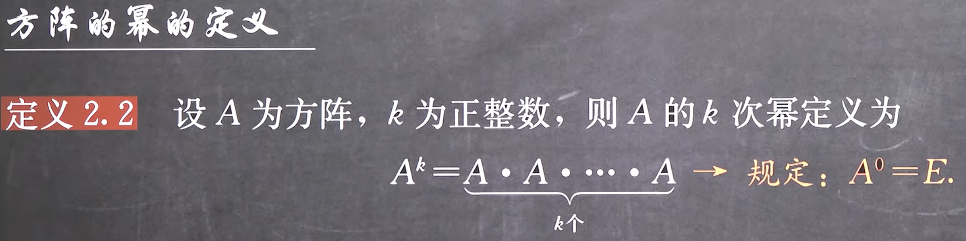
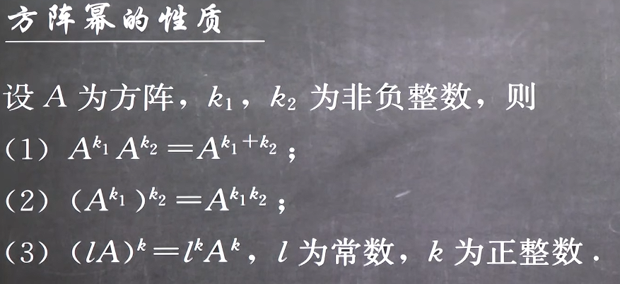
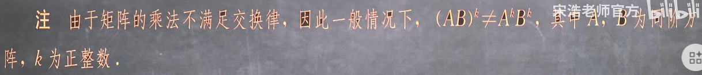
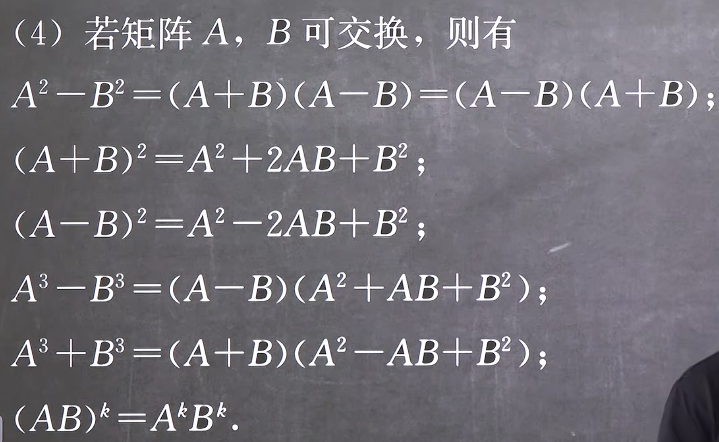
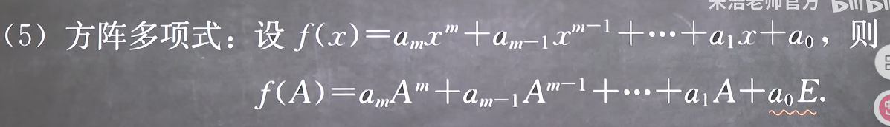
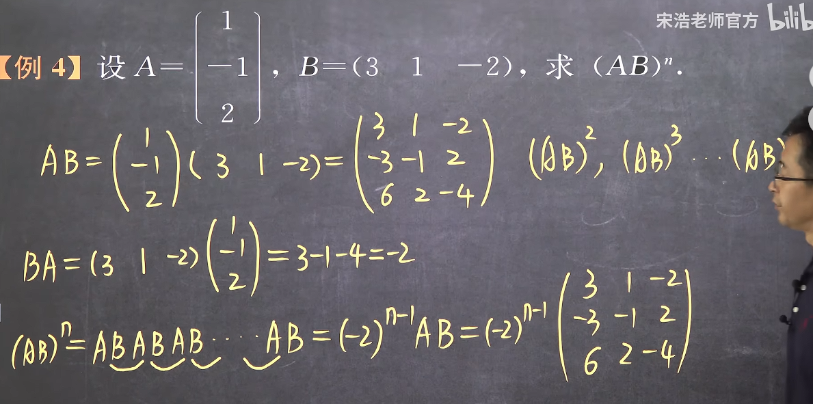
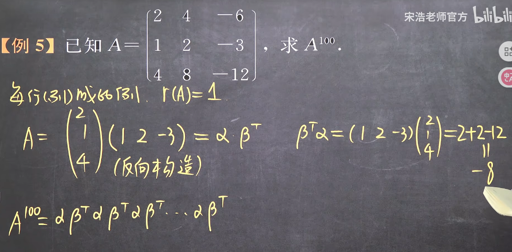

### 2.4方阵的幂

#### 1.定义与性质

注意，只有方阵才有幂

**注意：**

这是因为(AB)^2^ = ABAB ≢  AABB **除非A与B可以互换**

#### 2. 以下关系都不一定成立

**其只在AB可交换的时候才可以成立**

#### 3. 单位矩阵的幂
可以发现，由于对于任意的矩阵A，有
AE = EA = A
因此
EE = E
同理
E^k^ = E

#### 4. 与单位矩阵有关的公式
把2中的B^k^替换为E或其任意次幂，在任何情况下都成立

#### 5. 方阵多项式
由于只有方阵才有幂的定义，由此矩阵多项式也叫方阵多项式

注意常数项要加上E，因为A^0^ = E

#### 6. 善用结合率处理不可交换的矩阵乘法
虽然AB ≠ BA 但是ABA = A(BA)

因此(AB)^n^ = ABABAB...ABABAB = A(BA)(BA)(BA)...(BA)(BA)(BA)B

**这个方法可以用于求解矩阵的高次幂结果**,注意到只要化归C^n^ = (AB)^n^即可利用此结论
例如

这里可以看出来是这两个向量可以用脉动阵列的思想,由于横纵方向上都有相同的算子,因此是同一数据的流动

#### 7. 计算矩阵的高次幂的方法
1. 归纳规律法
2. 分解结合法