### 矩阵的转置

#### 1. 定义
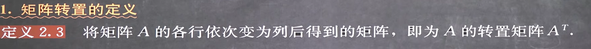

#### 2. 转置的性质
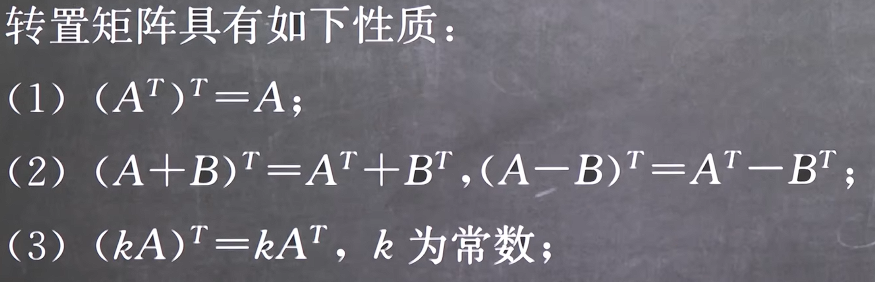
加法和减法的转置可以代入是因为加减法是对于对应关联的元素的运算

**显然乘法就不是，乘法是对应向量的运算，转置会导致左右乘互换，因此有如下性质**
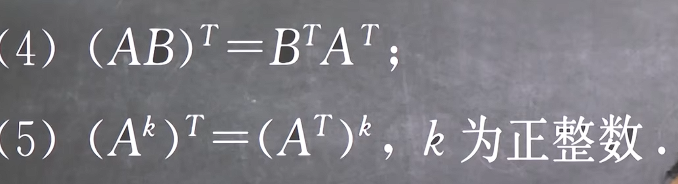
由(AB)^T^ = B^T^A^T^可以推得(ABC)^T^ = C^T^B^T^A^T^也成立
因此方阵的幂成立

**总结：加减正序倒，乘幂倒序倒**

#### 3. 对称矩阵和反对称矩阵
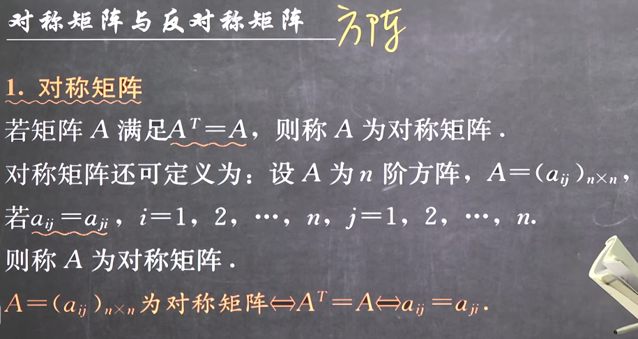
**1. 显然一定是方阵**
**2. 对称矩阵对于轴上的元素没有什么要求因为a~ii~ = a~ii~一定成立**
**3. 反对称矩阵由于a~ii~ = -a~ii~因此主对角线上一定是0**
**4. 注意和对角矩阵的差异，对角矩阵是对称矩阵的一种**

#### 4. 对称矩阵的推论
+ 由2.转置的性质 和3.对称矩阵和反对称矩阵可证得
****
**两个对称矩阵的和差还是对称矩阵**
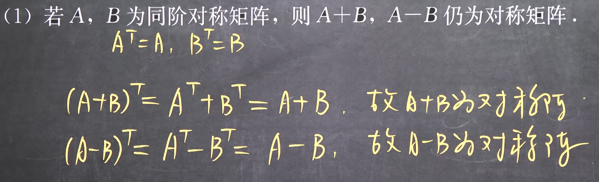
**对称矩阵的数乘和次幂还是对称矩阵**
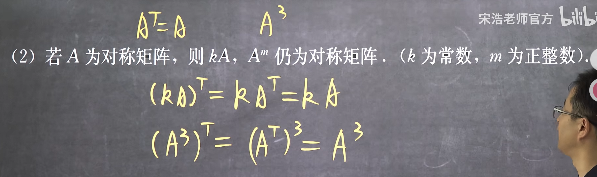
**可见对称矩阵的核心就是转置不变性**
****
**两个对称矩阵如果可交换则其积也是对称矩阵(两个对称矩阵的积不一定是对称矩阵)**
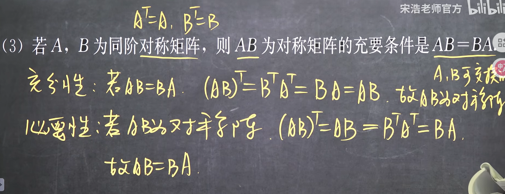
****
**总结：对称矩阵的核心是转置不变性，而转置和差正序，因此和差不改变对称性，数乘是和差的一种，因此也不改变，转置的乘法逆序，因此需要可交换的矩阵才不改变对称性，而幂是乘法的一种，但是矩阵和矩阵自身必定可交换，因此幂不改变对称性**
****
**任意矩阵与其转置的积为对称矩阵**
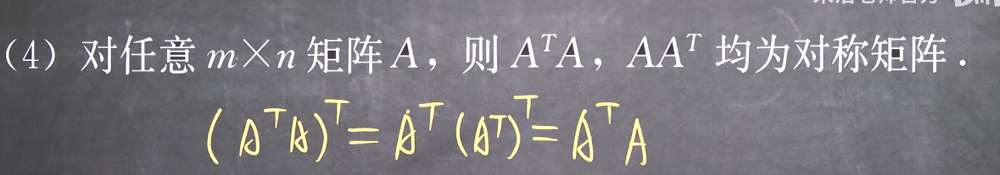
这里是生成一个对称矩阵

总之他们都可以由转置不变性推得

#### 5. 反对称矩阵
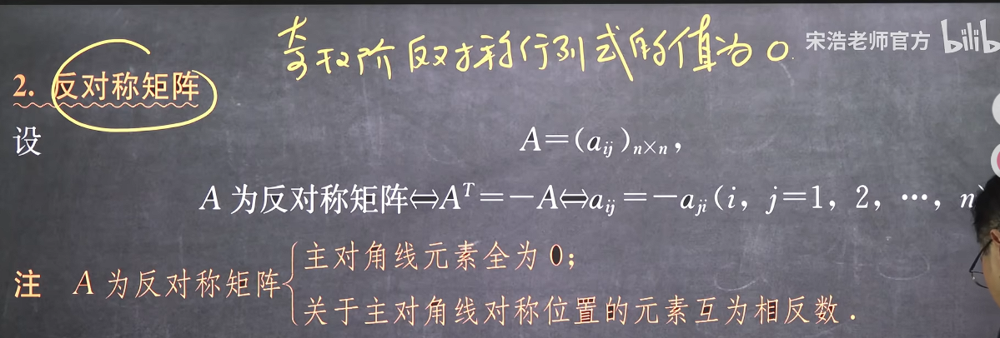

#### 6. 反对称矩阵的推论
+ 同理可证得

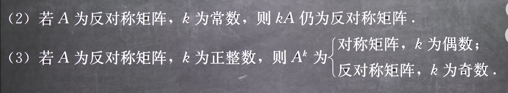
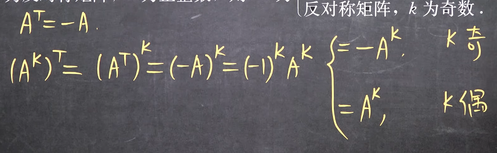