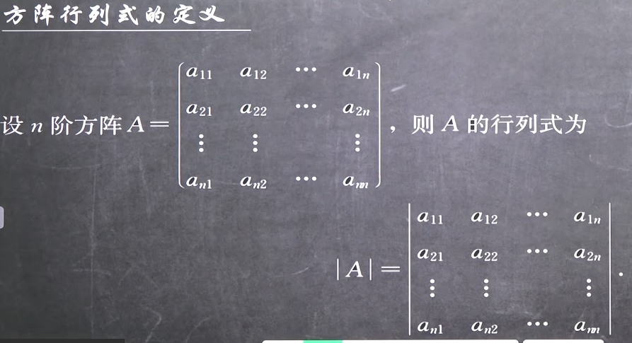
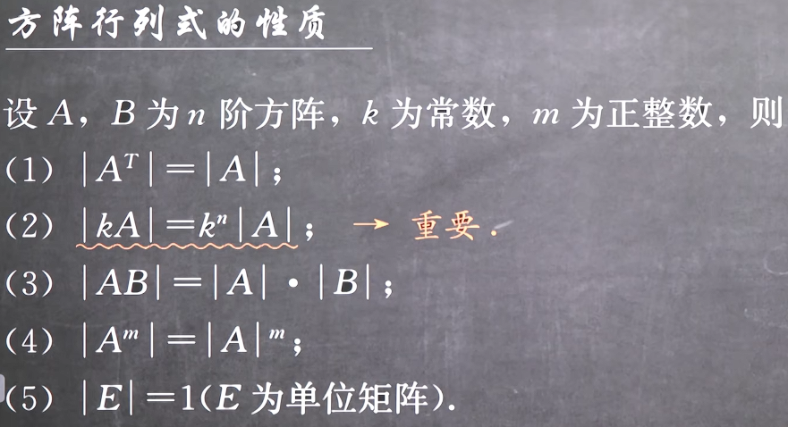
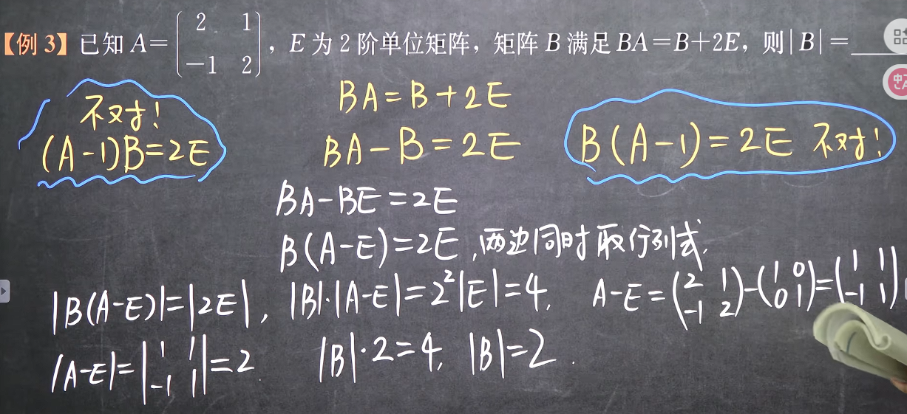
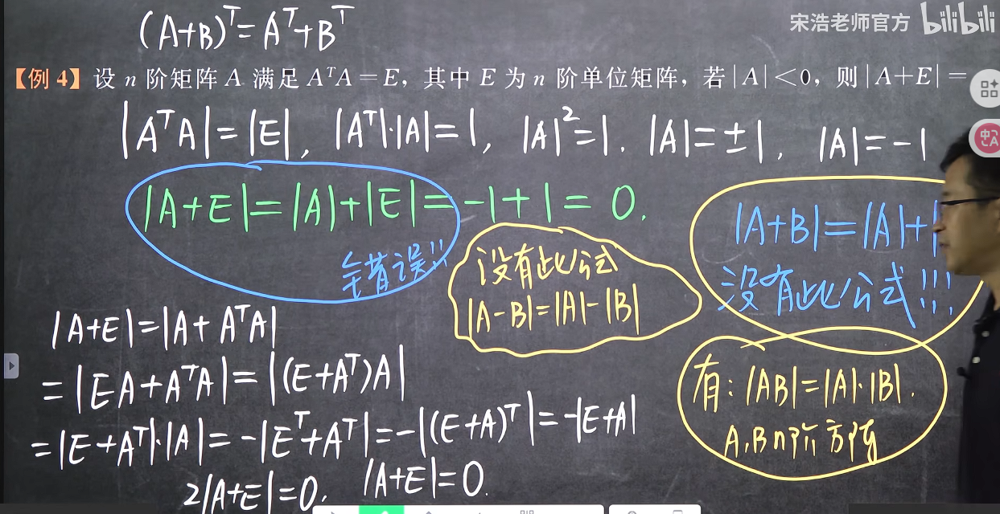

### 2.6方阵的行列式

#### 1. 定义

+ 显然只有方阵才有对应的行列式
+ 方阵A是一个阵列，而|A|是一个对应行列式，是一个数

#### 2. 方阵的行列式的性质

+ (1)式是由于行列式的转置不影响结果
+ (2)式是由于矩阵数乘的的定义与行列式计算规律的冲突
+ (3)式揭示了一个基本事实即矩阵乘法与行列式乘法的关系,其逆定理也可以使用**但是要注意的是,此式在一边有意义的时候另一边不一定有意义,因为只有方阵才有对应的行列式**并且**加减法不具有类似的性质**
+ (4)式可以由(3)式推得
+ (5)式由于单位矩阵的行列式是上三角行列式,因此为主对角线的积

**例题**

注意:
**1. 方阵的行列式的变换法则包含对于加减法的变换**
**2. 在提公因式时单位1是指单位矩阵E，因为这是一个方阵方程，注意非方阵也不能这样做**
**3. 可以发现，在加行列式之前，这其实是一个二元一次方阵方程，而加行列式其实是将其向实数域的一种转化，根本原理就是等式的两边可以同时取行列式，因为这是一个方阵方程，注意非方阵也不能这样做**

**例题**

此题目运用了E的是对角矩阵