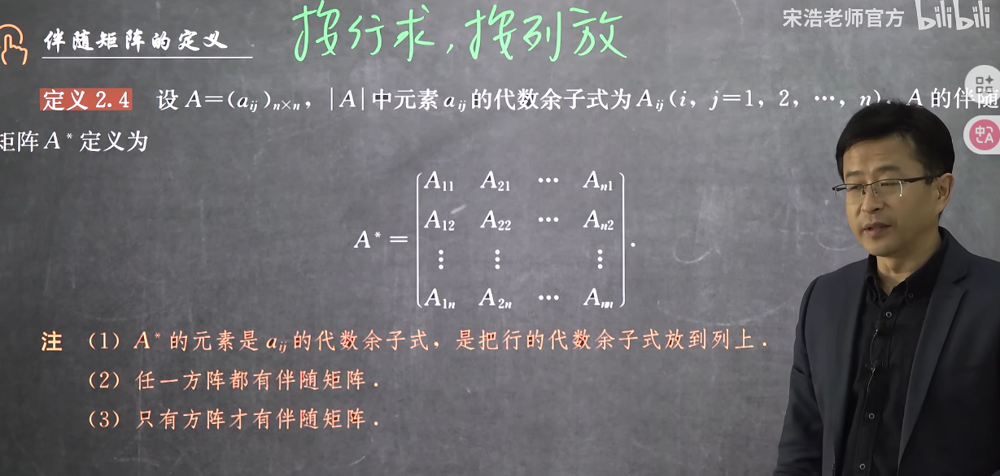
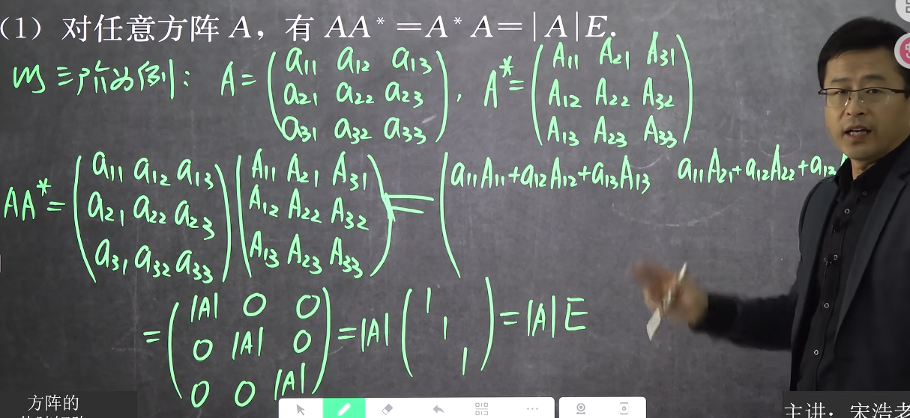
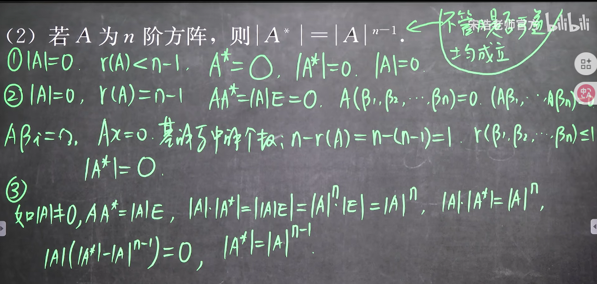
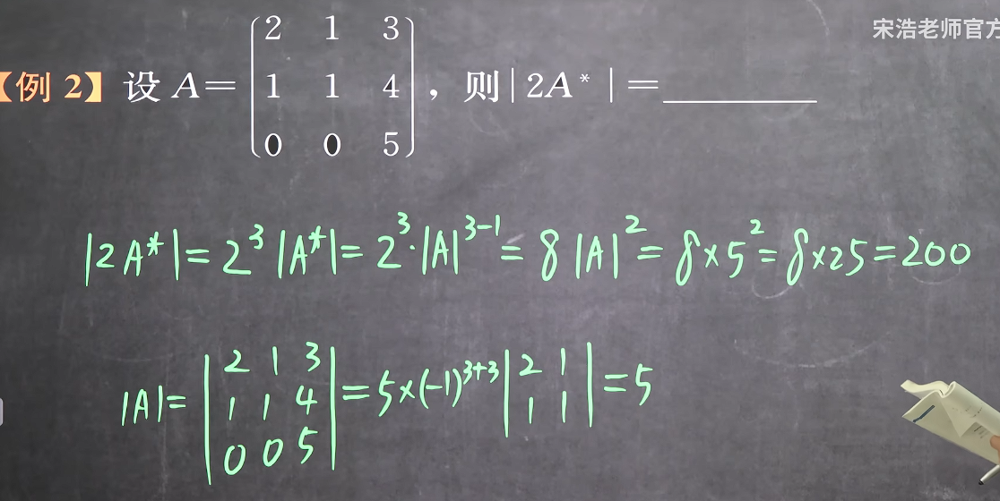
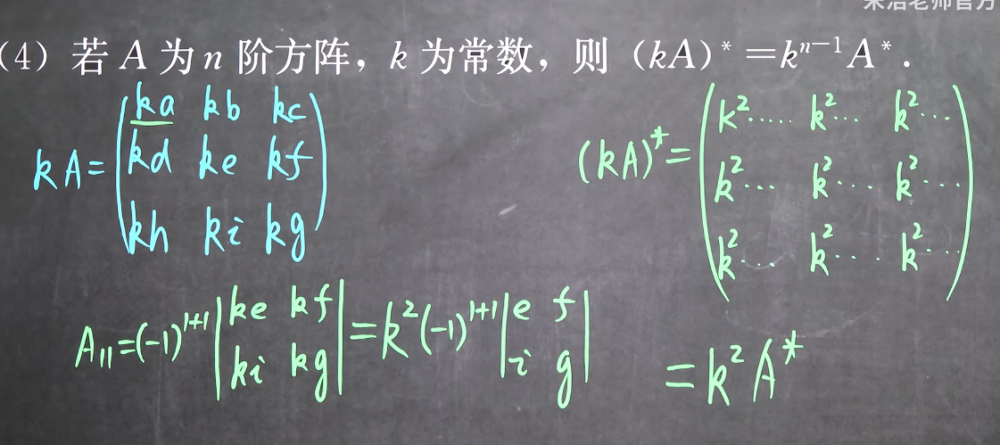
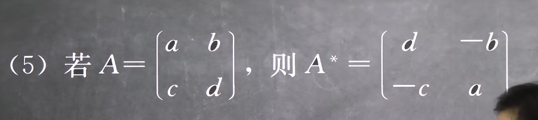
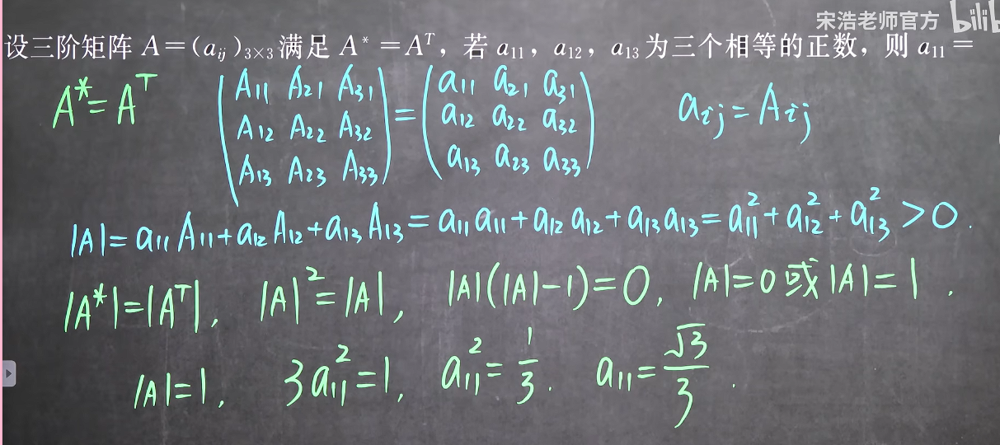

### 2.7方阵的伴随矩阵 

#### 1. 定义

这里把按行的代数余子式按列放是为了方便运用于矩阵乘法
**注意这里是代数余子式，因此有且仅有两个要素，一个是符号，一个是余子式**

#### 2. 伴随矩阵的性质
1. **性质一：矩阵与伴随矩阵的积**

**任意矩阵与其伴随矩阵矩阵的积是一个取其行列式大小的数量矩阵**
这里的单位矩阵A就像向量里面的单位向量，预示着AA^*^是一个(对角)矩阵而不是一个数
无论A可逆与否都成立

2. **性质二：伴随矩阵的行列式性质**

**求解伴随矩阵的行列式的时候非常重要**

无论A可逆与否都成立

3. **性质三：转置和伴随的可对换性**

这是由于伴随矩阵是索引相关的，这意味着T和*可以交换位置

4. **性质四：伴随的提出(注意和行列式的提出的区别)**

是k^n-1^而不是k^n^是由于矩阵A^*^的每一项都是A的降阶行列式求得的

5. **性质五：二阶矩阵的伴随矩阵**

主互换，负取反

#### 3. 例题

可见要利用这些性质，一个是要善于两边求转置和两边取行列式