### 2.8逆矩阵

#### 1. 逆矩阵的定义
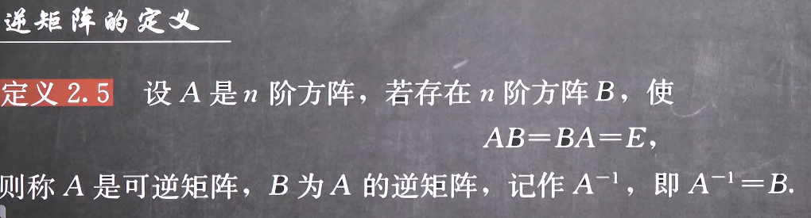
***
1. **注意，这不是矩阵的除法，矩阵没有除法**
2. **但是这个定义类似于某个数的倒数**
***
3. **不是所有的矩阵都有逆矩阵**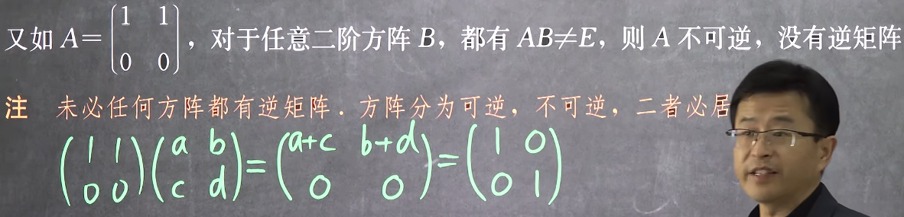这里是最直接的方法判断是否存在逆矩阵
***
4. **如果一个矩阵不是方阵，那么没有可逆与不可逆之说**
5. **一个矩阵的逆矩阵一定要是方阵，由于AB有意义，因此AB还一定是同型方阵**
***
6. **若方阵A可逆，那么A^-1^是唯一的**
7. **实际上只要是同型方阵满足AB=E，那么BA=E就成立，那么A和B就是可互换的**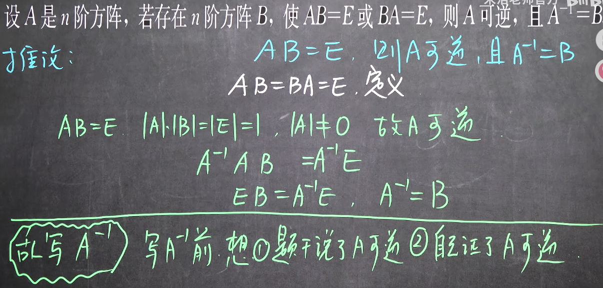

#### 2. 奇异矩阵与非奇异矩阵
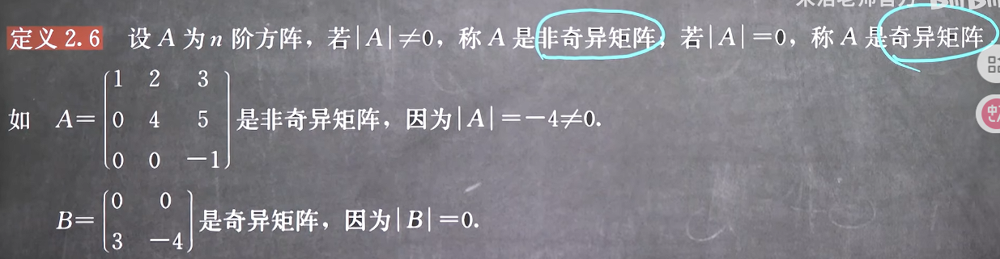
实际上有，奇异矩阵是不可逆的，非奇异矩阵是可逆的，这里可以类比倒数，但是这里不要求一定要是零矩阵

#### 3.矩阵可逆的判定及其求法
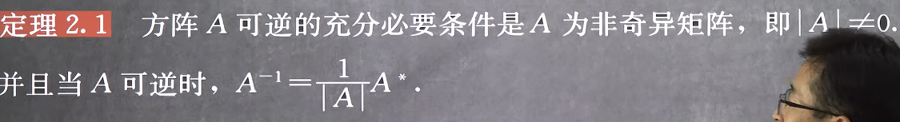
记忆：星星在天上，房子在地上
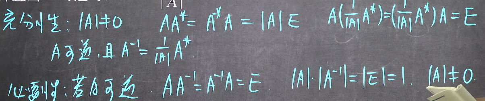
这种方法叫伴随矩阵法，**但是此方法太过复杂，我们实际上会使用初等行变换法**

#### 4. 对角型行列式的逆矩阵
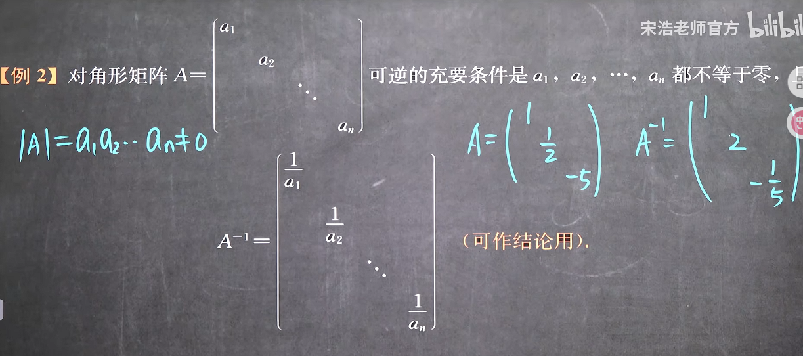
其逆矩阵是很显然的事情，因为对角型矩阵只在特定索引有值，那么只要只在主对角线上化为1就是E（对角矩阵的乘法公式）

#### 6. 矩阵可逆的判定及其求法的推论

由此我们有这样的题目
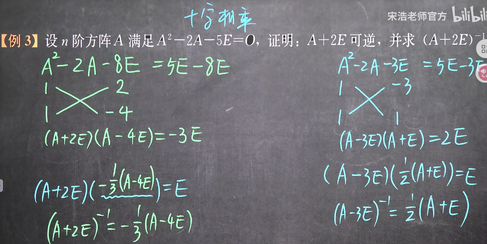
这里可以发现，本质上这是一个方阵多项式求公因式，只要证明对于f(x)-n=x^2^-2x-5-n中x+2是此式的公因式即可(**这里要减去n是因为我们要保证最后的乘积是nE**)或者说,直接用长除法得到的余数是常数即可

例如此题目可以认为是求解多项式的f(x)=(x^2^-2x-5)除以多项式(x+2)等于多少,还要余数是多少,使用长除法可得结果为(x-4)......3,余3说明(x+2)(x-4)差3等于原式(即还差了3不足是一份的,作为余数处理),即f(x)=(x^2^-2x-5)=(x+2)(x-4)+3

将个多项式转化为方阵多项式则有 原式 = (A^2^-2A-5E)=(A+2E)(A-4E)+3E=O,得解

#### 7. 可逆矩阵的性质
1. 可逆矩阵的逆矩阵可逆的判定及其求法
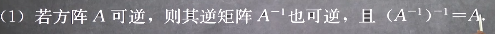
结合矩阵可逆的定义可以发现，若|A| ≠ 0那么|A^-1^| ≠ 0

2. 可逆矩阵的转置矩阵可逆的判定及其求法
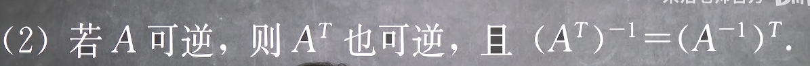
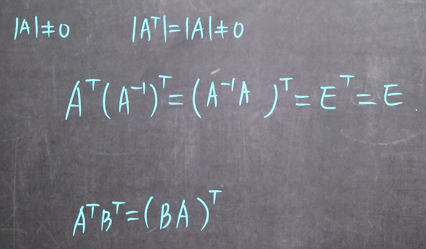
这也说明转置和逆的运算实际上是可以交换的

3. 可逆矩阵的数乘矩阵可逆的判定及其求法
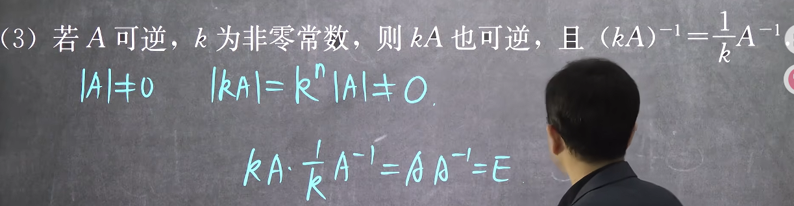
这也说明逆朝提外要取倒数
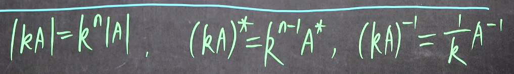

4. 可逆矩阵的伴随矩阵可逆的判定及其求法
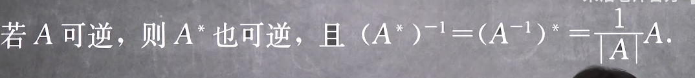
**由伴随矩阵法可得，伴随矩阵也可以由逆矩阵求得**求解伴随矩阵的逆，可以等价于求解下式的逆
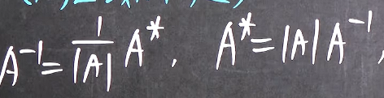
这也说明伴随和逆的运算实际上是可以交换的

5. 可逆矩阵的乘积矩阵可逆的判定及其求法
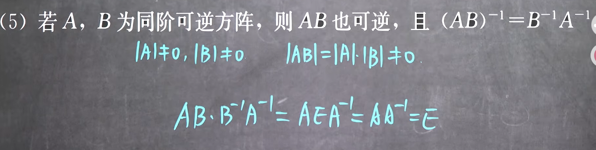
可见逆朝里带和转置朝里带有着类似的过程

6. 可逆矩阵的幂矩阵可逆的判定及其求法
幂是乘积的一种，因此
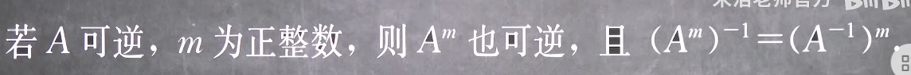

7. 逆矩阵的行列式
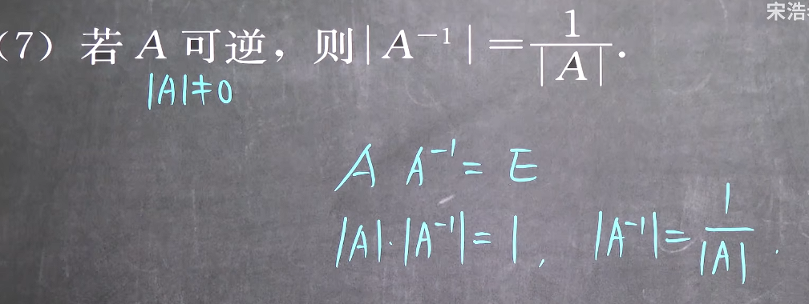

8. 伴随矩阵法
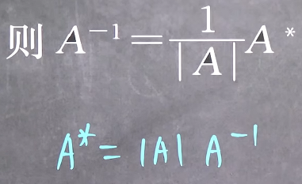
揭示了伴随矩阵和逆矩阵之间只有倍数关系,并且此倍数即为A的行列式，实现了三者的合并
A^*^/A^-1^=|A| （矩阵没有除法，这里只是助记）
而实际上只有4中变换，即**转置、行列式、伴随、逆**

#### 8. 可互换的运算

这里没有行列式什么事，都是可互换的
而实际上只有4中变换，即**转置、行列式、伴随、逆**

#### 9. 万能公式
1. **只有四种变换**--**转置、行列式、伴随、逆**
转置、行列式、伴随、逆

2. **行列式、伴随、逆之间的变换**--**伴随矩阵法**

揭示了伴随矩阵和逆矩阵之间只有倍数关系,并且此倍数即为A的行列式，实现了三者的合并
A^*^/A^-1^=|A| （矩阵没有除法，这里只是助记）
这里没有转置，因为转置不影响这个运算

3. **可互换的运算-**-**转置、伴随、逆**

这里没有行列式，因为行列式是一个数

4. **系数提出**

转置直接提即可，没有规则

5. **变换提出**

+ 转置有两个
(A+B)^T^ = A^T^+B^T^
(AB)^T^ = B^T^A^T^

+ 行列式有一个
|AB| = |A||B|

+ 逆有一个
(AB)^-1^ = B^-1^A^-1^

+ 伴随有零个

6. **转置、伴随、逆的行列式**
|A^T^| = |A|
|A^*^| = |A|^n-1^
|A^-1^| = 1/|A|

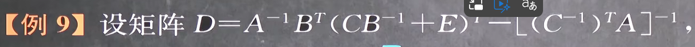