### 矩阵方程

#### 1. 矩阵方程的解
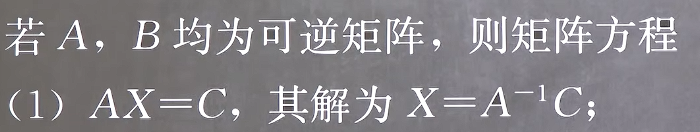
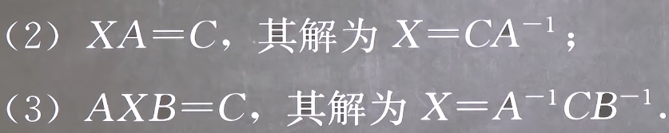
+ **这里注意左乘和右乘，判定方法是同时左乘或右乘逆矩阵**
+ **两边同乘逆矩阵的前提是这个逆矩阵存在！！！所以需要提前判断是否可逆，即行列式不为0**

因此步骤为
1. **判断是否可逆**
2. **两边同左(右)乘逆矩阵**
3. **求解逆矩阵**

#### 2. 矩阵方程的变换
由于求解矩阵方程的解时涉及判断同乘的矩阵(式)是否可逆,并且要求解其逆矩阵到底是什么,会非常复杂,**我们要通过变换尽可能避免两边同乘一个复杂的式子的逆矩阵**

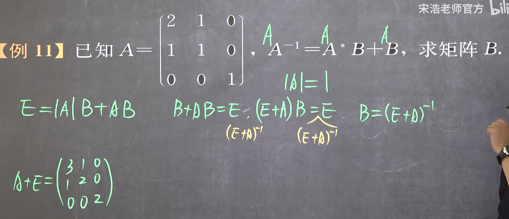

#### 3. 矩阵的初等变换
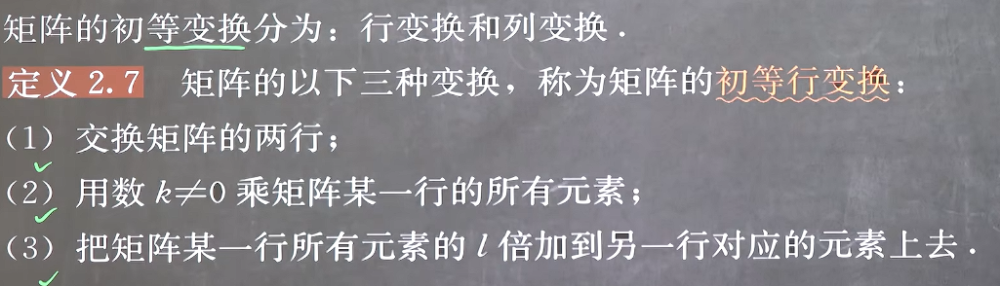
**注意矩阵做初等变换的时候中间用箭头连接,而不能使用等号,因为初等变换不符合矩阵相等的定义**

#### 4. 矩阵的标准型
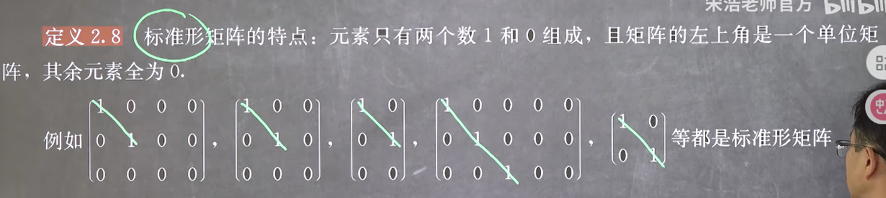

+ **标准型不一定要是方阵**
+ **标志型的(类)主对角线不一定要全为1**

定理:
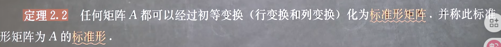

变换过程按先把第1列变换为100...再把第1行变换为100...然后把第2列变换为010...再把第2行变换为010...以此类推

#### 5. 行阶梯型矩阵
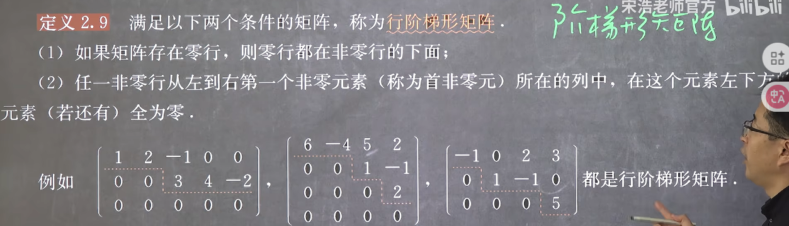
判断方法
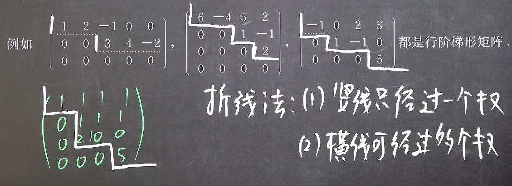

#### 6. 行简化阶梯型
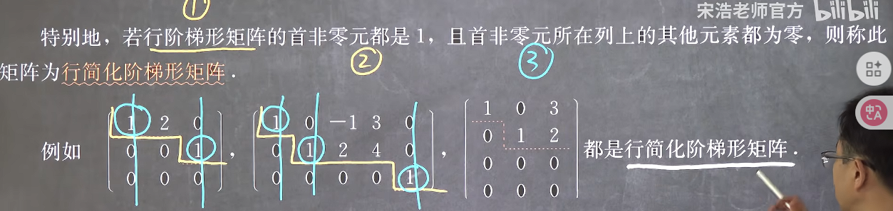

1. **首先它一定是行阶梯型矩阵**
2. **竖线右边第一个数必须是1**
3. **这个1所在的列必须只有除它以外都为0**
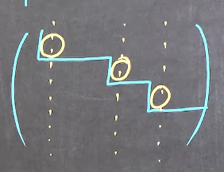
这三个符号一定要画好

定理:
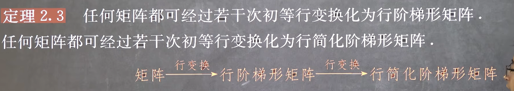
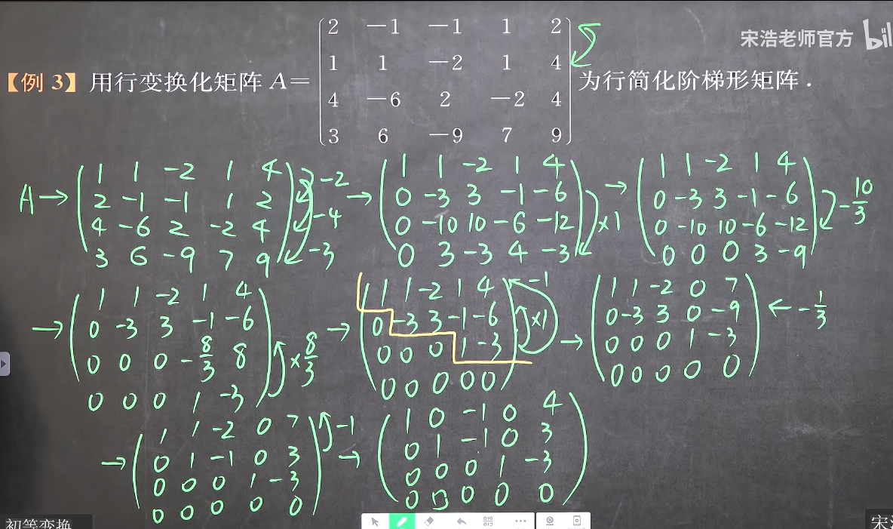
***
**这里要注意**
1. 任何矩阵是通过**初等变换**一定可以变成标准型
2. 任何矩阵是通过**初等行变换**一定可以变成行阶梯型型
**二者不一样**
并且有趣的是,一个矩阵的行阶梯型型不是唯一的,但是行简化阶梯型型是唯一的

