### 向量组的线性相关性

#### 1. 线性相关与线性无关的定义
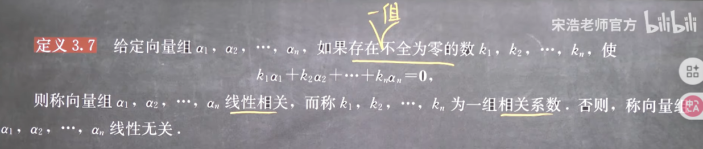
其实就是能不能相互表示，能相互表示就是相关，不能就是八竿子打不着，由于可以相互表示的时候一定可以通过移项使其变成一个线性组合等于0的形式，**但是要排除系数全为0的情况**，因为不等式两边同乘0等式成立(0x1=0x2)，这个时候移项就是系数全为0的意思
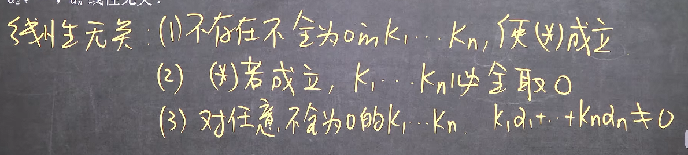

#### 2. 线性相关的推论

1. 单个向量的线性相关性
特殊的，向量组只有一个向量的时候
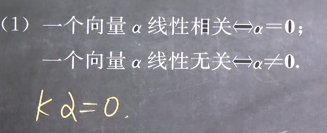
其实就是单个的时候，只有零向量才是线性相关的

2. 两个向量的线性相关性

只有两个的时候表示系数就恰好是系数了，因此成倍数关系
**因为线性相关的本质就是共线，线性无关的本质就是不共线，因此判断两个向量是否相关只需要判断是否共线即可，即只需要判断是不是成比例即可**

**但是！！两个以上就不一定了，如果存在有共线的，那么可以用3判定其相关，但是不存在两两共线的，那也不确定，因此共线方法只适用于两个向量之间的时候，例如三维上的共面就是这种情况，就是说其中一个向量被另外两个向量可以表示，下面推论就会说这个本质**

3. 向量组的线性相关性和其部分组的线性相关性的关系

这是因为部分组的线性组合方程，总是能扩写成向量组其余向量的对应系数全为0的形式，则只要部分组是线性相关的，就说明存在只要的一组系数不全为0，使得部分组各项的和为0，那么其余项全部取0即可（其余项也可能存在不需要全取0的组合，但是只要存在一种组合即可）
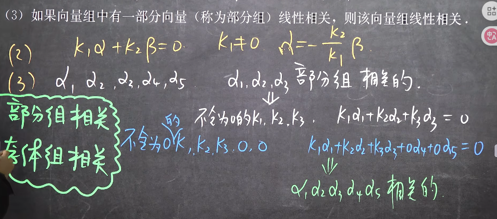

显然由1可得如果向量组包含一个零向量，则必然线性相关
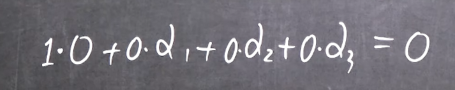
4. 3的逆否命题
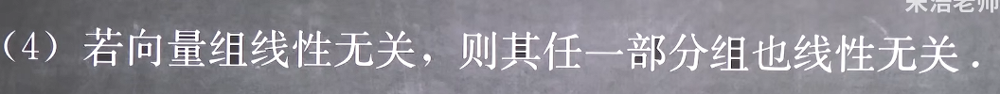

6. 初始向量组的线性相关性

7. 接长向量组的线性相关性
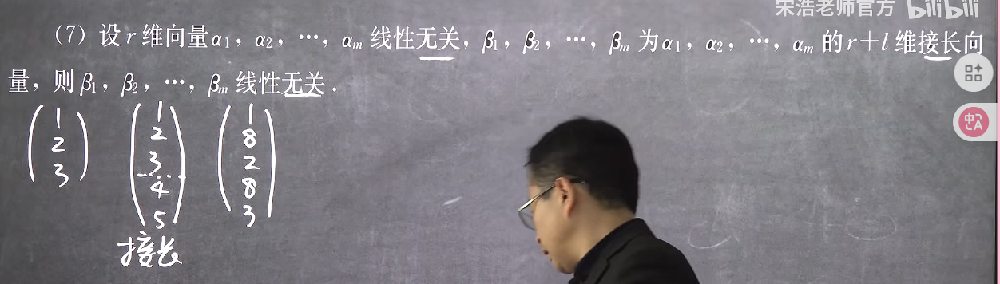
注意接长可以在任意位置接，因为新维度和原维度无关，但是旧维度的相对位置要保留
这很显然，因为其总在一定的低维度中无法相互表示，即在低纬度中就无法共线，那么高纬度也就无法共线
**无长**
8. 截短向量的线性相关性
注意截短可以在任意位置截，但是相对位置要保留
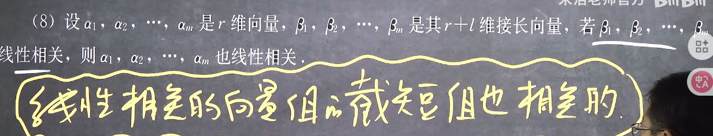
这很显然，因为其原本在有高维变量的情况下，也能共线，那么降维之后也必然还是共线的
例如
**关短**
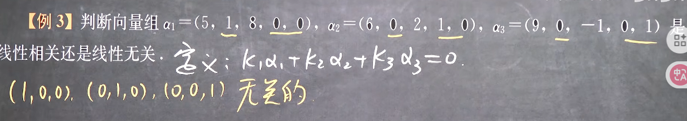

#### 3. 线性相关性的判定
定义法
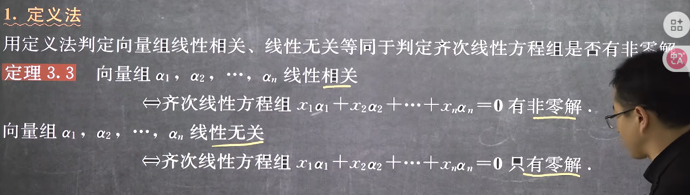
即求解方程组
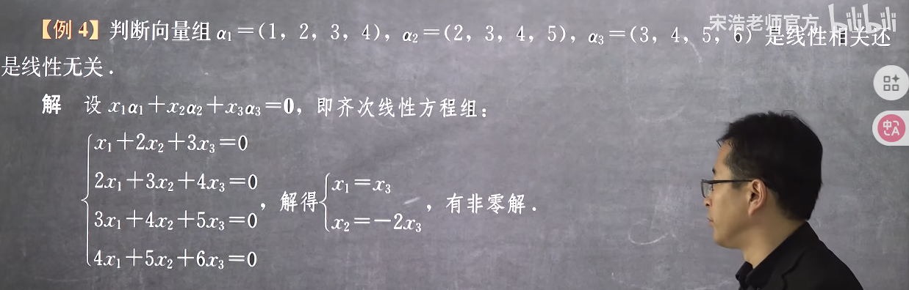

#### 4. 线性相关性的推论
1. 推论1

这里是至少存在一个

2. 推论2
如果线性相关的出现只由于一个向量，那么这个向量就一定满足推论1，即

且显然是以原向量组为基的（因为原向量组线性无关，所以可以做基底），那么由基底表示的一定是唯一的

3. 替换定理
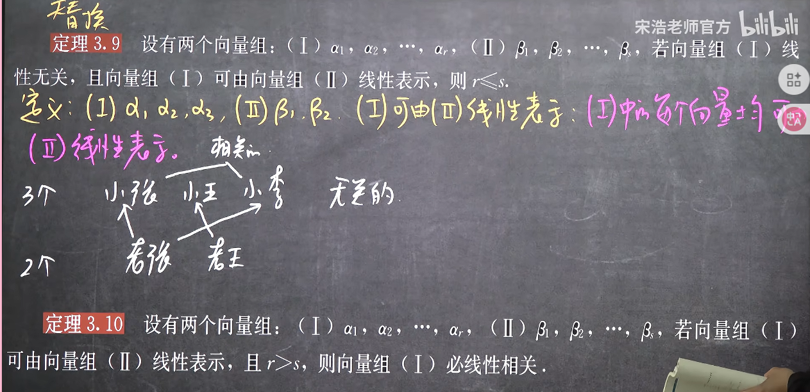
每一个无关的向量都会增加一个表示维度（秩），因为向量组无关则意味着其表示空间最大，满秩=r，那么用另一个基底去表示它的时候至少就需要比它数量多才能保证秩>=r

其逆否命题就是

例题
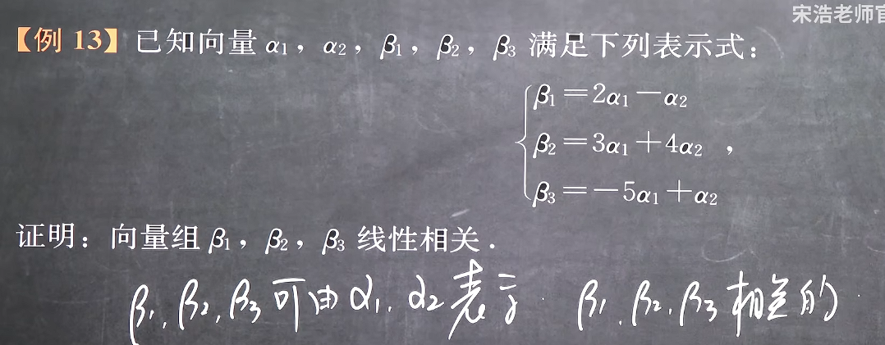

4. 替换定理的推论(等价线性无关的向量组的数量,注意不是等价向量组)
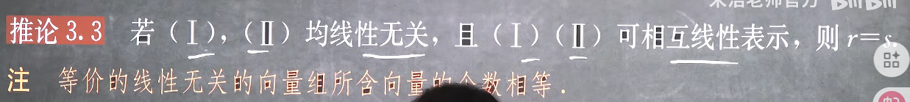

5. 向量个数和向量维度的关系
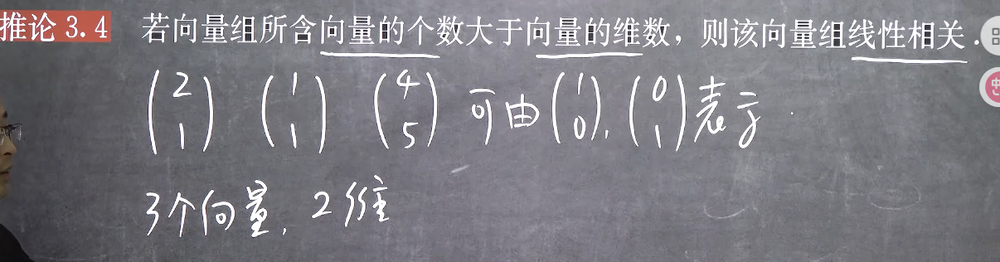
可以利用替换定理证明其可以被一个数量更少的向量组（初等基）表示，因此一定是线性相关的，或者可以认为n维空间只需要n个线性无关的向量即可表示，而大于n的时候多出的向量一定可以用原来n个线性无关的向量表示