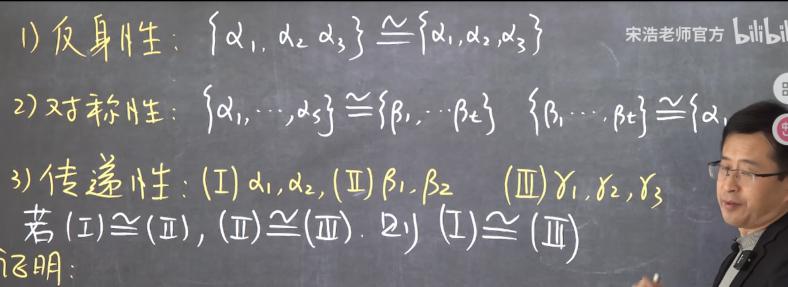

### 向量组的等价

#### 1. 向量组等价的定义

如果两个向量组可以互相线性表示，则说明其等价

**等价的向量组不一定所含有向量一样多**，因为显然如果存在两个向量组等价，那么将两个向量组合并后的向量组与前二者也是等价的，或者将其中一个向量组的某一线性组合添加到向量组中时也是依然等价

这是由于等价的本质其实是两个向量组张开的空间维度一致，那么在其中加入线性相关的向量或者说在这个空间中的向量，不影响等价性

因此，我们可以推得，**等价的线性无关的两个向量组所含有向量一样多**因为线性无关的向量组中每一个向量都参与到了线性空间的张开，若要求二者的张开空间维度一致（等价），那么就必须二者数量一致

由此我们也可以推得**等价的两个向量组其极大无关组包含的向量个数相同**因为向量组的张开中，只有无关组向量参与到了空间张开

#### 2. 向量组等价的性质
