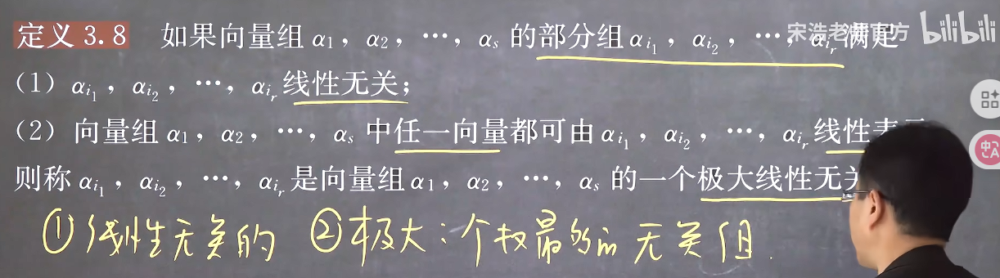
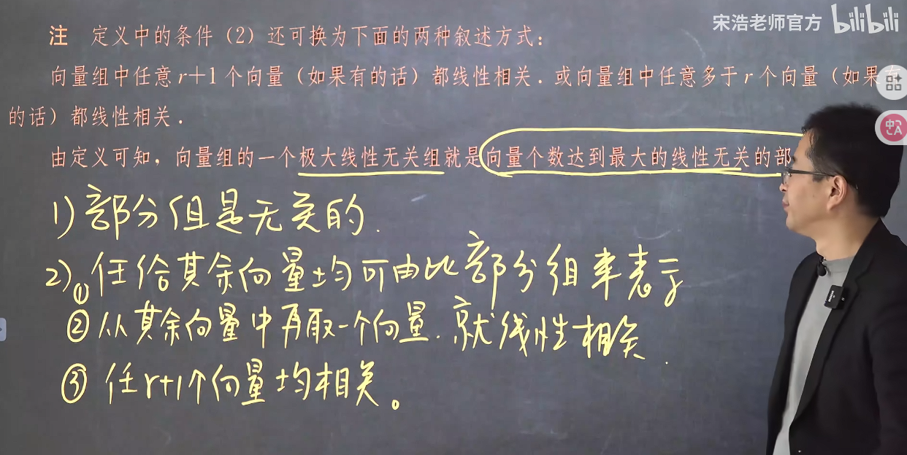
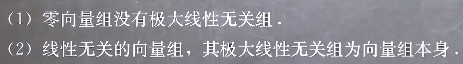
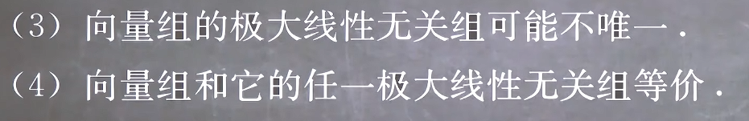
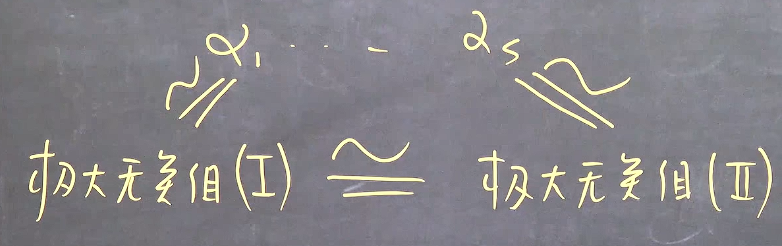
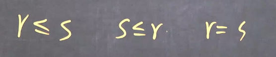
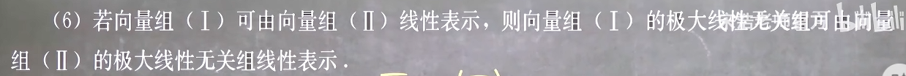
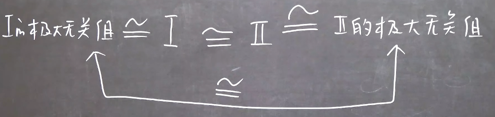
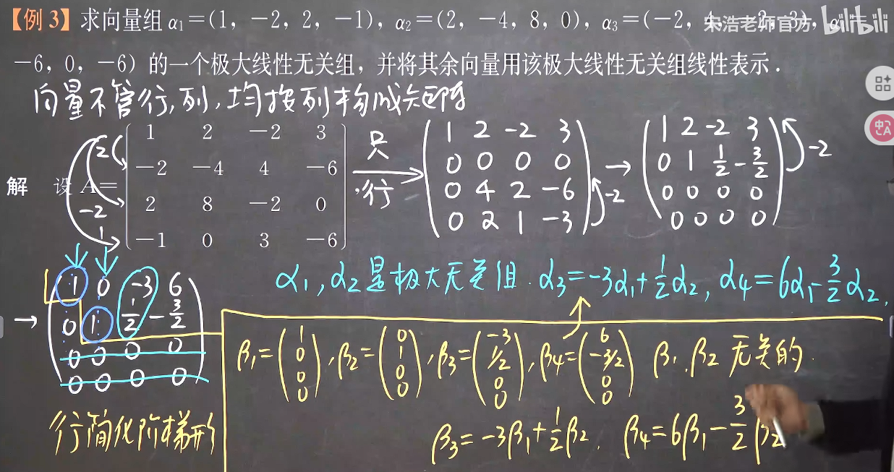

### 极大线性无关组

#### 1. 定义

**极大线性无关组不一定是唯一的，但是所含向量的个数是唯一的**

#### 2. 极大无关组的最大和最小的情况

**总之就是张开成此向量组空间的至少需要的部分组**
**等价就是张开的空间维度相同**

**因为构成的是同一个空间**
可以发现其实就是

#### 3. 极大线性无关组的求法————初等行变换法

1. 将向量组包含向量全部转化为列向量按顺序排列成矩阵
2. 将此矩阵**只使用行变换**变换为行简化阶梯型
3. 行简化阶梯型的本质就是将线性无关组包含的向量变换成单位正交积，其余向量变换成此基底的线性表示，由于对列向量进行行变换线性关系不变，由此原向量组的线性关系也和这个行简化阶梯型表示的向量组一一对应