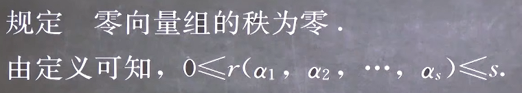
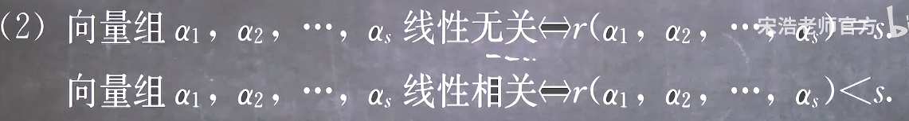
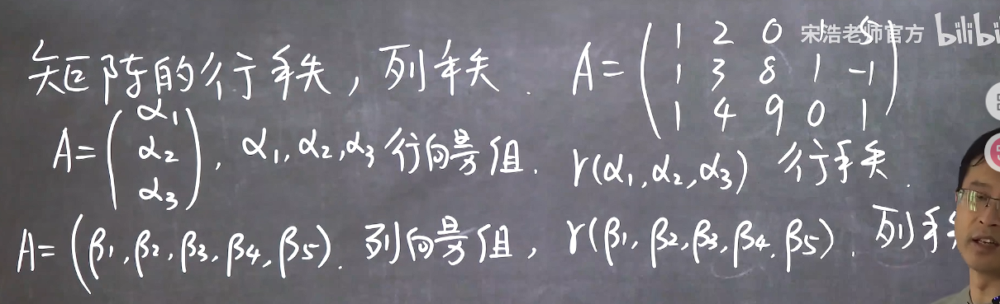
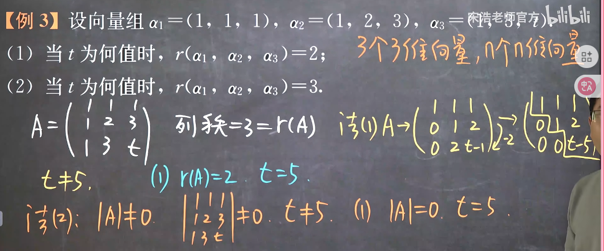

### 向量组的秩

#### 1. 向量组的秩的定义

其实就是向量组张开空间的维度

显然维度不会超过向量个数，实际上也不会超过包含向量的维度

#### 2. 向量组的秩的推论

这个由极大无关组的特点就能推出

显然前者张开的空间一定要在后者空间维度相同或之下

因为向量的个数大于维数的时候一定无法继续向更高维度张开，一定是线性相关的，即其极大线性无关组绝对不会超过包含向量的维度
由此可见

#### 3. *矩阵的*行秩和列秩

**事实上有**

一个矩阵的秩=它的行向量组的秩=它的列向量组的秩

由这个实时出发，就可以
把求解向量组的秩
转换成求解一个按列合并矩阵的列秩
再转化成求解这个矩阵的秩
再转化成求解这个矩阵行阶梯型矩阵的非零行行数

**这就是求解向量组的秩的典型方法**
例题
