### 线性方程组解的判定

#### 1. 线性方程组的初等变换
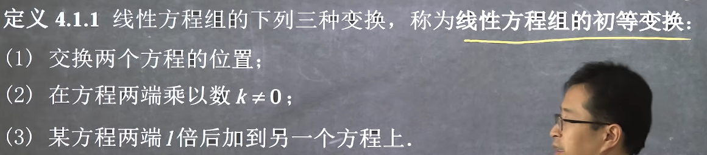
我们平时解方程组其实都是在继续方程组的初等变换，因为这种变换不影响解的结果

**这种变换可以映射为对增广矩阵的初等行变换**

由此也易得
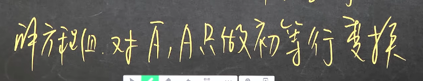

#### 2. 线性方程组解的判定
**引例**
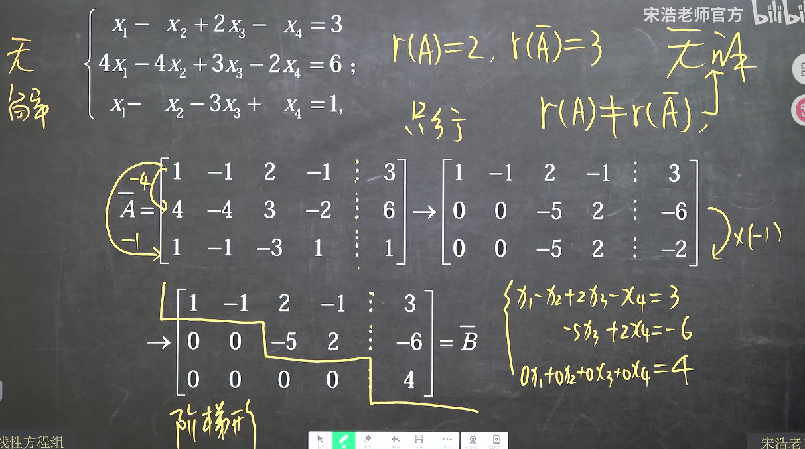
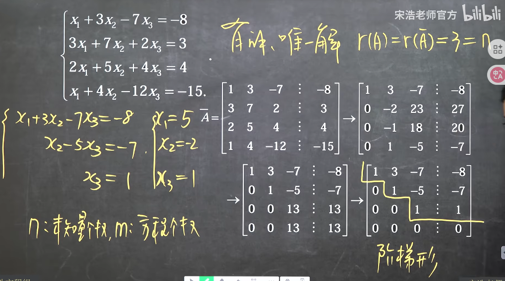
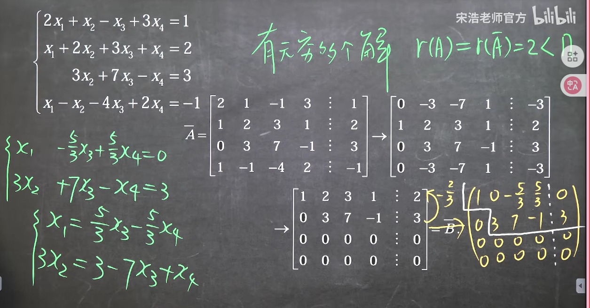

**总结：**
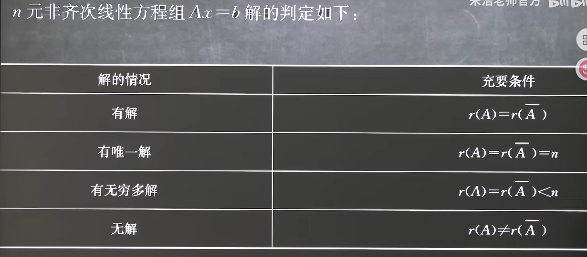
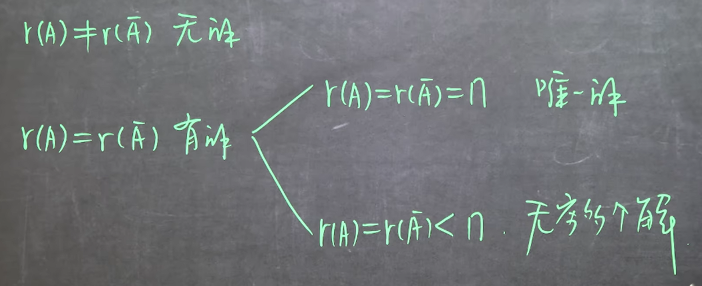

小技巧：如果在虚线处拐弯则无解，不拐弯则有解，解的个数再另外判定

#### 3. 齐次线性方程组解的判定
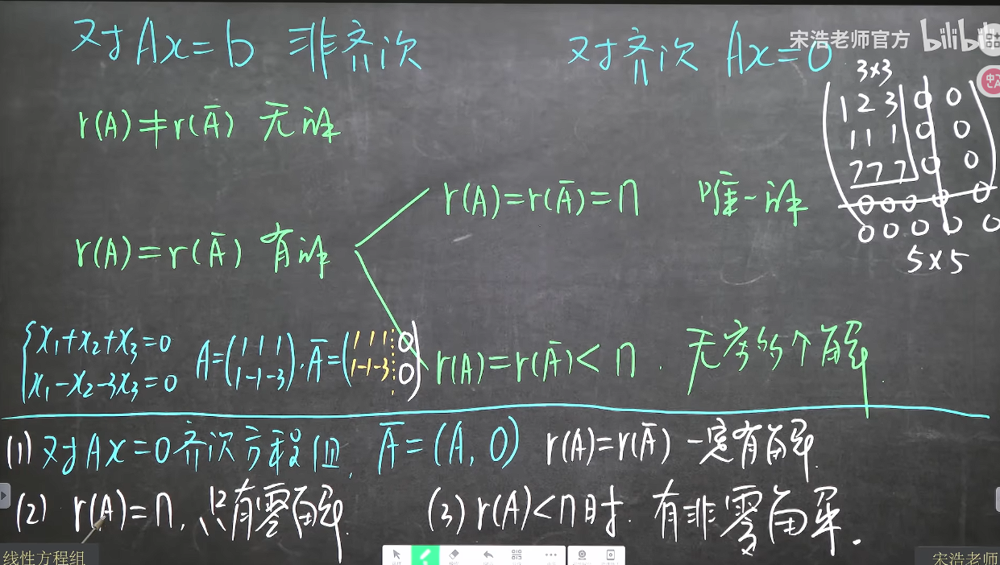
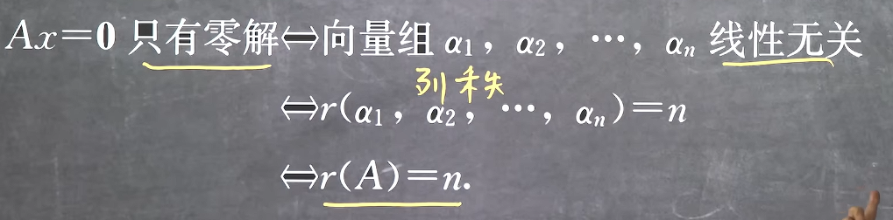
由于齐次线性方程组增广矩阵补充的是一个零向量，这完全不影响原矩阵（即系数矩阵）的秩，因此齐次线性方程组中系数矩阵的秩一定等于增广矩阵的秩，由此可知齐次线性方程组一定有解

当系数矩阵的秩等于n时，**有唯一解**，又由于0解一定是齐次线性方程组的解，因此此时有且仅有0解

当系数矩阵的秩小于n时，**有无穷个解**，那么一定包含零解以外的解，即存在非零解，显然此时*列向量组*是线性相关的，可以从无穷多解或者矩阵的秩小于n来理解

由此只需分析A即可，不需要分析增广矩阵，有**总结**
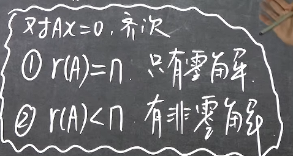

#### 4. 齐次线性方程组方程个数和未知数个数
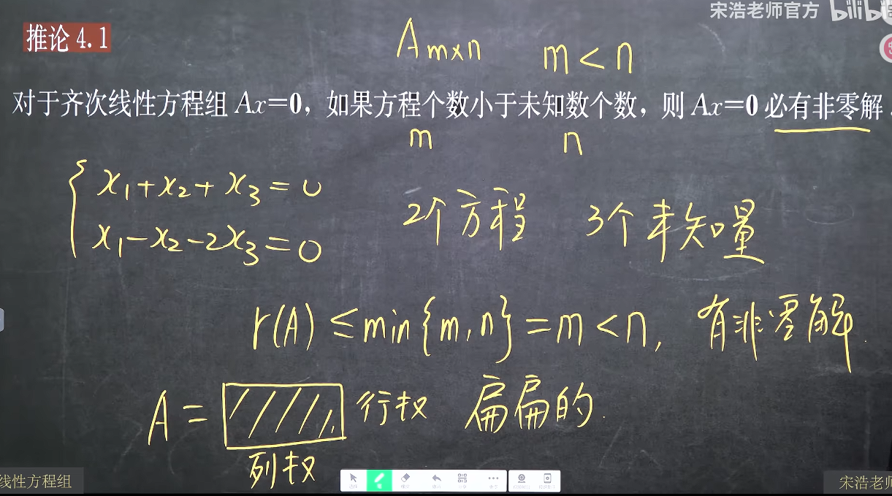
因为这种情况一定是无数解
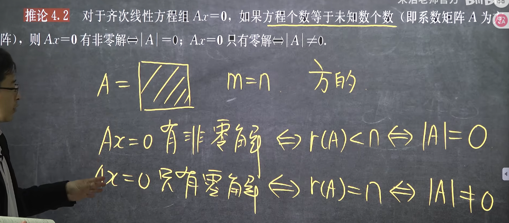
例题
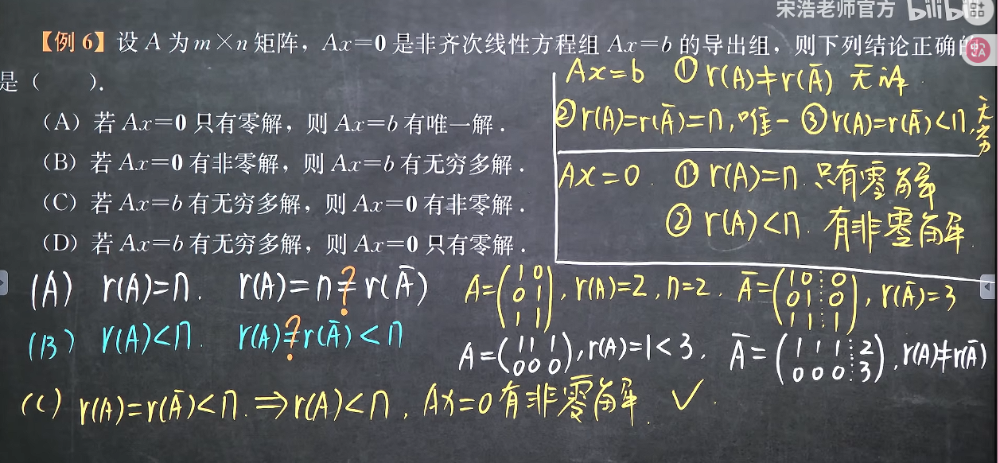
这个题直接由定义出发即可