### 齐次线性方程组的基础解系

#### 1. 定义
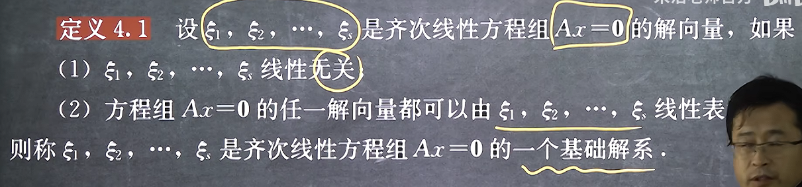
其实基础解系就是其解空间的极大无关组，本质是同一个概念

#### 2. 齐次线性方程组基础解系的求解
**引例**
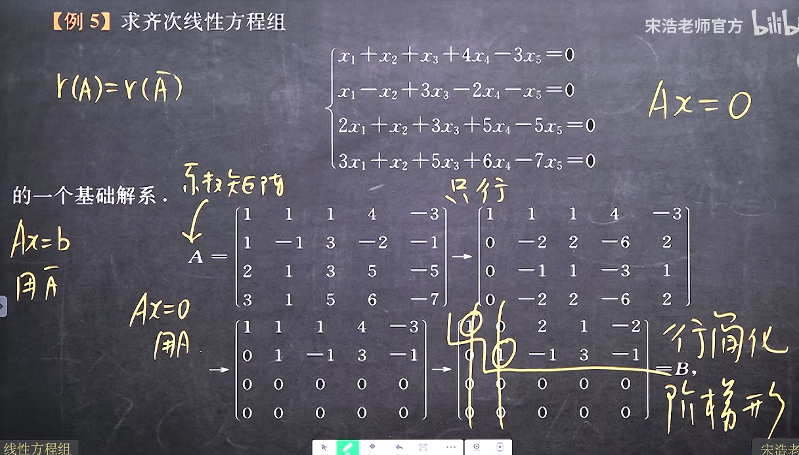
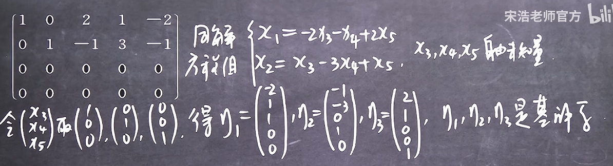

易得基础解系中解的个数是n-r(A)个
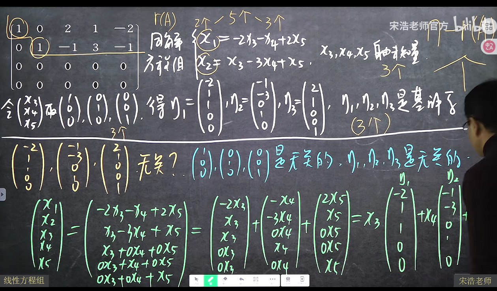
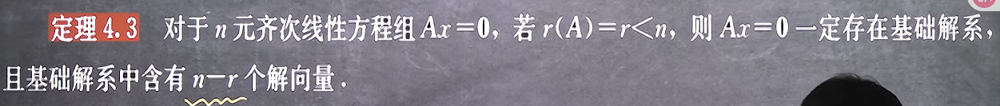

例题
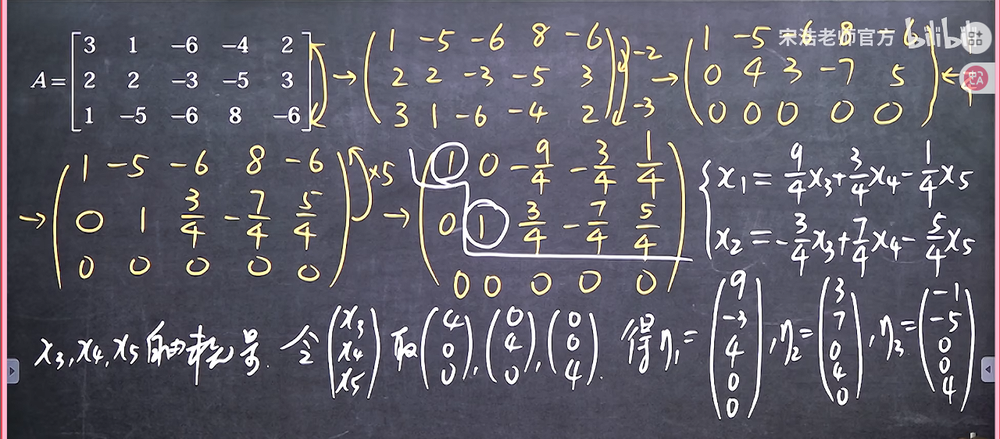
这里自由变量其实只要取一个合适的线性无关组即可
得到基础解系后则可得：
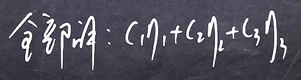

#### 3. 基础解系的判定
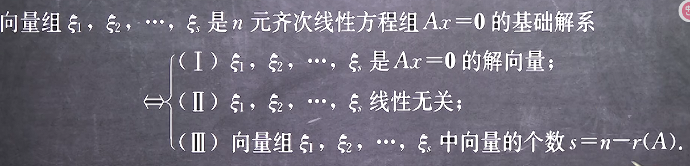
首先它必须是解，齐次必须可以作为基底（线性无关），最后只要这样的线性无关向量（基底）足够多，多到可以张开成解空间即可（s=n-r）

例如
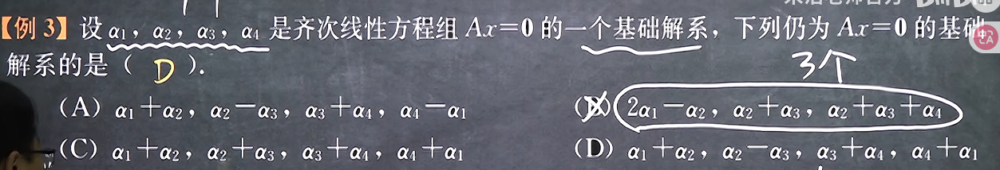
由于其解的线性组合还是解，由此只需要判断哪个选项是线性无关的即可
而4个向量线性无关，即这个向量组的秩是n，求解向量组的秩的方法是拼接为一个矩阵然后求矩阵的秩，而我们拼接为矩阵的秩后可以将这个秩分解为

由于只要B可逆，那么矩阵的秩就不变，那么就转化为求解B是否是可逆矩阵

#### 4. 性质和结论
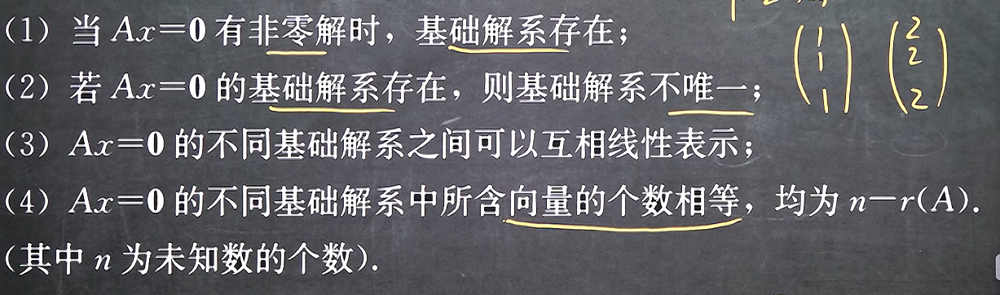
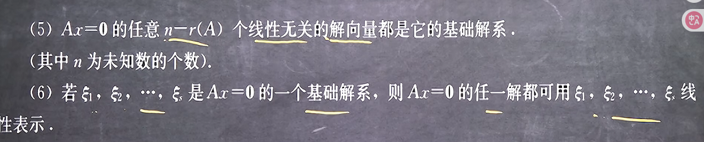

例题
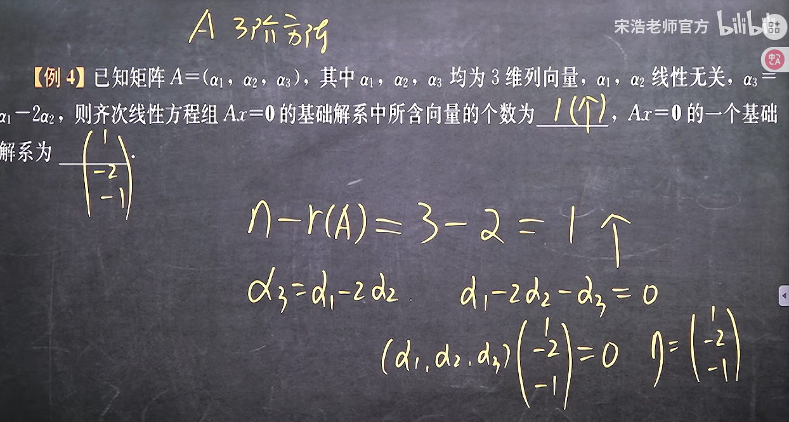