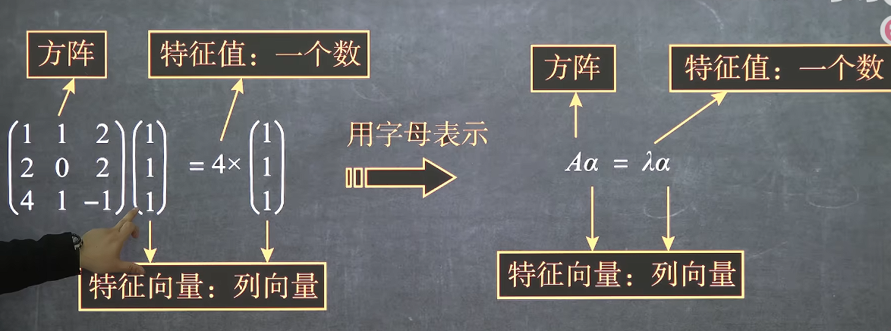
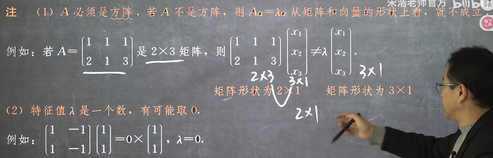
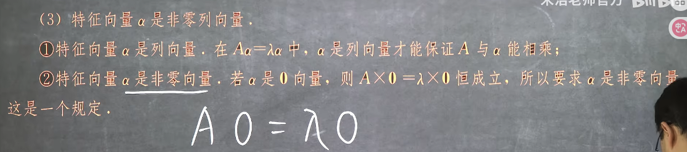
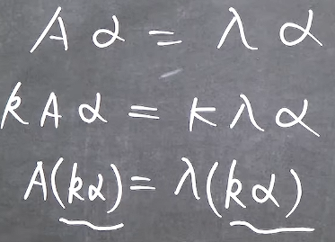
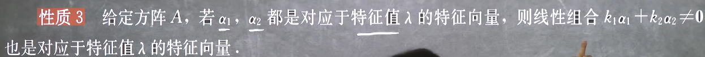
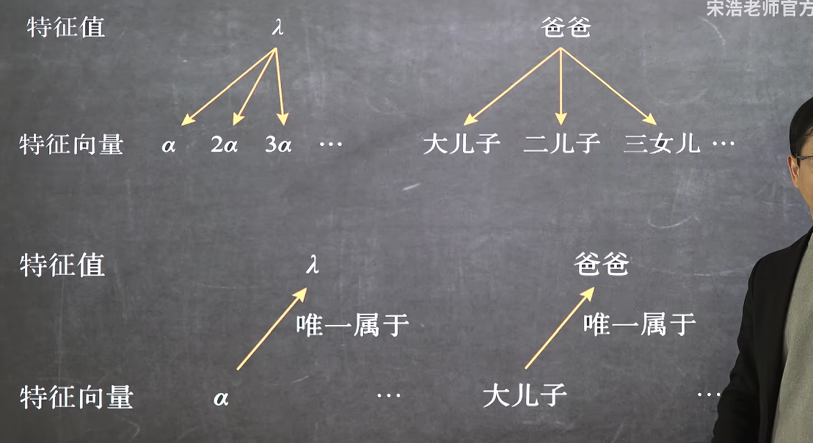
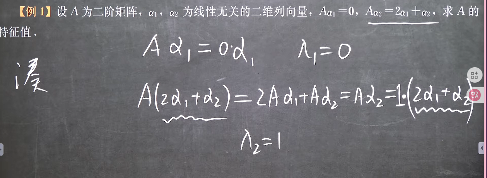

### 特征值与特征向量的定义与关系

#### 1. 特征值与特征向量的定义

注意：只有方阵才有特征值和特征向量，且特征向量一定是列向量，并且是非零列向量，但是特征值可以取0

#### 2.  特征值与特征向量的关系
1. 性质1

这意味着特征向量只要存在就是无穷多个

2. 性质2

但是每个特征向量都只有唯一对应的特征值

3. 性质3

这意味着对应于同一个特征值的特征向量都是同一个空间内的

这揭示了一个方阵的特征可以解释为对某个线性空间方向上的一种线性缩放，这个本质同时可以解释上面3条性质，并且这种缩放可以是多个空间上的不同缩放

#### 3. 例题

这里就是定义的运用，凑出Aa=入a的形式

***

**条件：每行元素之和已知**
