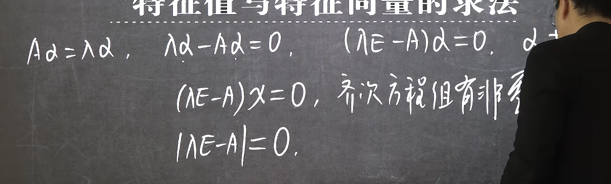
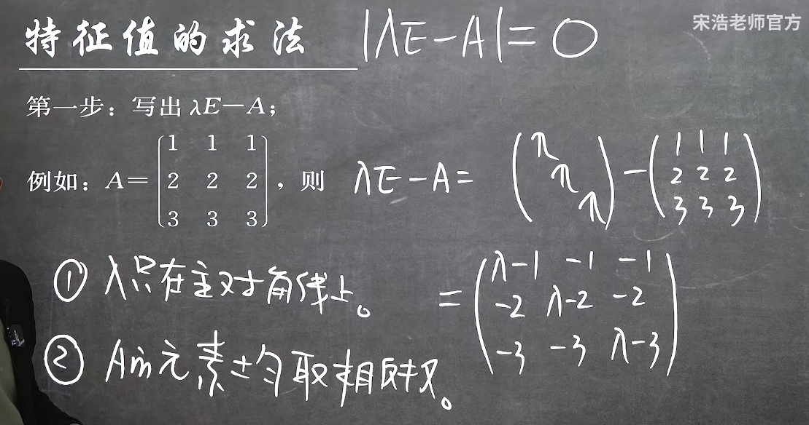
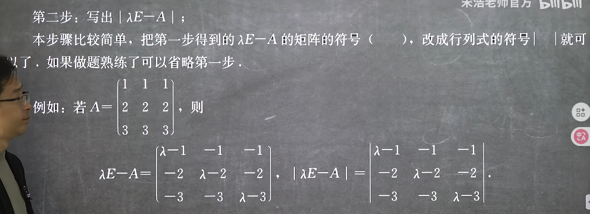
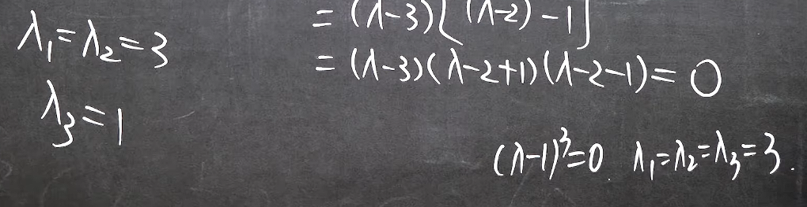
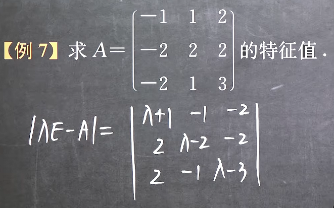
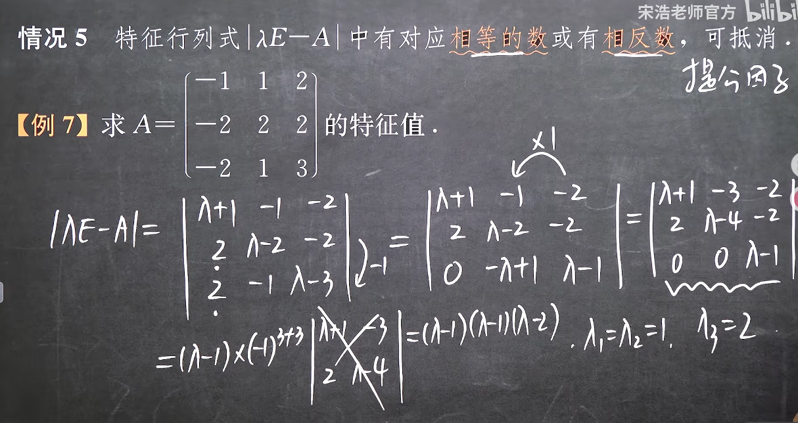
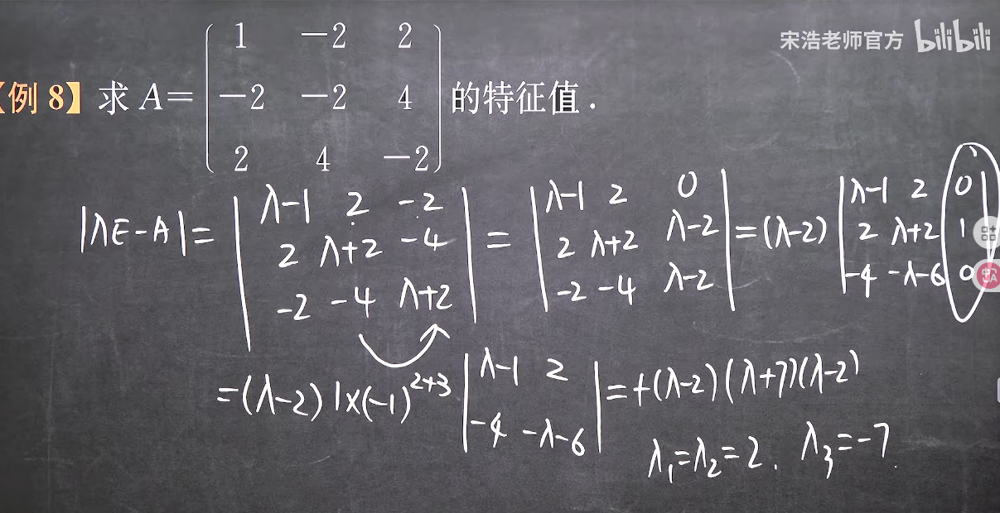
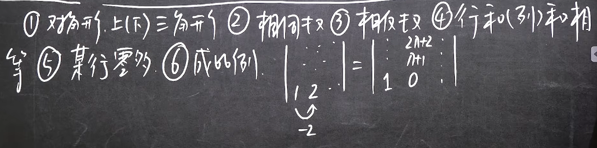
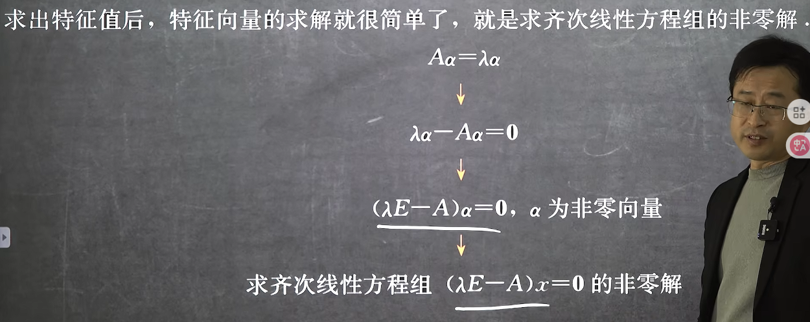
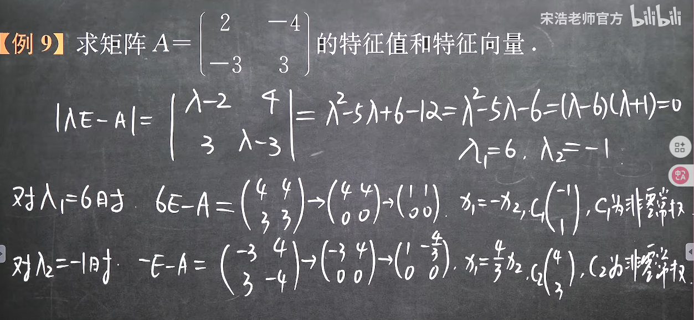

### 特征值和特征向量的求法

#### 1. 特征值的求法

由此有

注意有重根的时候要都写出来

***

由于这是一个行列式方程且主对角线上都有入，因此这个方程张开成一般式的时候是n次的，一般是解不出来零点的，因此我们需要想办法提公因式，例如行和相等的矩阵

比如这种情况，展开是一个3次方程，且也没有适合按行按列展开的项，就需要想办法提公因子

这样变换才能解

***
常见技巧

#### 2. 特征向量的求法

注意这里不是求什么逆矩阵，这里求的x是一个n维列向量，因此**本质上是求齐次线性方程组的通解**
