### 特征值与特征值向量的性质

#### 1.性质
1. 性质1
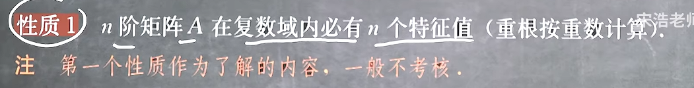
2. 性质2
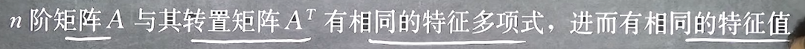
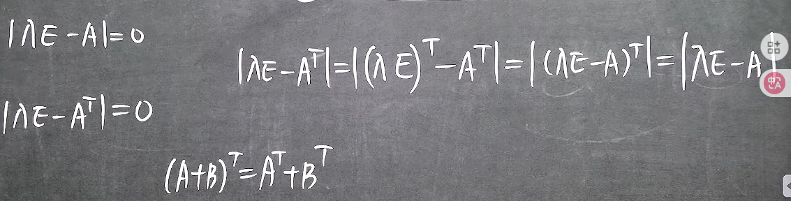
但是！
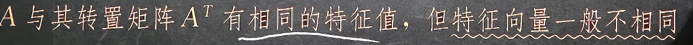
因为求特征值和求特征向量的步骤不同，求特征向量涉及求解解系
3. 性质3：**重要！**
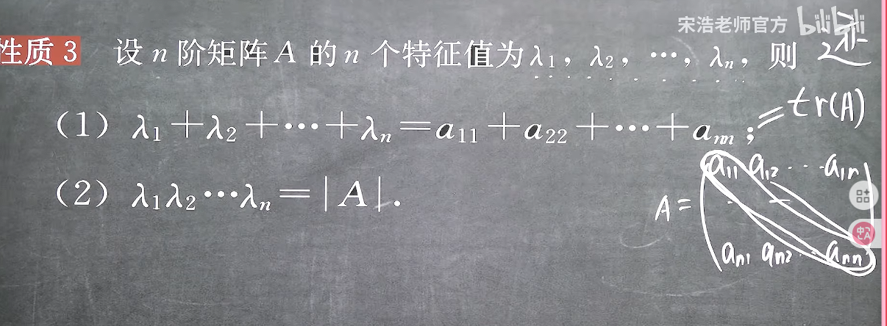
可见矩阵的行列式等于所有缩放倍数的积
4. 性质4
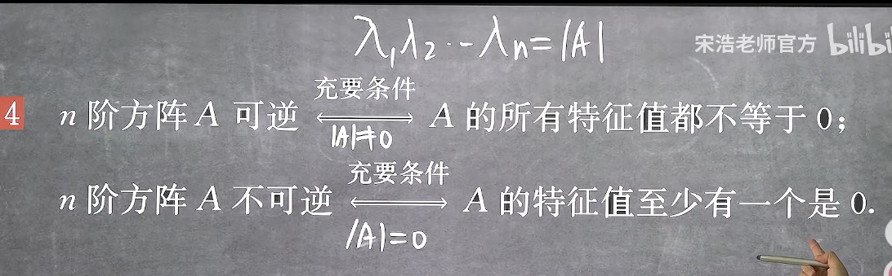
这也意味着，如果方阵存在一种变换是将某个空间方向压缩降维，那么此矩阵就不可逆
5. 性质5
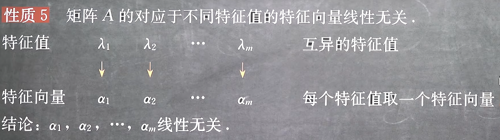
但是注意这些特征值必须是要**互异的！**
6. 性质6
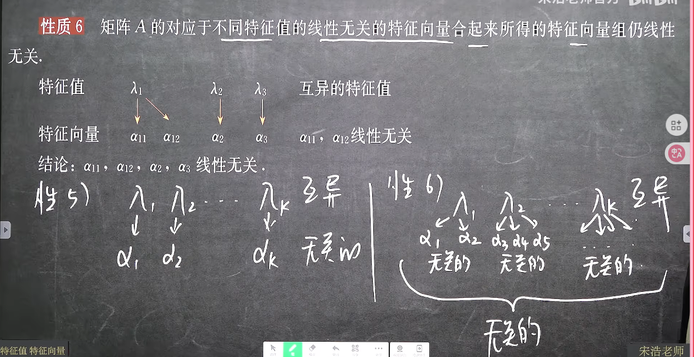
7. 性质7
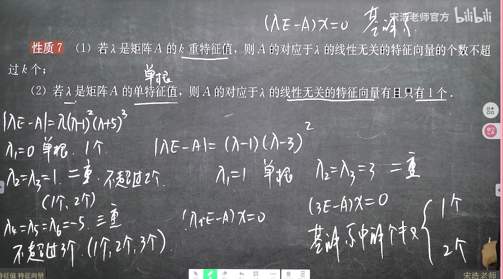
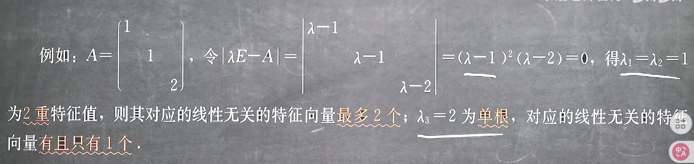
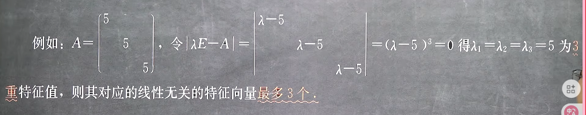
8. 性质8
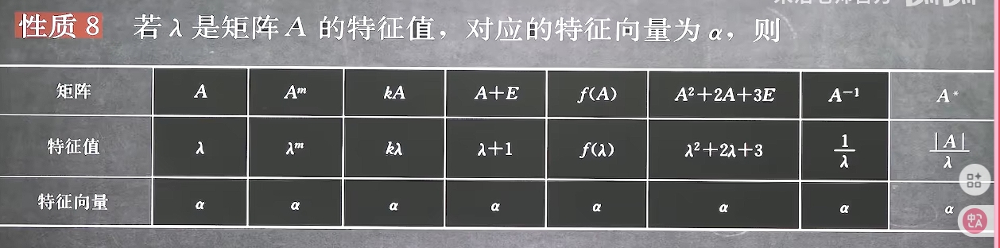
直接把A替换成入然后转换为实数域式即可，其中伴随矩阵利用伴随矩阵法公式替换，但是特征向量是永远不变的
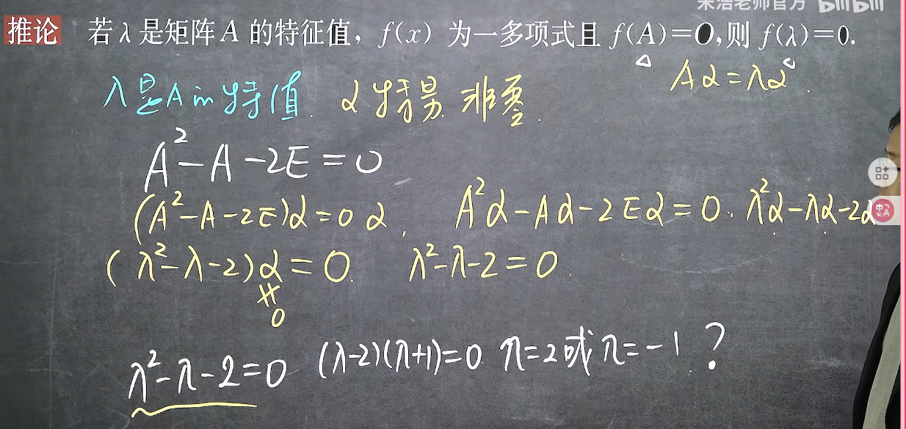
注意：
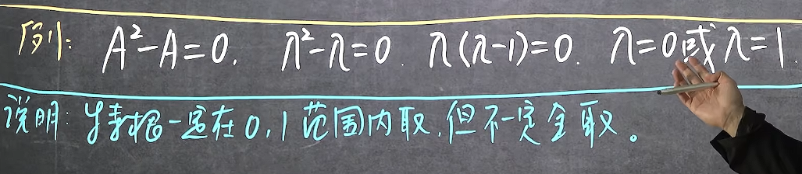

例题：
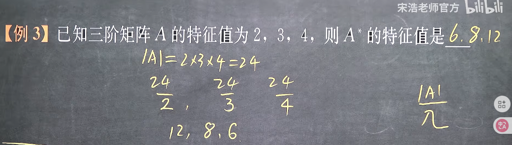
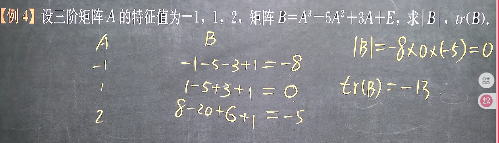
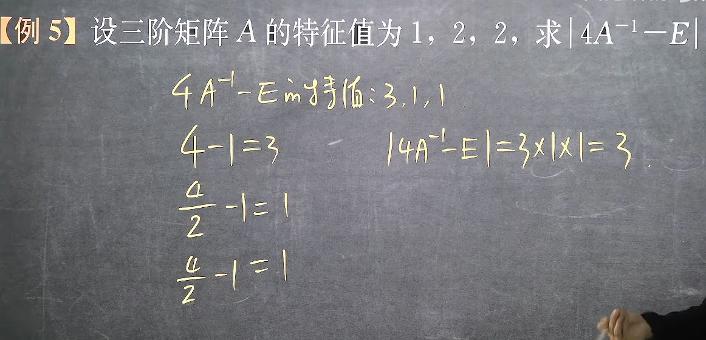
***
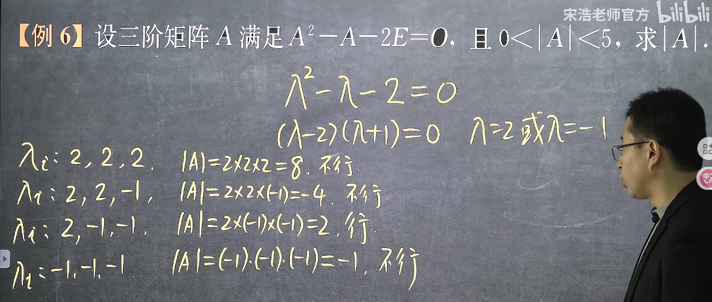
重要！！！
***
9. 性质9
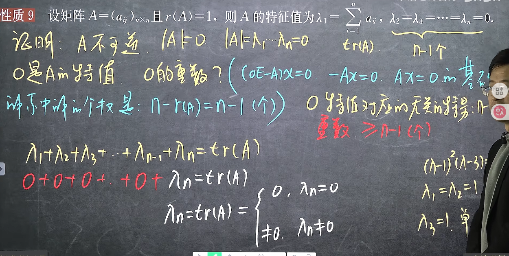

推论：
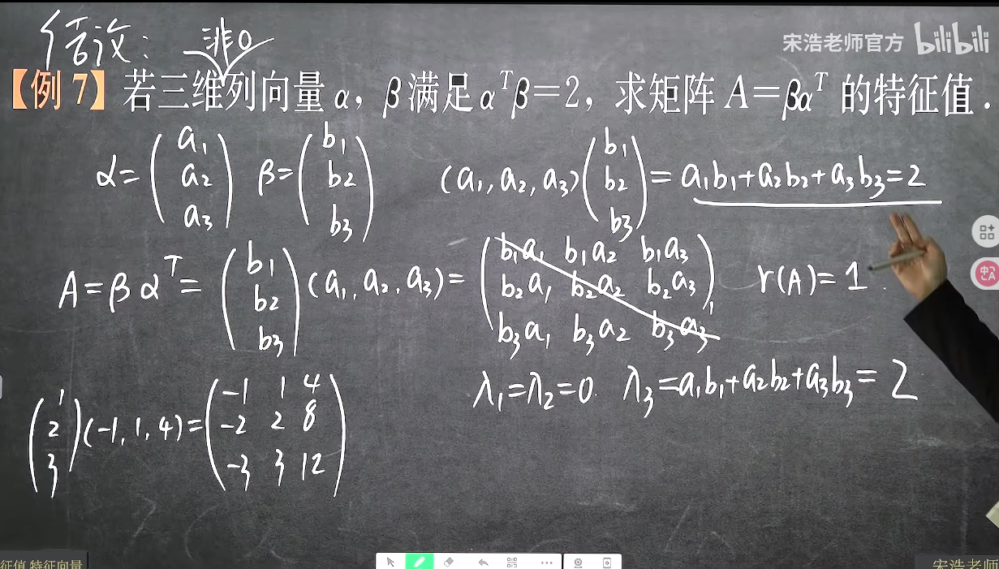
注意特征根为0、0、2而非2