### 5.6向量的内积与正交

#### 1. 定义
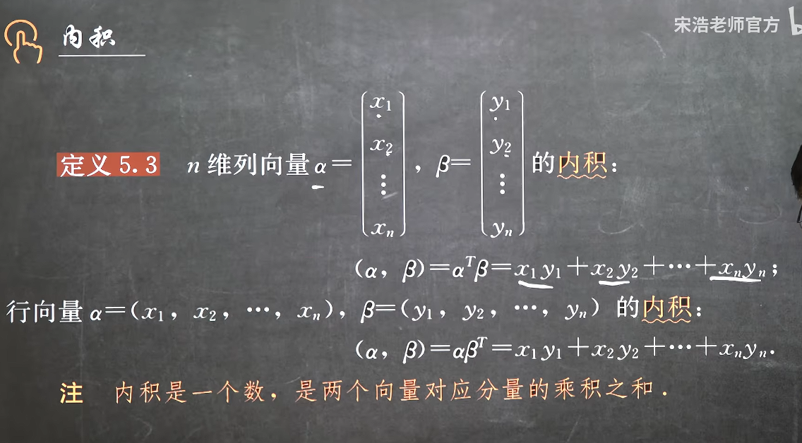

#### 2. 性质
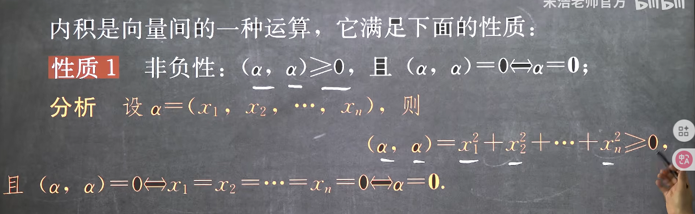
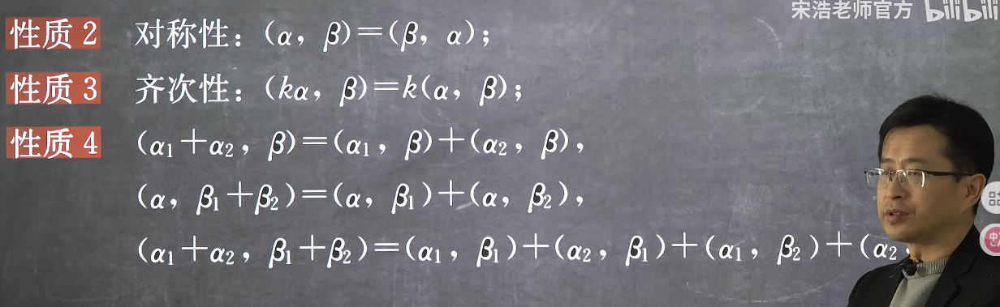

#### 3. 向量的模
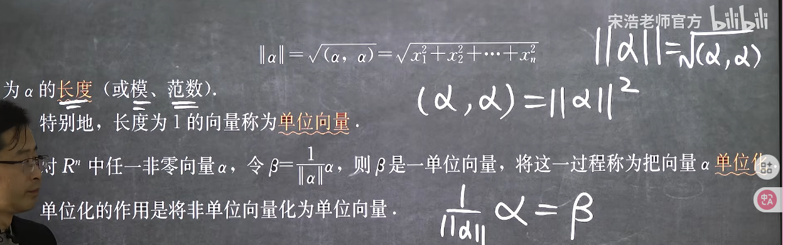
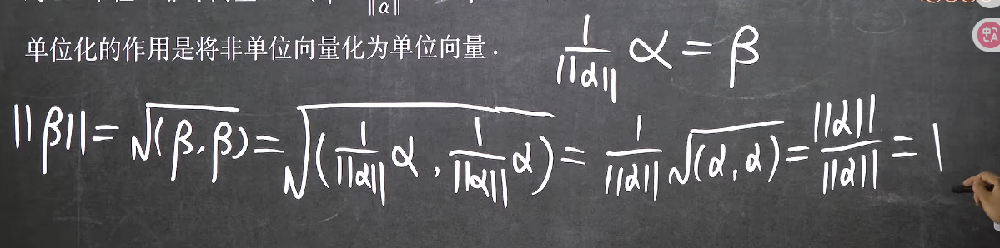
自己和自己的内积其实就是模的平方

#### 4. 向量的正交
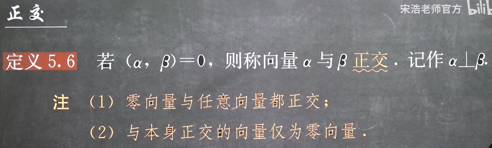

#### 5. 正交向量组
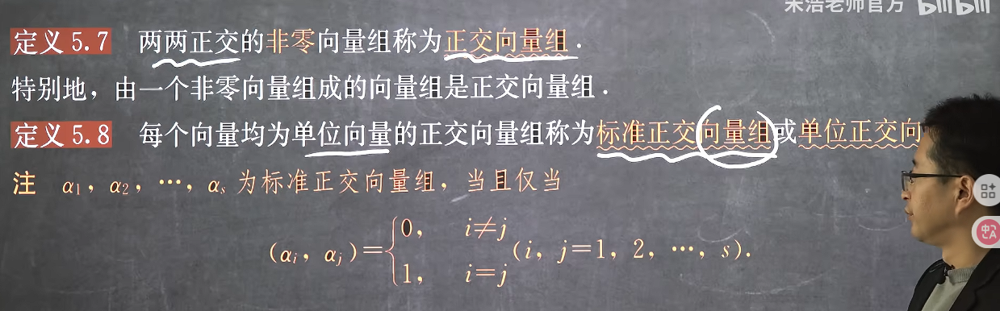

推论

#### 6. 施密特正交化
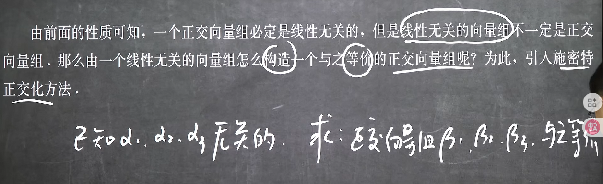
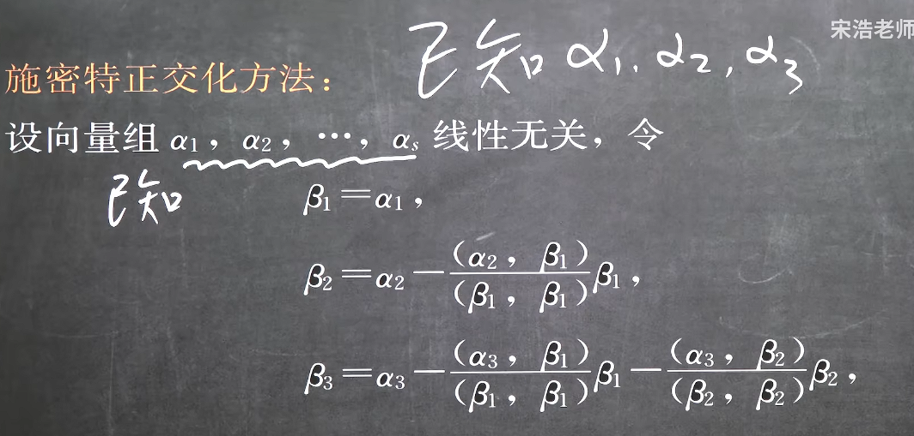
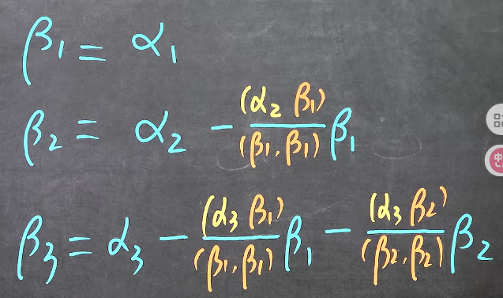
注意施密特正交化只能在原向量组线性无关的情况下保证产生的是等价正交向量组，但是不一定是单位化的，如果我们需要单位正交向量组，那么我们还需要对其进行单位化
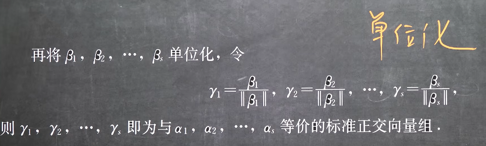

#### 7. 正交矩阵
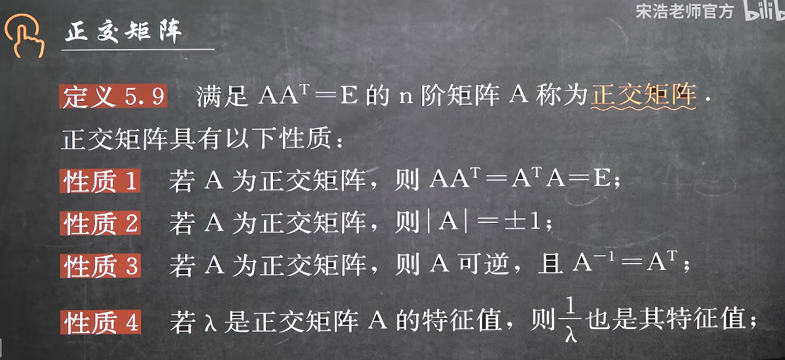
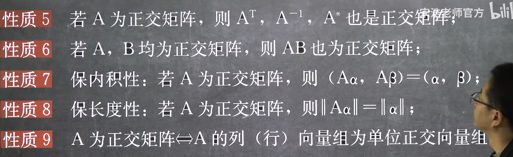