### 二次型及矩阵表示

#### 1. 定义

#### 2. 二次型的矩阵
1. 定义：
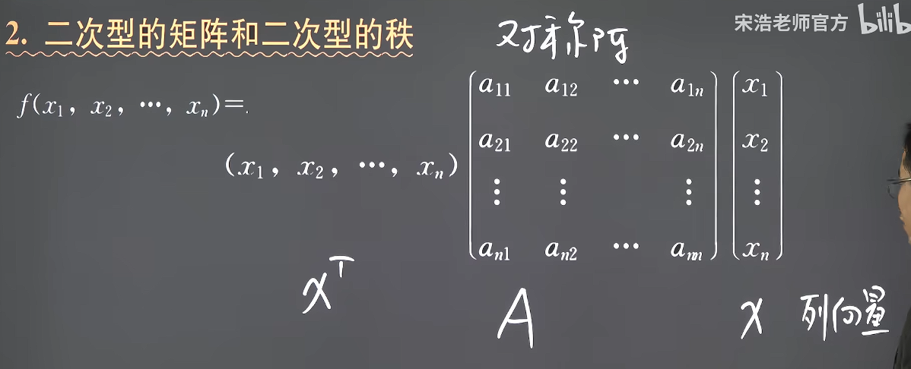
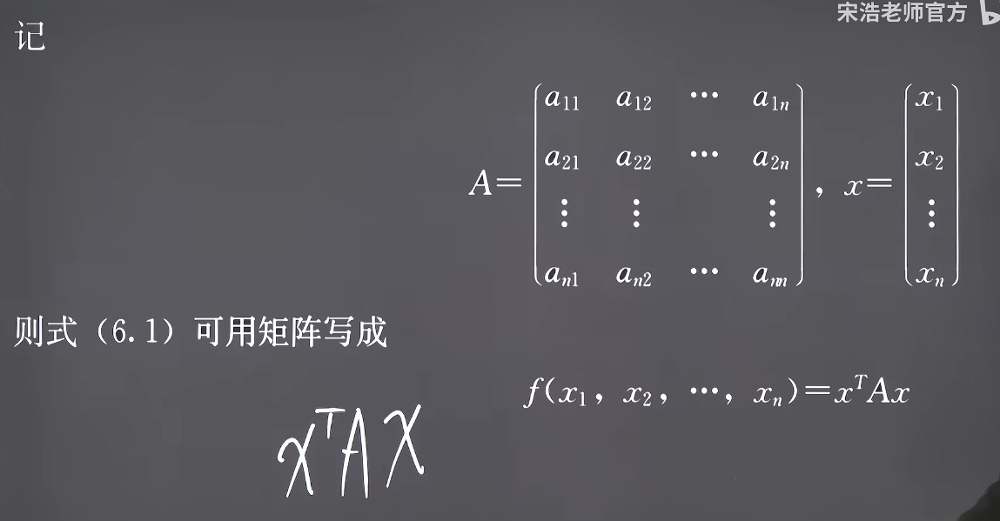
**其中A必须为实对称矩阵，即A^T^=A必须成立**
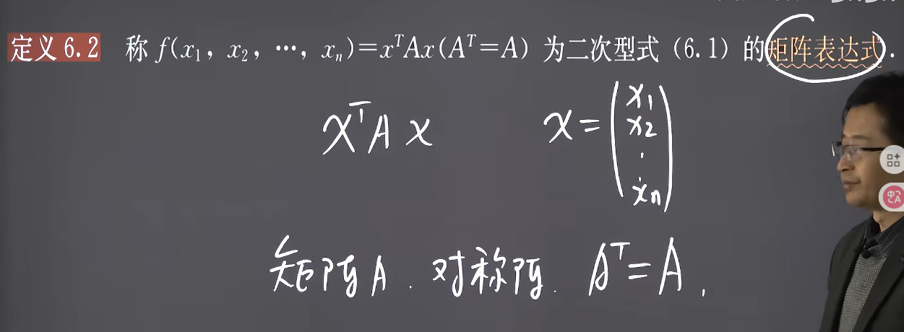

2. 例程：
**二次多项式转二次型**
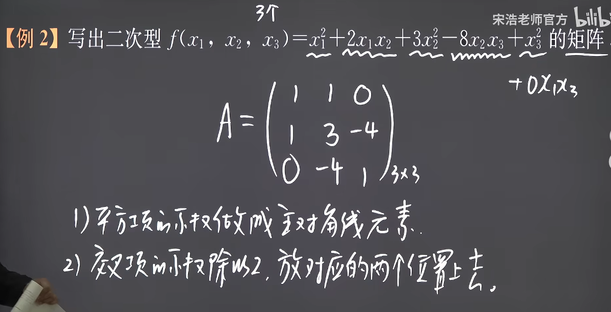
反之
**二次型转二次多项式**
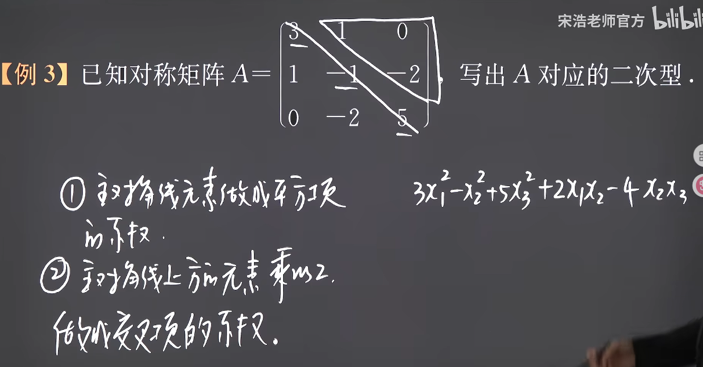
记得要乘或除以2
**注意：有时候题目给出的X^T^AX并不是二次型**
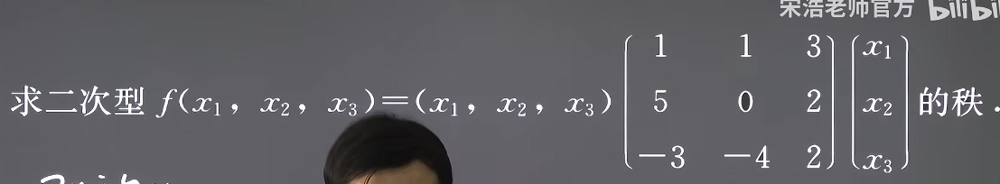
这里可以发现矩阵A不是实数对称矩阵，因此**其不是二次型！！！**
这个时候要进行对称化，方法是将对称的元素求平均再放回去
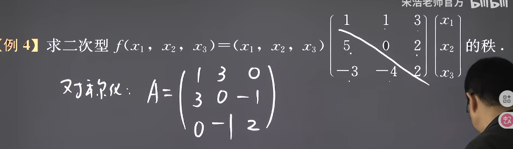

#### 3. 二次型的秩
1. 定义
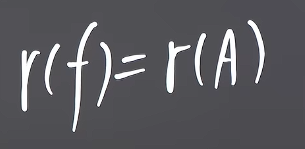

2. 例程
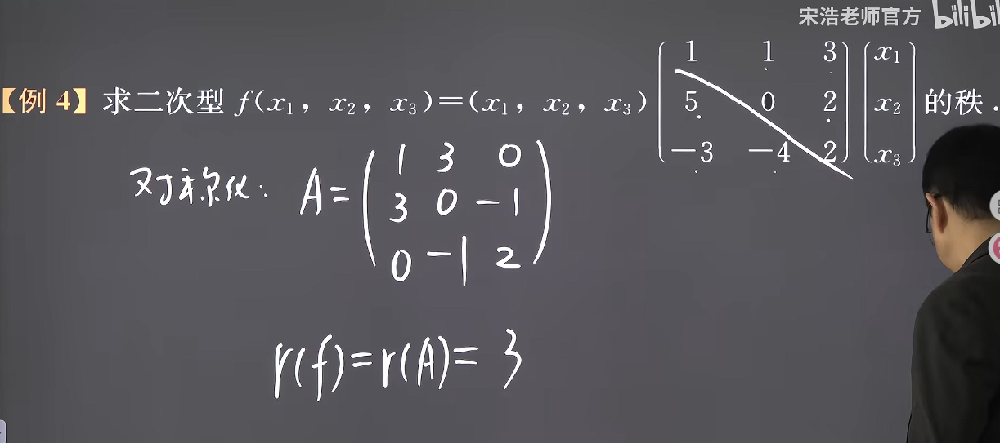
要注意！！这里必须求的是对称化后的A的秩

#### 4. 二次型的标准型
定义
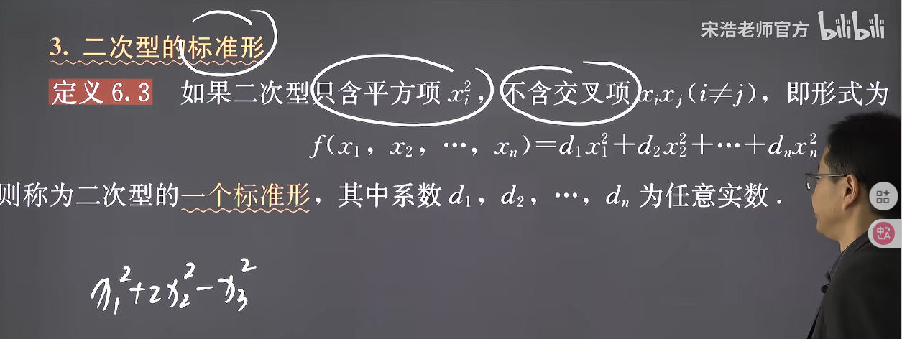
至于为什么叫标准型因为这个时候A是对角矩阵
那么就能直接得到秩
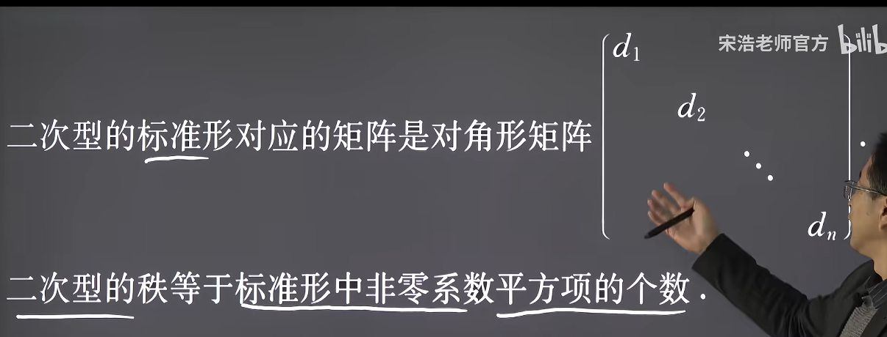
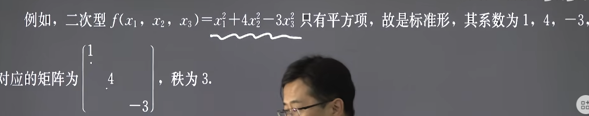

#### 5. 二次型的规范形
1. 定义
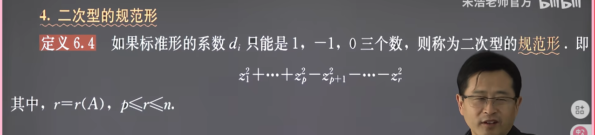
并且注意必须是先是1然后是-1然后是0

且有二次型化为标准型是不唯一的，但是化为规范型是唯一的

#### 6. 二次型的惯性指数和符号差
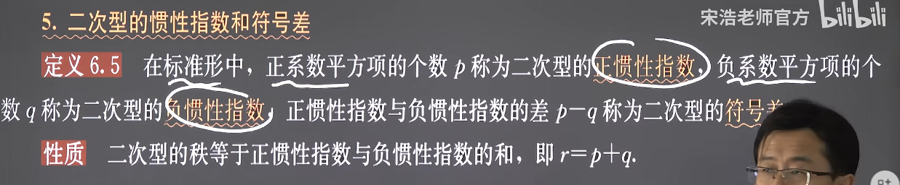

#### 7. 二次型的线性变换
1. 定义
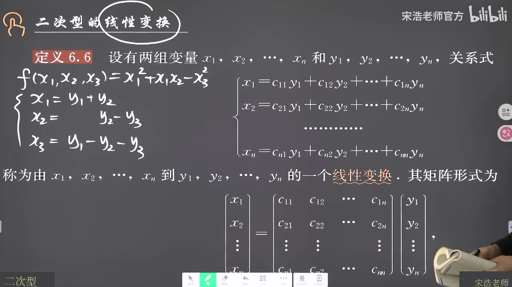
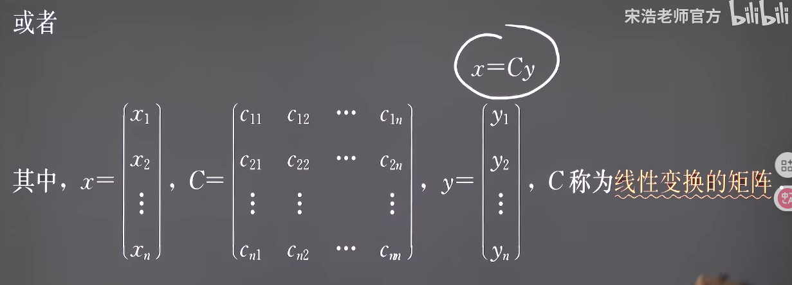
注意：
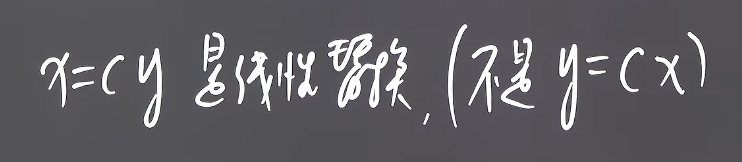
因为有
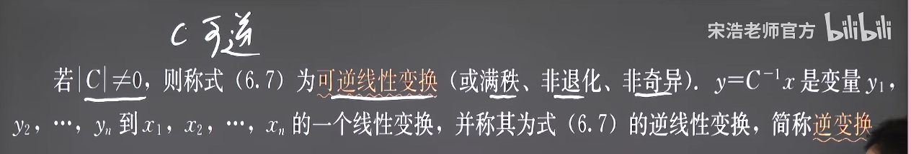
特殊的
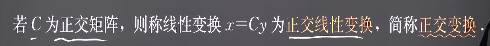
多次的线性变换
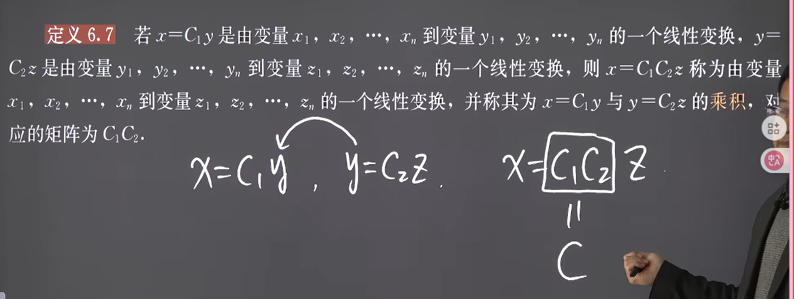
2. 并且有定理：
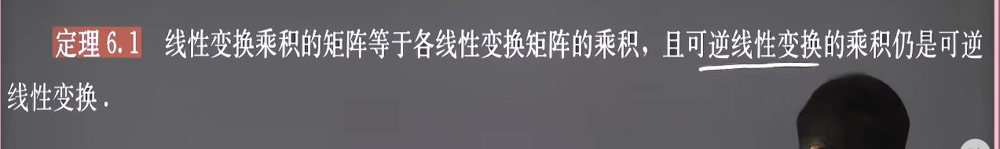
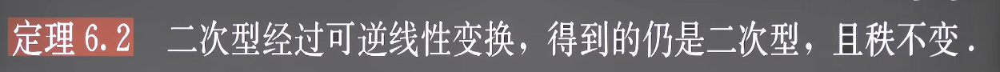
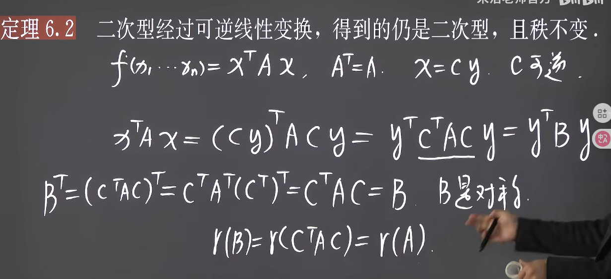

#### 8. 合同矩阵与合同变换
1. 定义
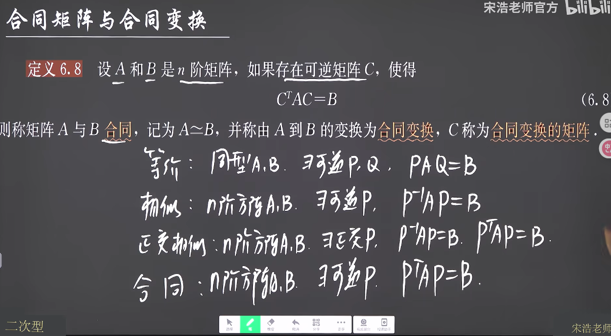
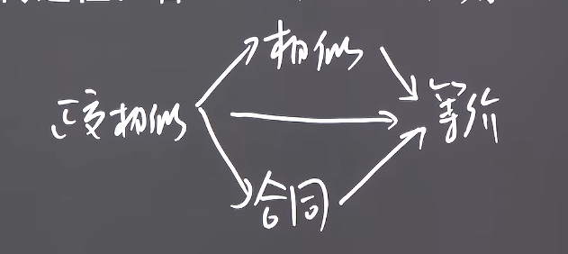
合同的本质就是对其对应的二次方程进行了一次线性变换
2. 性质

3. 结论
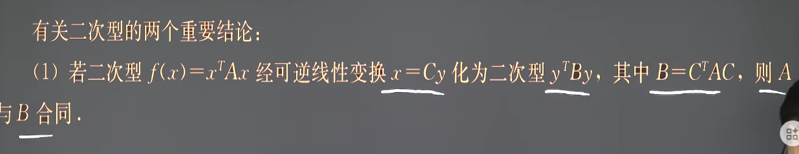
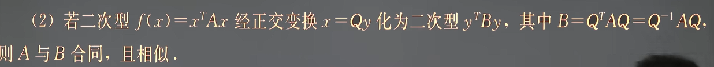