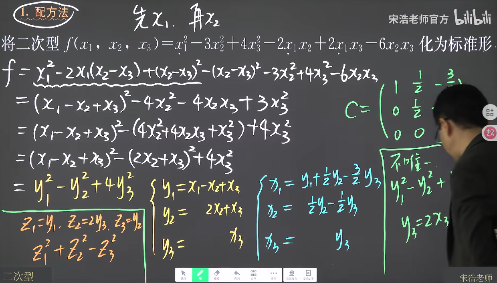
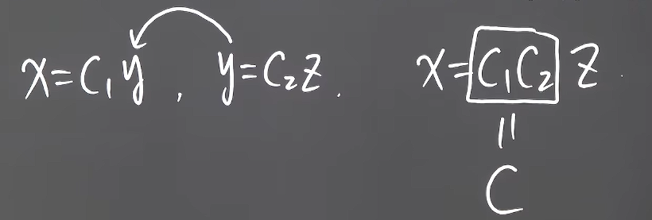
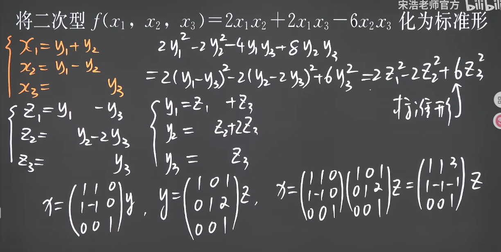
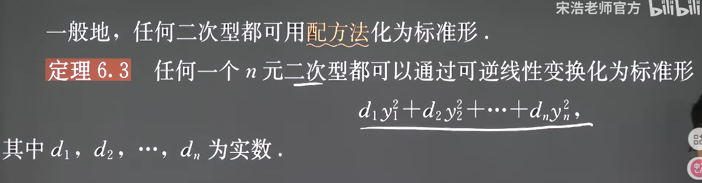
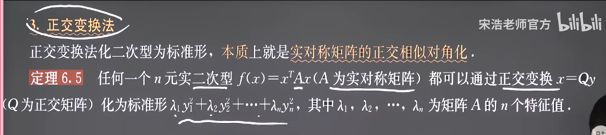
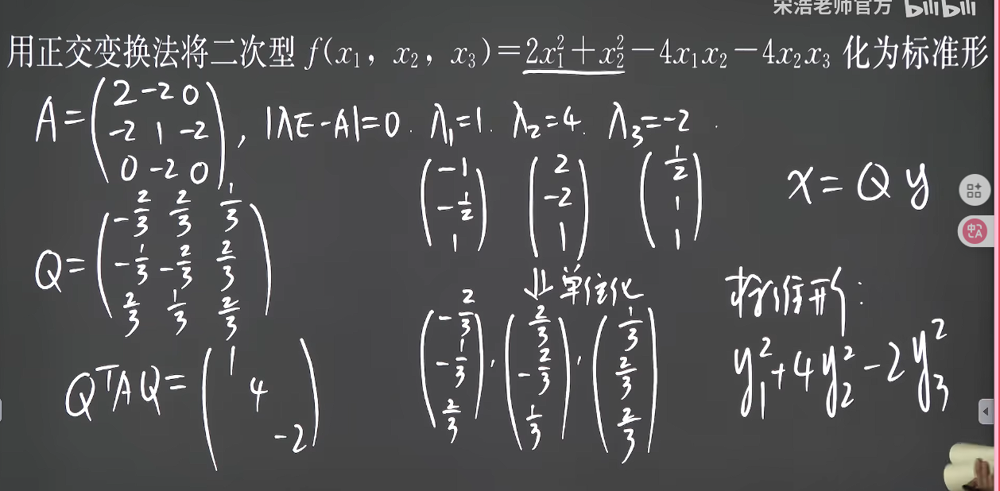
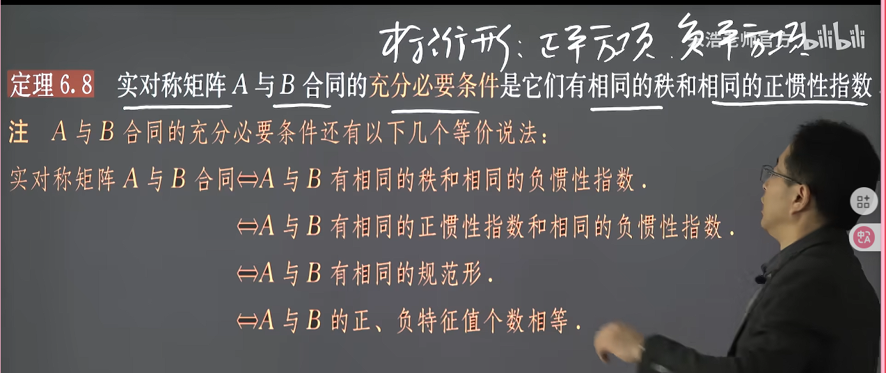

### 化二次型为标准型

#### 1. 化为标准型方法
1. 方法一：配方法

注意是是X=CY不要写反了，否则C就是错的
如果要进一步化为规范型，则再进行一次替换，保证系数都替换为1 -1 0，并且把顺序改一下

而新的C就是两个C按顺序相乘

对于没有平方项的配方法，我们先使用一次平方差公式的变换，将其配出平方项和交叉项

然后再对结果进行标准型的配方变换

一般的，有

由此可以知道，任意一个二次型都能变换为一个标准型，这就意味则任意一个实对称矩阵都可以用合同变换为一个对角型矩阵，即

2. 方法二：正交替换法

#### 2. AB合同的充要条件

